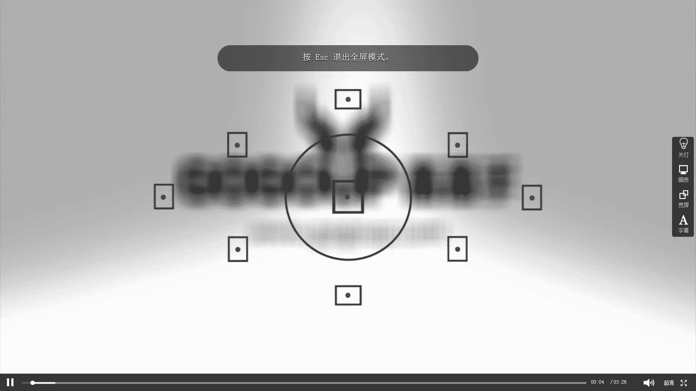

# 手机摄影教程：第04课：视觉训练（作品实例讲解）：课时11 · 创意-低角度 📱

在本节课中，我们将通过具体的作品实例，学习如何运用低角度这一创意视角进行拍摄。低角度拍摄能带来独特的视觉冲击力，发现日常生活中被忽略的美。

## 概述
本节将分析三张采用低角度拍摄的照片，讲解其拍摄思路、具体操作手法以及背后的故事。我们将学习如何贴近地面、利用倒置手机等方法，捕捉与众不同的画面。

## 实例一：屋顶的“跑道”
上一节我们介绍了视角的重要性，本节中我们来看看如何将普通场景拍出创意。第一张照片拍摄于一个屋顶。

这张是未经后期处理的原片，旨在展示一种创意的视角。拍摄时，将手机倒置，使其摄像头贴近屋顶的防水涂料表面。这个表面在清晨阳光下，呈现出类似塑胶跑道的质感和温暖的色调。

拍摄时，利用手机的触摸对焦功能，将焦点对准清晰的地面纹理。这样操作能产生强烈的视觉压缩感，上下景物形成吸睛的对比，类似于专业相机配合大光圈镜头产生的“空气切割”效果。

**核心操作**：`手机倒置 + 贴近地面 + 触摸对焦`

这个创意视角的核心，在于用一种特殊的方法去捕捉和展示一个微妙而细小的视觉片段。

## 实例二：鞋与海鸥的呼应
接下来，我们看看如何将低角度应用于人物与环境的互动拍摄中。第二张照片讲述了一个关于等待与捕捉的小故事。

拍摄时，在滇池大坝上看到一个女孩正在喂海鸥。她站在约50公分高的坝墙上，穿着红色匡威鞋和牛仔裤。我上前征得同意后，便趴下采用低角度贴近地面。

我请女孩保持自然状态继续喂海鸥，而我则从极低的角度，对准她的鞋子和飞来的海鸥进行拍摄。这个过程并非一次成功，而是连续拍摄了大约十张，才捕捉到这张鸟与鞋形成呼应的理想画面。

**拍摄心法**：`低角度贴近 + 寻找元素呼应 + 耐心连拍`

这种拍摄方法不需要复杂构思，只需贴近地面，通过手机屏幕直接观察构图，感受何种角度看起来舒服、特别。这是一种非常规的、训练观察力的好方法。

## 实例三：冰面上的夕阳
最后，我们来看如何将低角度与自然风光结合。第三张照片拍摄于沈阳浑河的冰面上。

作为一个南方人，我对北方的冬日雪景充满兴趣。当时冒着严寒来到冰面，恰逢夕阳西下，天空呈现出泛黄与湛蓝交织的暖色调，景色非常迷人。

这张照片的拍摄手法与第一张屋顶照片类似，也是将手机倒置，把摄像头贴近冰面进行拍摄。冰面的纹理与天空的霞光共同构成了一幅简洁而富有意境的画面。

**场景利用**：`发现独特纹理（冰面）+ 倒置手机贴地拍摄 + 捕捉黄金时刻光线`

## 总结
本节课中，我们一起学习了低角度创意拍摄的三种实践：
1.  **贴近纹理**：通过倒置手机、触摸对焦，放大地面细节，创造抽象美感。
2.  **捕捉互动**：在极低角度下，寻找人物与环境元素（如飞鸟）之间的趣味呼应。
3.  **融合风光**：利用地面（如冰面）作为前景，结合特定时刻的光线，拍摄简洁的风光作品。

低角度拍摄的本质，是**改变我们惯常的观察高度**，以手机的便利性为支点，探索一个贴近大地的、新奇的世界。关键在于敢于趴下身体，尝试倒置手机，并耐心通过屏幕寻找最佳构图。