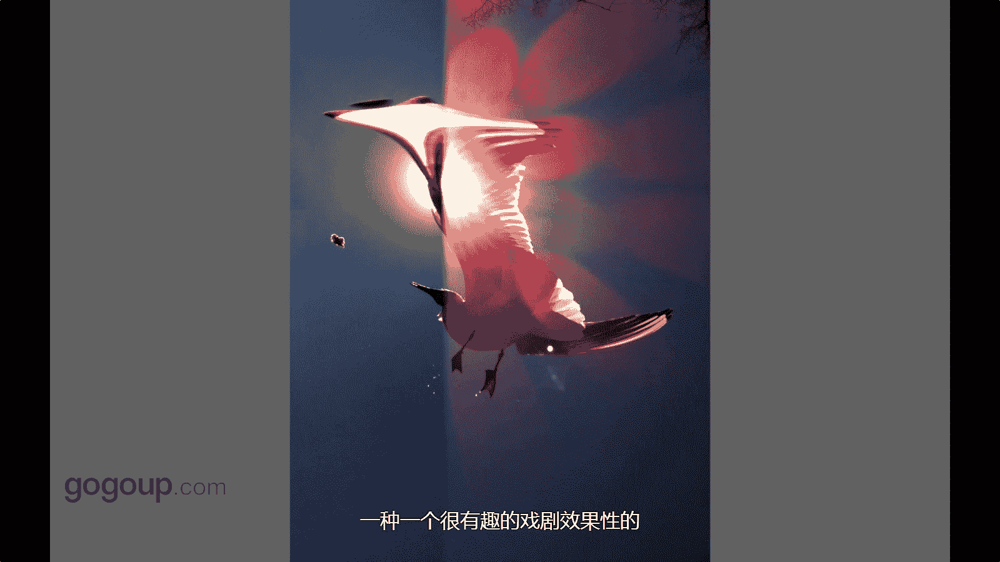

# 何雄-手机摄影教程：第04课：视觉训练（作品实例讲解）：课时13 · 创意-利用器材瑕疵

在本节课中，我们将学习如何将手机摄影中常见的“瑕疵”转化为独特的创意元素。我们将通过具体作品实例，理解如何利用这些非常规的视觉效果，为你的照片增添个性和艺术感。

## 从“缺点”到“特点”

上一节我们探讨了视角的重要性，本节中我们来看看如何利用器材本身的特性进行创作。

这张照片大家可能看到过。它是由一部手机拍摄的。在传统摄影观念中，画面中的这种效果通常被视为一个令人讨厌的缺点。

具体来说，这张照片是用iPhone 4拍摄的。当iPhone 4在逆光环境下拍摄时，有时会产生一种特殊的线性光斑效果。这种效果非常特别。

我们可以利用手机器材自身产生的一些独特现象进行创作。在专业摄影领域，这种线性眩光通常是最不受欢迎的缺陷之一。然而在手机摄影中，这种光学现象可以成为一种独特的美感，或是一种只有手机才能拍出的特别味道。

## 创意的核心：视角与发现

总而言之，不同的视角或拍摄手法，决定了你对拍摄对象呈现方式的不同。捕捉到那个恰好能展现非常态效果的瞬间或角度，我认为这就是一种创意。

创意就是发现那些常人看不到的东西。它是一种信念，也是我们在创意学习中必须去主动发现和掌握的一种能力。

这是一个非常有趣且吸引人的效果实例。

## 实践要点总结

以下是利用器材“瑕疵”进行创作的关键思路：

*   **转变观念**：不将非常规光学现象（如眩光、紫边）简单视为缺点。
*   **主动尝试**：在逆光等特定环境下，观察你的手机会产生何种独特效果。
*   **融入构图**：将这些效果作为画面视觉元素的一部分进行构思，而不仅仅是意外产物。
*   **形成风格**：持续探索，将这种独特的“器材语言”发展为你的个人摄影风格之一。

本节课中，我们一起学习了如何重新审视手机摄影中的“瑕疵”。关键在于转变思维，将器材的局限性或特性视为创意的源泉。通过主动探索和利用这些非常规的视觉效果，你可以为作品注入独特的个性和难以复制的艺术感。记住，创意往往源于对寻常事物的不同看法。