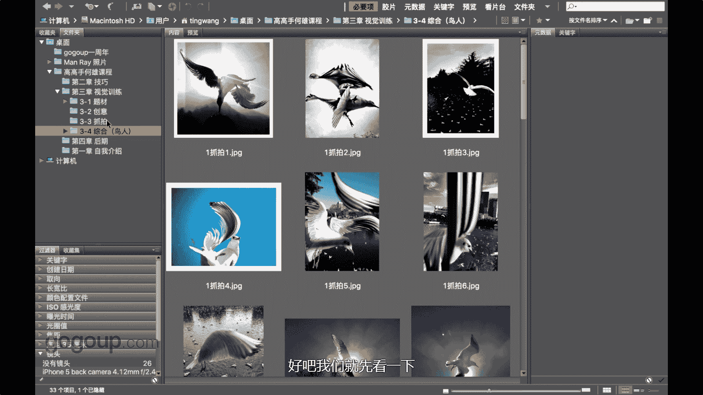
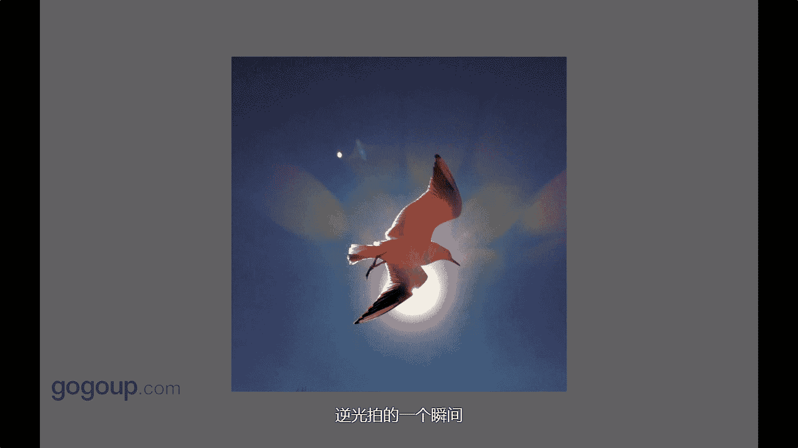
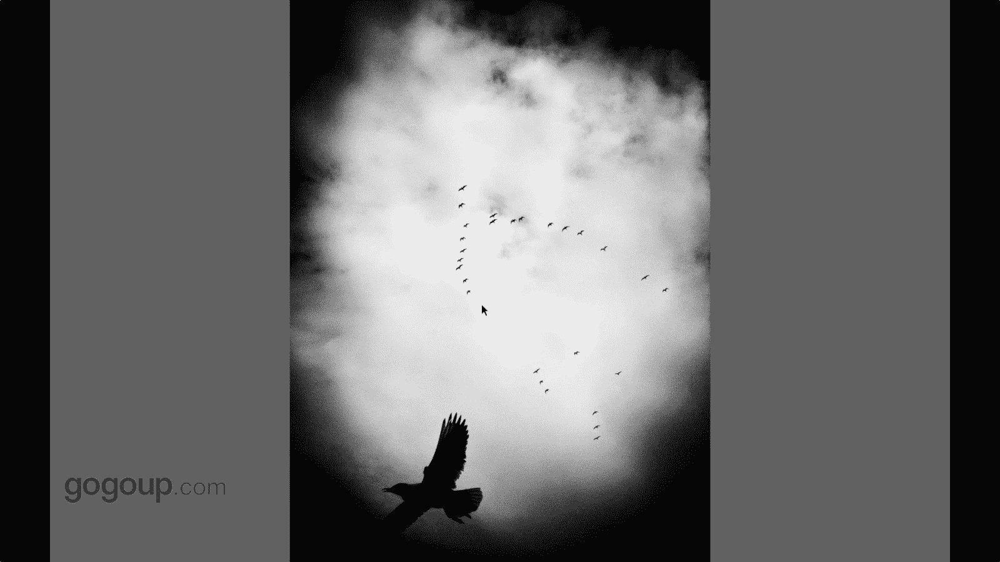
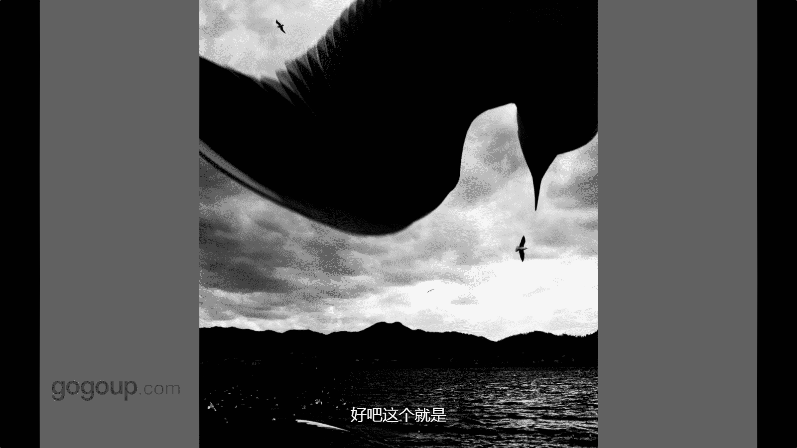
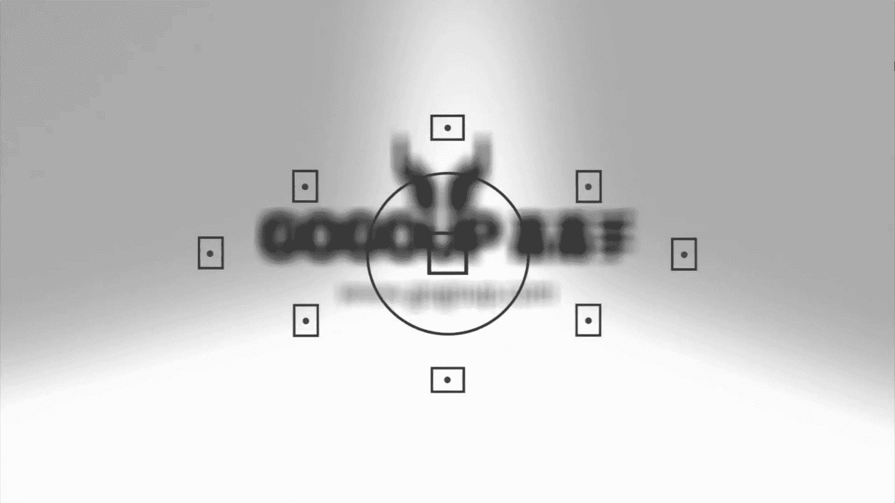

# 手机摄影教程：第04课：视觉训练（作品实例讲解）：课时15 · 综合-解析《鸟人》系列作品 🕊️📸

在本节课中，我们将通过解析《鸟人》系列作品，学习如何捕捉动态瞬间、运用光线以及构建画面故事。这个系列以鸟类与城市、人物的互动为主题，展现了抓拍艺术的魅力。

## 系列概述与抓拍核心

《鸟人》系列是我个人比较成功且具有代表性的作品集，其核心在于**抓拍**。鸟类是难以控制的拍摄对象，因此整个系列都建立在捕捉不可预见的瞬间之上。抓拍充满趣味，每个瞬间都独一无二。只要你做好准备并持续拍摄，就会获得许多精彩的机会。

以下是《鸟人》系列中的一些关键作品及其拍摄手法的解析。

## 作品实例解析

### 动静结合的瞬间

抓拍的精髓在于捕捉动态主体与静态背景结合的瞬间，这能产生强烈的视觉冲击力。

*   **合成与抓拍的结合**：有一张作品在后期使用了软件进行合成。画面中，鸟觅食的瞬间与逆光下的城市剪影（由头发演化出的山形）相结合。虽然经过合成，但鸟的瞬间是真实抓拍的。
*   **动态模糊的意外之美**：另一张照片中，由于阴天光线不足且手机快门速度跟不上，一只快速扇动翅膀的鸟产生了动态模糊（拖影）。其身体和脚保持清晰，与模糊的翅膀形成对比，这种意外效果反而构成了独特的画面。
*   **惊吓引发的动态**：一张照片捕捉到鸟受惊后展翅欲飞的瞬间。它停在栏杆上，因我的靠近而惊动，这个动静结合的瞬间与背后的城市建筑形成了有趣的对照。

### 极近距离的抓拍效果

当手机非常贴近拍摄主体时，主体快速移动的部分会产生明显的动态轨迹，这是一种独特的视觉效果。

*   **贴近拍摄的拖痕**：一张照片因拍摄距离极近，鸟飞过时翅膀划出了清晰的轨迹。很多人误以为是后期添加的效果，但这其实是拍摄时自然产生的。后期仅进行了色调（蓝调）调整。
*   **顺光下的细节**：在顺光条件下近距离抓拍，可以同时保留动态主体的轨迹和静态背景的清晰细节。例如一张照片中，鸟的翅膀有拖痕，但后面的房屋和人物依然清晰，这不同于大光圈虚化背景的效果。
*   **冬季的经典瞬间**：一张在冬季拍摄的作品，同样因为距离极近，鸟从身边掠过时，其动静对比被极致地呈现出来。

### 逆光创作的独特魅力

逆光拍摄能为画面带来特殊的光影效果和氛围，是《鸟人》系列中重要的创作手法。

*   **海鸥的逆光瞬间**：一张用iPhone 5拍摄的海鸥照片令我印象深刻。海鸥掠过时，其动态与下方水面的静态倒影相互呼应，构成了一个极具张力的动静结合瞬间。
*   **特有的光斑效果**：使用iPhone 4拍摄时，曾捕捉到特有的逆光光斑效果。这需要极快的快门速度（手机电子快门可达1/10000秒以上）。这种效果是手机摄影在特定条件下的创意呈现。
*   **穿透阳光的震撼**：一张早期逆光作品给了我很大惊喜，画面中鸟仿佛从太阳中穿透而出。这种强烈的逆光虽然会“吃”掉部分细节，但形成了一种残缺而独特的美感。
*   **将太阳拍成红点**：在正午逆光下，使用手机的点测光并对准最亮处（太阳）减曝光，可以将太阳压暗成一个红点，同时保留地面水波等细节。这是手机摄影在控制大光比场景时的一个优势。

### 街头环境中的叙事

将鸟类置于城市街头环境中，能构建出富有故事性和幽默感的画面。

*   **“走斑马线的海鸥”**：在昆明街头抓拍到海鸥低空飞过斑马线的瞬间。背景中电线杆上停满的海鸥与前景中“遵守交规”的这只形成趣味对比，为普通的街景增添了亮点。
*   **“非机动车道”的飞行**：另一张照片中，海鸥在空中飞行的轨迹恰好与地面的非机动车道重合，配合建筑、车辆和光影，构成了一个充满形式美感的画面。
*   **等待与抓拍的结合**：许多街头抓拍也需要耐心等待。例如等待海鸥起飞瞬间，与地面其他海鸥、城市环境共同构成理想画面。
*   **城市与鸟的尺度对比**：采用低角度仰拍，让飞过的鸟在画面中显得巨大，与城市建筑形成夸张的尺度对比，这种透视效果极具视觉冲击力。

### “鸟与人”的关系升华

这个系列从单纯拍鸟，升华到探讨鸟与人的关系，用人物作为前景或互动元素，深化作品内涵。

*   **人物作为前景**：这是系列中期的重要手法。用人物作为前景，与飞过的鸟形成瞬间的、完美的结合，点明“鸟人”主题。
*   **剪影与互动**：在逆光下采用剪影手法，等待鸟飞过的瞬间与人物剪影产生互动。云南常见的“耶稣光”（丁达尔效应）为画面增添了戏剧性。
*   **含蓄的喂食瞬间**：不直接拍摄抛洒食物的动作，而是捕捉老人抛食后收回手的瞬间，以及鸟即将啄食的状态。这种含蓄的表达留下了更多想象空间，增强了画面的神秘感和交流感。
*   **“神来之笔”的巧合**：一张经典照片抓拍到孩子躺卧时，一只鸟恰好从上方飞过，形成了巧妙的构图。这种“神来之笔”源于长期的观察、等待和预判。
*   **图案与象征**：利用人物毛衣上的雪花图案与飞过的海鸥结合，象征冬季与觅食，赋予画面更多解读层次。
*   **自拍场景的介入**：捕捉年轻人用手机与海鸥自拍的常见场景，记录下人与鸟在现代生活中的另一种互动方式。
*   **制造眼神交流**：在街头，通过轻微声响引起喂食老人的回头，在他看向镜头的瞬间抓拍，此时恰好有海鸥飞过其头顶，形成了人物、鸟类与摄影师三者之间的眼神与姿态呼应。
*   **手的触摸与表达**：将自己的手伸向空中，表达一种“触摸”或“渴望飞翔”的情绪，等待海鸥飞近时抓拍，完成一次主观情绪与客观景象的融合。

### 其他风格化尝试

系列中也包含了一些更具个人风格和实验性的作品。

*   **密集的震撼**：拍摄海鸥群瞬间停落的壮观场面，这种密集构图可能引发观者的“密集恐惧症”，从而产生强烈的视觉或心理反应。
*   **后期创意合成**：将手机拍摄的鸟群背景与抠出的人物剪影合成，创造出一个仿佛人物被鸟群托起或置于奇异峡谷中的超现实画面。
*   **失焦的梦幻感**：故意使用失焦手法，拍摄海鸥狂舞的瞬间，形成光斑与模糊动态结合的梦幻场景。
*   **极简与空灵**：拍摄单只海鸥与远处金球建筑的画面，构图干净、空灵，强调形式感和意境。
*   **“王者风范”的特写**：一张鸟的特写作品，通过眼神光、翅膀姿态和阳光勾勒，赋予鸟类一种凝视世界、充满气场的“王者”形象。
*   **大赛获奖作品**：一张获得莱卡摄影大师赛手机组金奖的作品。画面中两只海鸥的姿态形成巧妙互动（如一只形似高跟鞋），并与远处的滇池、西山构成和谐呼应，堪称“神来之笔”。

---

本节课中，我们一起学习了《鸟人》系列作品的创作思路。核心在于**利用抓拍捕捉不可复制的瞬间**，并通过**逆光、近距离、动静结合**等手法强化视觉效果。同时，系列作品从拍鸟升华至表达**鸟与城市、鸟与人的关系**，为简单的场景注入了故事性和情感。记住，精彩的手机摄影作品离不开细致的观察、耐心的等待以及对瞬间毫不犹豫的捕捉。