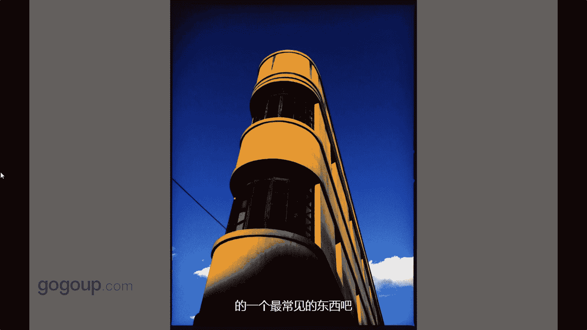

# 何雄-手机摄影教程：第04课·视觉训练（作品实例讲解）：课时2 · 题材-建筑 🏙️

在本节课中，我们将通过分析具体的建筑摄影作品，学习如何观察和捕捉建筑题材的美感。我们将探讨如何利用构图、光影和视角，将生活中常见的建筑转化为富有张力的摄影作品。

## 概述

建筑是我们生活中非常常见且密不可分的题材。许多人认为照片需要“人味”，而与我们关系最密切的建筑本身就充满了人文气息。本节课将通过几张实例照片，讲解如何发现并拍摄出有感染力的建筑影像。

## 作品实例讲解

上一节我们探讨了摄影题材的选择，本节中我们来看看如何具体拍摄建筑。

### 实例一：新旧对比

这张照片拍摄于昆明的一条老街。画面中，一个翻新中的老式窗户作为前景，后方则是现代化的高楼大厦。

这种拍摄手法的核心在于构建**对比**与**空间感**。以下是这种构图思维的关键点：
*   **新旧对比**：古老的前景与崭新的背景形成强烈时代反差。
*   **几何构图**：利用窗户的框架结构引导视线，增强画面的秩序感。
*   **纵深空间**：前景、中景、背景的层次拉开了空间距离。

### 实例二：发现平凡中的张力

这是一个拆迁废墟的墙面。它本身很常见，但经过拍摄和后期处理，能产生独特的视觉效果。

吸引摄影师的是它像由许多电视屏幕拼成的大屏一样的质感。这提醒我们，摄影的魅力在于：
*   **转换视角**：将普通的场景通过独特的观察角度转化为有趣的画面。
*   **强调质感**：聚焦于物体表面的纹理、图案和结构。
*   **后期强化**：通过适当的处理，可以突出画面原有的张力和形式感。

### 实例三：光影与倒影

这张照片拍摄于一个废弃的建筑内部，捕捉的是地面上的光影与倒影。

手机摄影的优势在于可以贴近物体或采用低角度等特殊视角进行拍摄。这张照片的成功要素是：
*   **光影捕捉**：夕阳下的金黄色光线创造了温暖的氛围。
*   **对称构图**：光影与水面倒影形成了近似完美的对称，公式可表示为：`画面元素 ≈ 倒影元素`。
*   **细致观察**：需要细心发现生活中这些由光线构成的短暂而美妙的画面。

### 实例四：造型、光影与色彩

这张照片拍摄的是昆明市中心的胜利堂，一栋具有弧形立面的老建筑。

拍摄的契机在于回头时，发现夕阳的光线打在泛黄的墙上，与一小片湛蓝的天空形成了绝佳搭配。这张照片体现了：
*   **建筑造型**：独特的弧形结构是画面的视觉焦点。
*   **光影色彩**：暖色的墙光与冷色的天空形成色彩对比，激发温暖、舒适的感觉。
*   **瞬间把握**：美好的光线转瞬即逝，看到后应立即拍下，不要犹豫。

## 总结

本节课我们一起学习了建筑摄影的几种实用思路。关键在于培养观察力，利用**对比构图**、**几何线条**、**光影色彩**和**独特视角**，将普通的建筑场景转化为动人的作品。记住，手机是发现这些细节的绝佳工具，请随身携带，多加练习。