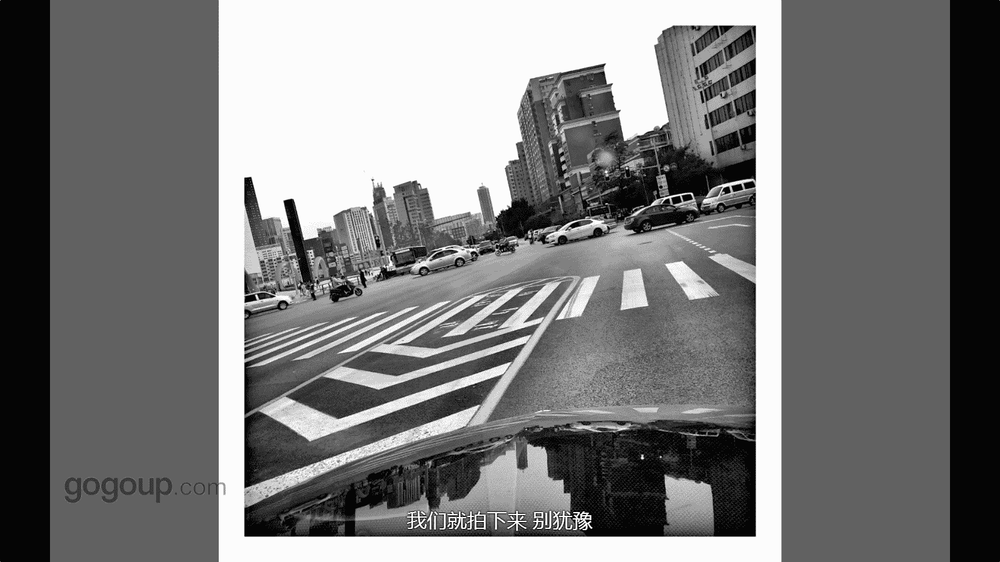

# 手机摄影教程：第04课：视觉训练（作品实例讲解）：课时3 · 题材-汽车 🚗

在本节课中，我们将通过具体的汽车题材摄影作品，学习如何从日常生活中发现独特的视角，并进行视觉训练。汽车是我们身边常见的元素，通过观察和拍摄，可以锻炼我们的构图与发现美的能力。

上一节我们探讨了视觉训练的基本概念，本节中我们来看看如何将这一概念应用到“汽车”这一具体题材上。

汽车与我们的生活密不可分。它不仅是交通工具，也是我们摄影题材中容易获取的一部分。每个人都可以尝试拍摄。

以下是第一张作品的讲解。

这张照片拍摄的是一辆洒水车。它在停车加水时，其反光镜构成了画面。反光镜映照出前方的景象。

我等待了几分钟。因为画面中出现了鸟，鸟是一个非常重要的画面元素。它让世界显得生动。

我最终捕捉到了一个空间。这个空间是倒影与现实、影像与实体之间的对比视角。这种视角可能大家平时不会发现。但如果你走近一点、贴近一点观察，就会发现很多视角。这些视角能带来许多意外的瞬间。

这张照片的拍摄很简单。它是在我的副驾驶座位上，于车内等红灯时拍摄的。我直接将手机贴近挡风玻璃。

然后拍下了这个画面。你可以看到引擎盖上的倒影与前方景象形成呼应，斑马线的条纹也增强了画面感。在构图上，我并没有过多考虑是否水平。我觉得这样很有意思。构图不必拘泥于是否绝对水平，这就是一种视觉训练，是在培养这种视角感。

这种视角在我们的生活中随时存在。我们只需要发现并拍下来，不要犹豫。

接下来，我们看第二张作品。

这张照片也是行车途中拍摄的。中途停下来，是为了上卫生间。在这样一个瞬间，我回头一看，发现了这个画面。

在秋冬时节，一片黄叶恰好落在引擎盖上。回头再看这张照片，形成了鲜明的色彩与质感对比。

这东西可能看起来没什么特别。但它正是在告诉你视角的重要性。你需要去发现一些东西。发现一些色彩或者一些瞬间性的东西，然后把它拍下来。

最后，我们再看两组作品，巩固这种观察方法。

在本节课中，我们一起学习了如何以汽车为题材进行视觉训练。核心在于**贴近观察**、**捕捉对比**（如倒影与现实、色彩与质感），并**摆脱构图教条**（例如不必刻意追求绝对水平）。记住，生活中充满值得记录的视角，关键在于主动发现并果断拍摄。