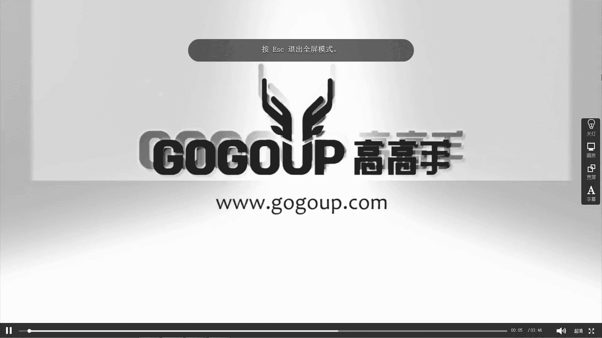
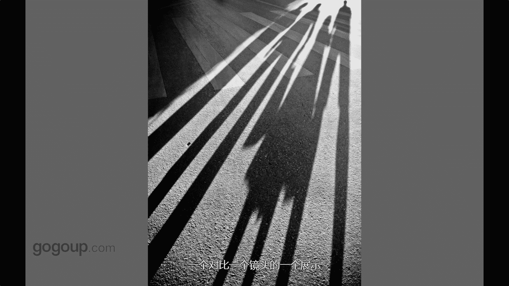

# 何雄-手机摄影教程：第04课：视觉训练（作品实例讲解）：课时5 · 题材-影子

在本节课中，我们将要学习如何观察和拍摄“影子”这一题材。影子在生活中随处可见，只要有光，就会产生影子。无论是剪影、倒影还是水面的反射，影子都能为照片增添趣味和深度。我们将通过几个具体的作品实例，来解析如何发现并捕捉这些有趣的瞬间。

## 概述：影子的魅力

上一节我们探讨了如何寻找拍摄题材，本节中我们来看看“影子”这个具体而有趣的元素。影子是光与物体相互作用的结果，其形态、长短和方向会随着光源变化，这为摄影创作提供了丰富的可能性。学会观察影子，能帮助你发现日常生活中被忽略的视觉趣味。

## 实例一：戏剧性的工作场景

首先，我们来看一张充满戏剧性的照片。这张照片并非刻意摆拍，而是在一次外拍活动中偶然捕捉到的。

当时的情景是夕阳西下，一群摄影师正在为模特拍摄逆光或侧逆光照片。其中一位摄影师正拿着反光板为模特补光。我并未参与他们的拍摄，只是从旁经过。

当我回头时，发现这位摄影师的影子，连同他手中的反光板和身上挂着的相机、闪光灯包，一同投射在了旁边的一面墙上。这个影子与前方真实的模特形成了奇妙的呼应。

这个瞬间之所以有趣，在于它呈现了一种“超现实”的严肃感。影子里的摄影师装备齐全，正在认真工作，这个画面本身就像一幅充满故事性的剧照。这张照片没有经过任何合成或后期处理，它纯粹是“光与影的游戏”。

**核心技巧**：保持观察力，在熟悉的场景中寻找不寻常的光影组合。逆光环境下，物体的影子会被拉长并变得清晰，是创作的绝佳时机。

## 实例二：灵感迸发的创意互动

第二个例子展示了如何主动与影子互动进行创作。一天下午经过一个球场时，阳光将我的影子投射在地面上。

我突发灵感，伸出手，让手的影子与球场地面上的线条进行“互动”和“创作”。这同样是利用影子，但加入了拍摄者主动的干预和构思。

**核心概念**：你可以成为自己照片的“导演”。通过调整身体或物体的位置，主动设计影子的形态，使其与环境中的其他元素（如地面纹理、线条）产生有趣的关联。

公式可以表示为：
**创意影子 = 主体 (你或物体) + 光源 (如太阳) + 投影面 (如地面、墙壁) + 你的构思**

## 实例三：水洼中的颠倒世界

让我们把视线转向地面。第三个例子是关于水洼中的倒影。

一个孩子站在废墟中的一滩水边，他背着的书包也清晰可见。水面平静，完美地倒映出天空和孩子的身影。

当我们把照片倒转过来观看时，会产生奇妙的视觉错觉：水中的倒影变成了正像，看起来仿佛孩子站在一个浑浊、朦胧的“天空”之中，而真实的土地则变成了倒影。这种视角的颠倒，创造出一个仿佛来自异世界的画面。

**核心技巧**：善于利用地面上的小水洼。它们是最天然的镜子，能为你提供独特的、颠倒的视角。寻找简洁的主体和干净的背景，能让倒影效果更突出。

## 实例四：生活中的温情长影

最后，我们来看一个充满生活气息的例子。这张照片拍摄于夕阳时分，一对父子正走过斑马线。

夕阳将他们的影子拉得极长，投射在斑马线上。长长的影子与真实的人、规则的斑马线形成了简洁而有力的对比。对于拍摄者我而言，因为画面中是自己的孩子，所以这张照片充满了个人情感与意义。

对于观察者而言，这种场景其实很常见。以下是生活中容易捕捉到的类似影子题材：

*   **交通工具**：自行车、汽车的影子。
*   **行人**：走过斑马线时被拉长的影子。
*   **动物**：猫咪等小动物的可爱影子。
*   **静物组合**：树木、栏杆与它们影子的图案组合。

**核心技巧**：在日出或日落时分（黄金时刻），光线角度低，影子会被拉得最长，形态也最鲜明。这是拍摄长影、创造强烈对比和图案的最佳时间。

## 总结

本节课中，我们一起学习了如何拍摄“影子”这一题材。我们通过四个实例看到，影子可以是被动发现的戏剧性场景，也可以是主动设计的创意互动；可以是水洼中颠倒世界的魔法，也可以是日常生活中承载情感的温暖瞬间。

记住，拍摄影子的关键在于**观察**和**联想**。留心光线的方向，观察影子在不同表面上的形态，并思考它如何与周围环境互动。从今天起，试着用新的眼光看待那些随处可见的影子，你会发现一个充满趣味和创意的摄影新世界。

