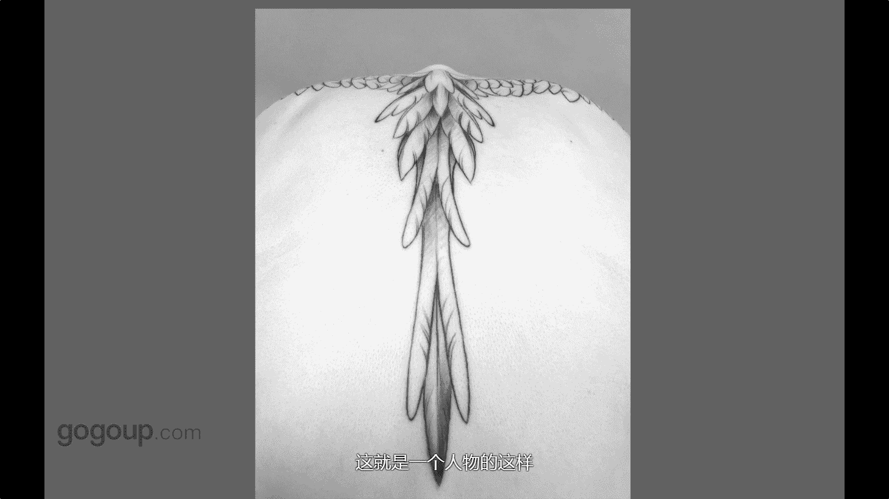

# 手机摄影教程：第04课：视觉训练（作品实例讲解）：课时8 · 题材-创意人像 📸

在本节课中，我们将通过具体的作品实例，学习如何从日常生活中发现并拍摄创意人像。我们将重点分析如何运用对比、光影和独特视角，将普通的场景转化为富有想象力的摄影作品。

## 从生活对比中寻找创意 🎭

上一节我们探讨了视觉训练的基础，本节中我们来看看如何将创意融入人像摄影。创意往往源于摄影师的想法和观察。关键在于从身边常见的事物中发现不寻常的对比或趣味点。

以下是一个从生活对比中产生创意的实例：

*   **发现对比**：作者在展览上看到一张情侣在海滩的裸背照片，因其肤色与晒痕形成对比而印象深刻。
*   **灵感转化**：作者的朋友身上有因骑车晒出的明显痕迹，这激发了创作灵感。
*   **执行拍摄**：作者让朋友背对镜头，低头，突出晒痕与正常肤色的对比区域，拍摄了一张具有趣味对比的背影照片。

这个例子说明，创意无需复杂的场景，它可能就隐藏在日常生活的细微之处，比如朋友特别的晒痕或纹身。

## 利用光影与特写突出主题 ✨

从对比的创意中走出，我们再来看看如何利用光影和特写来塑造画面。当被某个细节的光影或形态吸引时，可以尝试近距离拍摄，捕捉其质感。

以下是如何操作的具体说明：

*   **观察光线**：在光线条件好的时候，寻找那些被光影塑造出强烈质感的局部，比如一双布满皱纹的手。
*   **聚焦特写**：忽略常见的“苍老”主题，只关注光影本身带来的视觉吸引力，用手机靠近拍摄。
*   **后期强化**：通过后期处理，可以进一步强化光影对比和视角感，让普通的特写产生不寻常的视觉效果。

这种方法的核心是**剥离常见的叙事，专注于形式美感**。公式可以表达为：**创意人像 = 观察 (光影/细节) + 聚焦 (特写) + 强化 (后期)**。

## 总结 📝

本节课中我们一起学习了创意人像的拍摄思路。首先，创意可以来源于生活中的**对比**，将普通的个人特征转化为画面的趣味中心。其次，要学会利用**光影**和**特写**，聚焦于形式而非内容，捕捉瞬间的视觉吸引力。记住，优秀的创意人像往往始于细致的观察和独特的个人视角。