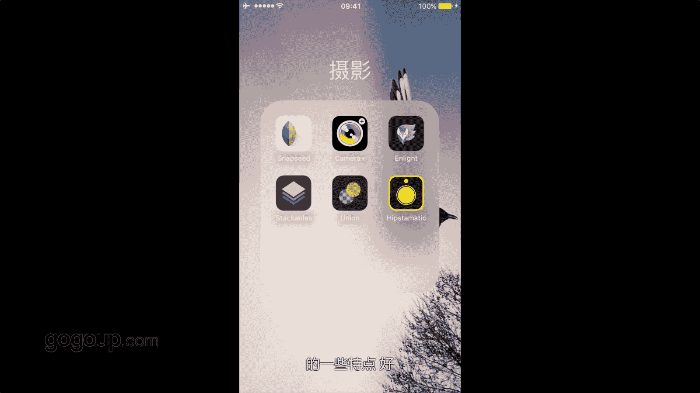
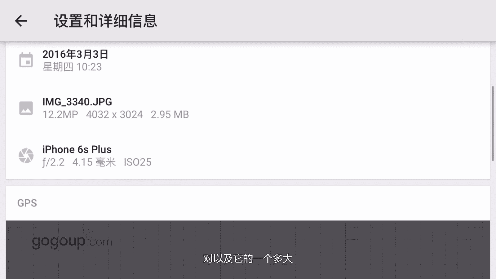
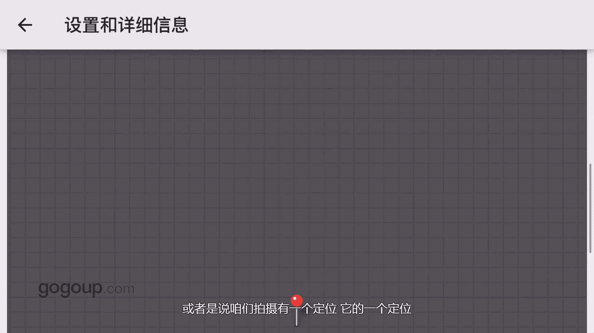
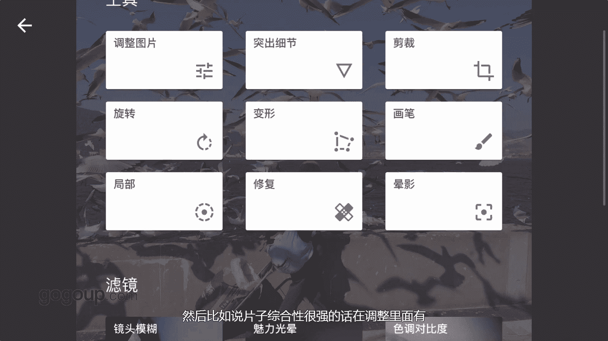
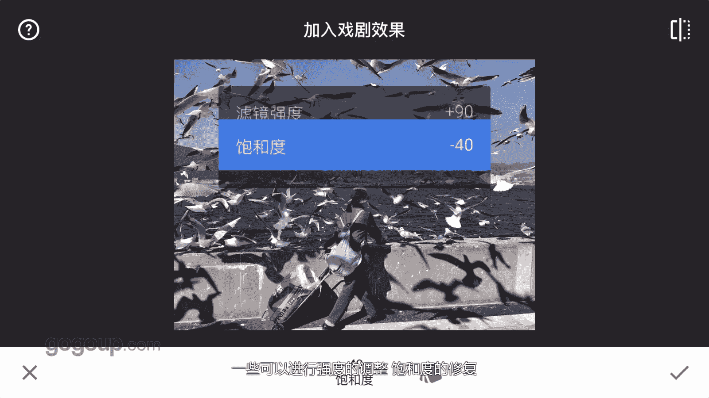

手机摄影教程：第05课：用手机做后期：课时1 · Snapseed 📱

在本节课中，我们将要学习如何使用手机APP进行照片后期处理。手机摄影APP功能非常强大，我的所有手机摄影作品都是在手机上使用APP完成后期的。许多相机拍摄的作品也会使用手机APP进行处理。本节将从我常用的修图APP开始介绍。

本章节将分享我最常用的六款手机摄影修图APP。大家可以先了解一下，后续会对每个软件进行演示，介绍其优点和特长。

通过演示每个软件的特点，可以更直观地分享如何应用它们。

现在打开Snapseed软件。导入一张照片，先查看它的一些功能。导入照片后，点击右上角三个点的图标，可以看到这个软件的特点：综合性很强。

点击设置和信息参数，再点击详细信息，可以看到相册时间、照片尺寸等信息。如果拍摄时开启了定位，这里还会显示拍摄地点的参数。

这是一个查看照片信息的界面。在这里可以导入照片，例如之前外拍海鸥的一张照片。

点击右下角的编辑按钮（铅笔图标），可以看到一系列编辑工具。

以下是主要的编辑功能列表：

*   **图片调整**：对照片进行基础参数调整。
*   **细节突出**：增强照片的清晰度和结构。
*   **裁剪**：裁剪照片尺寸。
*   **旋转**：旋转照片角度。
*   **变形**：校正透视变形。

以及以下高级编辑工具：

*   **画笔**：进行局部精细化调整。
*   **局部修复**：修复照片中的瑕疵。
*   **晕影**：为照片添加暗角效果。

下方还有滤镜功能区，包含以下效果：

*   **镜头模糊**
*   **魅力光晕**
*   **色调对比度**
*   **HDR景观**
*   **戏剧效果**
*   **斑驳**等风格化滤镜

以及最后的**边框**添加功能。

Snapseed综合性强的特点，在“调整图片”功能中尤为明显。点开“调整图片”，将手指放在画面中间，会出现一个可调节的菜单。

以下是可调整的核心参数列表：

*   **亮度**：`亮度值`
*   **氛围**：`氛围值`
*   **对比度**：`对比度值`
*   **饱和度**：`饱和度值`
*   **阴影**：`阴影值`
*   **高光**：`高光值`
*   **暖色调**：`色温值`

这些参数可以对照片进行整体的调试。

“细节突出”功能主要包含**锐化**和**结构**调整，能进一步增强照片的质感和清晰度。

我们也可以使用它的滤镜，例如“HDR景观”。点进去可以看到有几种预设效果。

每个预设都可以进行调整。可以对滤镜的**强度**和**饱和度**等参数进行个性化修复和设置。

Snapseed的综合性很强，对于修图或者进行个性化的风格微调，是一个功能非常强大的工具。

最后，这个软件还有一个优点：它处理照片时不会损伤原始像素。它不会将照片压缩成小尺寸（如1024x768或更低），而是保持照片原有的分辨率（如800万或500万像素）。Snapseed是一款大家熟知的、广泛使用的软件。

以上是一个简单的介绍。

本节课中，我们一起学习了Snapseed这款综合性手机修图软件的基本界面和核心功能。我们了解了如何查看照片信息、使用基础调整工具、应用滤镜效果，并知道了它保持照片原始画质的优点。下一节，我们将继续探索其他实用的手机摄影后期APP。