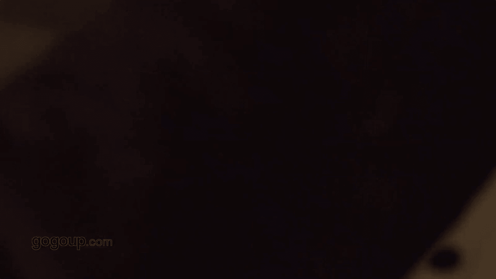

# 手机摄影教程：第05课：用手机做后期：课时13 · 多重曝光

在本节课中，我们将学习如何使用手机App进行前期多重曝光拍摄，并完成后期调整，创作出一张富有创意的合成照片。

多重曝光是一种将两张或多张照片叠加在一起的摄影技法。传统上，这需要在相机内或后期软件中完成。本节课我们将使用一款名为“胶片模拟相机”的App，它允许我们在拍摄时直接完成机内多重曝光，简化创作流程。

## 第一步：前期拍摄多重曝光

上一节我们介绍了多重曝光的概念，本节中我们来看看如何用手机App进行前期拍摄。

我们选择在“高高手”的吉祥物“小路”旁进行创作。首先，打开“胶片模拟相机”App，并找到多重曝光功能开关，通常其图标为两个重叠的方形 **`[+]`** 或类似标识。打开此开关后，相机便进入多重曝光模式。

以下是具体的拍摄步骤：

1.  **拍摄第一张底图**：首先，对场景（例如一条道路）进行第一次曝光拍摄。这张照片将作为叠加的底层图像。
2.  **拍摄第二张叠加图**：然后，将吉祥物“小路”放置在手掌上，进行第二次曝光拍摄。此时，App会自动将第二张图像（小路和手）叠加到第一张图像（道路）之上。

完成两次曝光后，一张初步的多重曝光作品就生成了。我们可以立即在App内预览效果。

## 第二步：后期裁剪与构图

初步合成的照片在构图上可能不够完美，周围可能存在干扰元素。因此，我们需要进行后期调整，让主体更突出。

我们将使用Snapseed进行后期处理。首先导入刚才拍摄的多重曝光照片。

以下是裁剪与构图步骤：

1.  **选择裁剪工具**：在Snapseed中打开“工具”菜单，选择“裁剪”功能。
2.  **自由调整构图**：由于我们的创意是“小路”位于掌心，因此采用竖构图更能强调这种关系。通过拖动裁剪框，裁掉周边杂乱的部分，使画面主体更集中。

裁剪完成后，记得保存修改。这样我们就得到了一张构图更干净、主题更明确的底片。

## 第三步：色彩与影调调整

构图完成后，我们进入色彩与影调调整阶段，以强化作品的氛围和创意表达。

我们的创作意图是：让吉祥物“小路”叠加在手掌的纹理之上，形成虚实对比，背景中若隐若现的手掌能增添灵感和神秘感。为了强化这种效果，我们决定将照片转为黑白。

以下是具体的调整步骤：

1.  **转换为黑白**：在Snapseed的“工具”中选择“黑白”滤镜。将饱和度降至最低，即可获得黑白效果。黑白能去除色彩干扰，更突出光影和纹理的对比。
2.  **调整对比度**：为了让主体“小路”与手掌背景的对比更强烈，我们需要增加画面的反差。使用“调整图片”工具，适当提高“对比度”参数。
3.  **微调亮度与氛围**：根据画面效果，可以微调“亮度”、“曝光”等参数，确保画面整体协调。也可以使用“氛围”工具来平衡高光和阴影的细节。

经过这些调整，照片的黑白对比更加鲜明，手掌的纹理成为衬托“小路”的天然画布，创意感得以增强。

## 第四步：添加画框与最终导出

最后一步是为作品添加一个画框，这能提升照片的完成度和艺术感，类似于为画作装裱。

在Snapseed中，我们可以使用“相框”工具来实现。

以下是添加画框的步骤：

1.  **选择相框工具**：在“工具”菜单中找到“相框”。
2.  **挑选合适样式**：在提供的多种相框样式中，选择一个与黑白风格和作品氛围相匹配的款式。通常简洁的白色或黑色细边框是不错的选择。
3.  **应用并保存**：调整好相框后，点击“√”确认。最后，导出并保存最终作品到手机相册。

🎼

## 总结

本节课中，我们一起学习了利用手机App进行多重曝光创作的完整流程。我们从**前期拍摄**开始，使用“胶片模拟相机”App的机内多重曝光功能直接合成图像；接着通过**后期裁剪**优化构图；然后通过**转为黑白并调整影调**来强化作品的视觉冲击力和创意主题；最后通过**添加画框**来提升作品的最终呈现效果。这套流程结合了前期创意与后期精修，能帮助你轻松创作出富有个人特色的多重曝光作品。