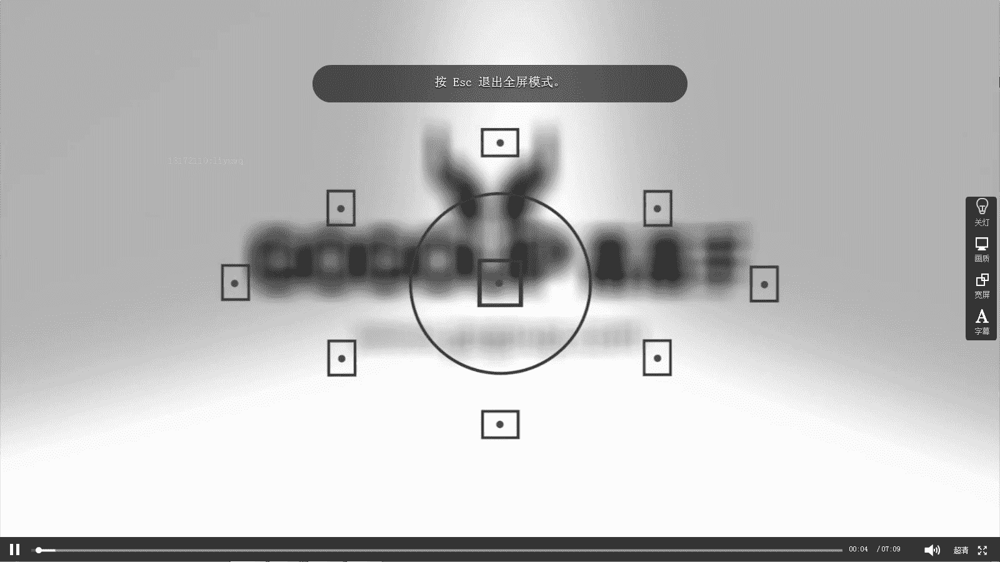
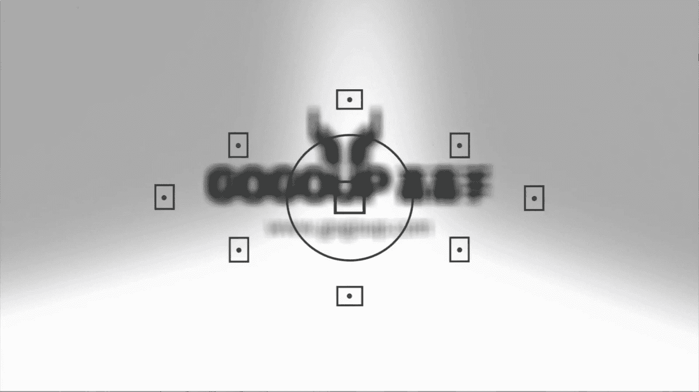

手机摄影教程：第05课：用手机做后期：课时3 · Camera+

在本节课中，我们将学习如何使用Camera+这款手机应用进行照片后期处理。我们将从导入照片开始，逐步探索其编辑功能、独特的旋转与裁剪工具、分离对焦与测光的拍摄模式，并重点讲解如何设置画质以保留最佳图像细节。

### 软件界面与照片导入

首先，点击屏幕上的Camera+应用图标进入软件。

以下是导入照片的步骤：
1.  点击界面右上角的加号（+）按钮。
2.  从相册中选择一张照片，例如一张横向构图的作品。
3.  勾选照片后，点击右下角的“导入”按钮，照片即被加载到应用中。

### 照片信息查看

导入照片后，界面底部有几个功能图标。点击“信息”图标，可以查看照片的基本参数，例如拍摄设备、尺寸、文件大小、快门速度、ISO感光度和曝光补偿（EV）值。这有助于了解照片的原始拍摄数据。

### 基础编辑功能

要进行照片调整或修饰，请点击“编辑”图标。软件会将照片载入编辑界面。

编辑界面下方提供了一系列场景模式选项，如清晰度、自动、闪光、肖像、美食、逆光、夜景、日光等。这些类似于相机的场景模式预设，但通常较少使用。例如，“清晰度”选项会自动应用调整，但用户无法手动调节参数，因此可以忽略此功能。

### 强大的裁剪与旋转工具

该软件的核心优势之一在于其裁剪和旋转功能。点击“裁剪”工具（图标为一个方框内带斜线）。

裁剪工具内提供了多种构图辅助线，例如黄金分割比例和方框图，帮助用户进行精确裁剪。例如，可以将照片裁剪为正方形构图。

更独特的是其“旋转”功能。这并非简单的90度旋转，而是允许进行精细的角度调整。

以下是旋转功能的操作方式：
1.  点击旋转工具（通常为弯曲箭头图标）。
2.  使用下方的滑块或按钮进行左右微调。
3.  此功能可以实现画面的左右翻转（水平翻转），这是许多其他软件不具备的。
4.  此外，还可以使用“拉直”工具来修正照片的水平线，通过拖动滑块使倾斜的画面变得水平。

### 分离对焦与测光的拍摄模式

除了后期处理，Camera+的拍摄模式也颇具特色。点击界面中的相机图标进入拍摄模式。

其强大之处在于可以将对焦点和测光点分离操作。

操作演示如下：
1.  在取景画面中，可以分别设定对焦点和测光点。
2.  将对焦点对准需要清晰的物体（如前景），然后将测光点拖动到画面中较暗的区域，整体曝光会变亮；若将测光点拖动到明亮区域，整体曝光则会变暗。
3.  这样可以在拍摄前就精确控制画面的清晰范围和明暗层次。

### 关键设置：画质选择

软件最重要的设置位于右下角，即三条横线的菜单图标内。点击进入设置页面。

在这里可以开关音量、添加网格线、水平仪或GPS地理标记。

最关键的设置是“画质”选项。点击“专业画质”右侧的感叹号可以查看说明。

专业画质（TIFF格式）采用无损压缩方式保存照片。这是非常关键的功能。

**核心概念**：`TIFF` 或 `RAW` 格式能最大程度保留图像的原始数据。虽然文件体积较大，但在后期输出和调整时具有极大优势，尤其是在需要专业打印或放大时。此外，无论经过多少次传输或导入导出，`TIFF`格式的图像质量都不会有损失。相比之下，`JPEG`格式每保存一次都可能因有损压缩导致画质下降，例如从3MB文件逐渐变为1MB或2MB。

画质选项通常有三种：
*   **优化**：可能限制图像长边像素，并进行压缩以节省空间，适合网络分享。
*   **高**：采用极低压缩率，类似于电脑处理中的“高”或“95%质量”效果。
*   **专业**：保存为`TIFF`格式。虽然占用空间大，但能最完美、最细致、最丰富地保证照片质量和画质细节。

对于重要作品，建议选择“专业”画质进行保存。

本节课中，我们一起学习了Camera+应用的基本操作流程。从导入照片、查看信息，到使用其独特的裁剪旋转工具进行构图修正，再到利用分离对焦与测光功能提升前期拍摄控制力。最后，我们重点探讨了画质设置的重要性，理解了选择`TIFF`无损格式对于保留最佳图像细节和进行严肃后期创作的价值。掌握这些功能，能让你的手机摄影后期处理更加得心应手。