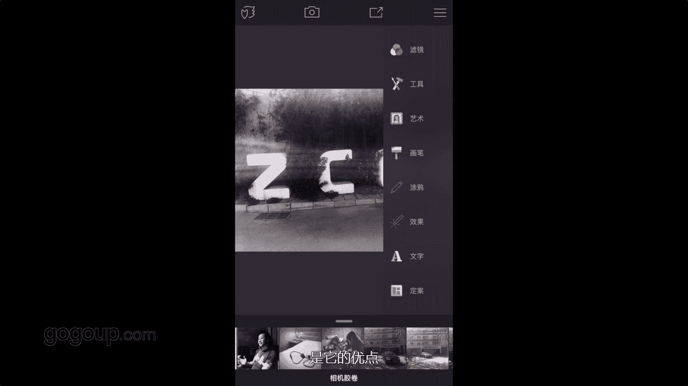

# 手机摄影教程：第05课：用手机做后期：课时4 · Enlight

在本节课中，我们将学习如何使用Enlight这款手机应用进行照片后期处理。我们将重点介绍其核心功能，包括导出设置、图像调整、滤镜应用、文字添加以及创意特效，帮助你掌握提升照片质量的实用技巧。

## 🦊 界面导览与基本设置

上一节我们介绍了后期处理的基本概念，本节中我们来看看Enlight的具体操作。启动Enlight应用后，首先会看到主界面。左上角有一个狐狸图标，点击它会启动一个交互式导览，引导你了解软件的基本操作。这个导览非常直观，建议初次使用者跟随学习。

主界面上方还有相机图标和保存箭头图标。左侧的三条横线图标用于打开或关闭工具栏。

接下来，我们进入关键的系统设置。点击左上角的狐狸图标进入设置菜单，这里可以调整相机保存位置和GPS定位。其中，“导出质量”选项至关重要。

以下是导出质量的详细说明：
*   **JPEG格式**：提供从75%到95%的质量滑块。选择95%时，虽然画质较高，但仍属于有损压缩格式。
*   **PNG格式**：这是一种无损格式，但文件尺寸通常较大。
*   **TIFF格式**：这是推荐选项，尤其是将滑块拉到最大时。下方还可以选择导出尺寸（如1MB、4MB、16MB）。经过Enlight处理并保存为TIFF格式的手机照片，文件大小可能会达到18-20MB，这能最大程度地保留画质细节。

## 🛠️ 核心编辑功能详解

了解了基础设置后，我们开始对一张照片进行实际编辑。导入照片后，点击右上角的三条横线图标即可打开编辑工具栏。

工具栏中，“图像”选项用于基础调整。在这里，你可以调整照片的清晰度。清晰度调整下方有映射控制，你可以针对中性区域或进行锐化处理。通过滑动手指，可以控制调整的强度百分比，从而精细地改变明暗或调整效果的强弱。

接下来，我们看看强大的滤镜功能。点击“滤镜”，你可以看到“模拟胶片”和“黑白”等多种选项。以黑白滤镜为例，它提供了多种不同风格的黑白效果。关键的是，应用滤镜后效果并非固定不变：你可以在图片中间区域左右滑动手指，实时调整滤镜应用的强度，这赋予了用户很高的自定义自由度。

## ✍️ 文字与创意工具

除了调整和滤镜，Enlight在创意表达方面也很出色。工具栏中的“文字”功能允许你添加文本或贴花。

以下是添加和编辑文字的具体步骤：
1.  点击添加文字，输入内容，例如“高手”。
2.  完成后，你可以选择不同的字体样式。需要注意的是，该软件对英文字体的特效支持更丰富，对中文特殊字符的支持可能有限。
3.  在屏幕上用两根手指做捏合手势，可以缩放文字大小。
4.  单指拖动文字，可以将其放置到画面任意位置。
5.  点击文字，下方会出现更多选项，可以调整字间距、颜色等。点击色块即可改变文字颜色，调整字间距可以控制字符间的拉伸效果。

另一个有趣的创意工具是“画笔”中的“涂鸦”功能。它允许你在照片上自由绘制。

涂鸦效果中有一个特别出色的功能叫“鸟群”。使用此效果在画面上涂抹，可以生成飞鸟的图案，为照片增添动态和故事感。你可以通过涂抹控制鸟群出现的位置和范围，如果对效果不满意，也可以用橡皮擦工具进行局部或全部擦除。这个工具非常适合用来制作双重曝光效果或添加创意元素。

## 📝 总结与个人偏好

本节课中，我们一起学习了Enlight应用的核心后期处理功能。我们介绍了如何设置高质量的导出选项（尤其是TIFF格式），掌握了图像清晰度调整和可调强度滤镜的使用方法，实践了添加与自定义文字的技巧，并体验了“鸟群”等创意特效的玩法。

就我个人而言，我偏爱Enlight的主要原因在于两点：一是其高质量的无损TIFF格式导出功能，能最大限度保留照片细节；二是其强大且灵活的文字添加工具，为照片增色不少。希望本教程能帮助你更好地利用这款工具，提升手机摄影的后期创作能力。

