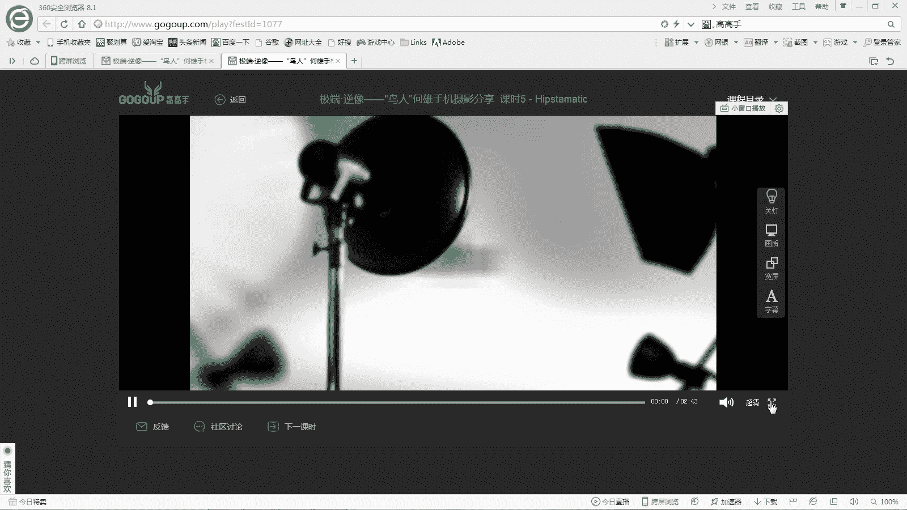

# 何雄-手机摄影教程：第05课·用手机做后期：课时5 · Hipstamatic

在本节课中，我们将要学习一款名为Hipstamatic的手机摄影后期应用。这款应用以其强大的胶片模拟功能而闻名，能够为照片赋予独特的复古风格和艺术效果。我们将介绍它的基本拍照功能、图库管理以及核心的滤镜特效系统。

## 软件概览与拍照功能

上一节我们介绍了其他后期应用，本节中我们来看看Hipstamatic。这是一款功能强大的胶片模拟相机软件。

打开软件后，它同样具备拍照功能。但该功能的操作方式与其他相机应用有所不同。

以下是其拍照功能的特点：

*   **自动曝光与对焦**：在拍照模式下，软件采用全自动测光和对焦，用户无法通过触摸屏幕手动选择对焦点。
*   **变焦与对焦感**：虽然无法手动选择对焦点，但可以通过手势进行变焦。其对焦过程模拟了传统相机的感觉，类似于使用长定焦镜头。
*   **专业模式（M档）**：界面下方有一个类似“M”的标识，代表手动或专业模式。在此模式下，用户可以对一些参数进行调整，例如针对风景或人像的预设。
*   **画幅比例**：软件支持多种画幅比例拍摄，如1:1、4:3、16:9、3:2等。用户可以在左下角的设置中进行选择。

## 图库管理与基础操作

了解基本拍摄后，我们进入图库查看已拍摄的照片。图库界面是进行后期处理的起点。

在图库中选择任意一张照片，即可进入编辑视图。软件界面设计直观，功能区域划分明确。

以下是图库与编辑界面的主要功能：

*   **全部照片**：查看所有已拍摄的图片。
*   **删除与收藏**：可以对照片进行删除或添加星标收藏。
*   **滤镜入口**：界面上的三个小圆点图标是进入庞大滤镜系统的关键入口。

## 核心滤镜系统详解

Hipstamatic最强大的部分在于其滤镜系统。它提供了海量的镜头与胶片组合，能够创造出上百种独特的视觉效果。

滤镜系统允许用户自由搭配不同的“镜头”和“胶片”模拟效果，并可以将常用组合设置为“最爱”以便快速调用。这些组合能极大地改变照片的影调和风格。

在众多效果中，有一个名为“石板”（Slate）的滤镜效果非常值得推荐。它能赋予照片一种传统、古老且质感强烈的视觉效果，是营造复古风格的优秀选择。

选择“石板”效果后，用户可以看到基于该效果的一系列具体样式变体。这些变体在色调、对比度和颗粒感上略有不同，提供了更精细的调整空间。

本节课中我们一起学习了Hipstamatic这款胶片模拟相机应用。我们了解了其自动化的拍照特性、直观的图库管理，并重点探索了它庞大而强大的滤镜特效系统，特别是“石板”等经典效果的运用。通过灵活使用这些工具，你可以轻松为手机照片添加浓郁的复古艺术气息。