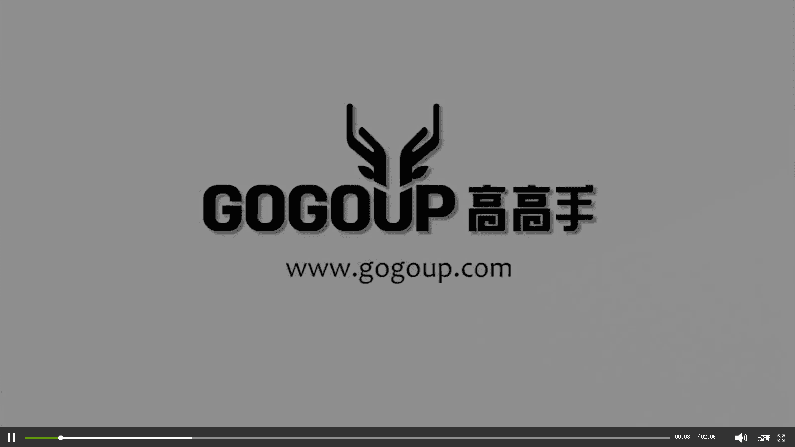

手机摄影教程：第05课：用手机做后期：课时6 · Union

在本节课中，我们将要学习一款名为Union的手机后期合成软件。这款软件主要用于图像合成，可以制作出网络上常见的合成照片或具有重曝效果的作品。我们将了解它的核心优势、基本界面以及后续会深入学习的实用技巧。

## 软件核心优势 🏆

上一节我们介绍了Union是一款合成软件，本节中我们来看看它相较于其他工具的核心优势。

Union软件的一个强大之处在于它对图像尺寸的处理。使用该软件进行合成时，它不会压缩照片的尺寸。这意味着它能保证输出图片的原始像素大小。对于摄影师而言，保留照片的最大尺寸是一个核心要求，因为这与后续的打印、展示或进一步编辑的质量息息相关。因此，Union的这一特性使其成为高质量手机后期合成的可靠选择。

## 界面与功能概览 📱

了解了核心优势后，我们点开软件，初步浏览一下它的界面和基本功能。

以下是软件主界面的几个主要部分：

*   **官方演示**：进入应用后，首先看到的通常是官方的示例作品，用于展示软件的可能性。
*   **前景/背景与蒙版**：软件的核心操作区涉及前景、背景和蒙版的概念。如果你曾学习过PS或其他图像处理软件，对此会比较容易理解。简而言之，你可以通过蒙版来控制不同图层的显示与隐藏，从而实现合成。
*   **图层混合模式**：软件提供了多种图层混合模式，例如正片叠底、亮度叠加等。这些模式决定了上下两层图像以何种方式进行混合，是创造特殊效果（如重曝）的关键。
*   **合成与调整**：你可以通过调整图层位置、透明度以及使用各种工具，对合成后的图像进行精细化处理，实现富有创意的视觉效果。

例如，你可以拍摄一张叶子的照片作为前景并抠图，再拍摄一张人像作为背景。在Union中，将叶子前景叠加到人像背景上，并通过调整混合模式（如“正片叠底”），就能轻松创造出独特的合成效果。

## 后续学习预告 🔮

本课时只是对Union软件的一个快速介绍。在随后的课程中，我们将和大家详细分享如何使用这款软件进行抠图与合成的实用技巧。

我们将深入讲解以下常用功能：
*   如何精确地抠出图像主体。
*   不同混合模式的实际应用场景。
*   合成过程中的图层管理技巧。
*   制作高级重曝效果的具体步骤。

---

本节课中，我们一起初步认识了Union这款手机图像合成软件。我们了解到它的核心优势在于能无损保留图像尺寸，并概览了其通过前景、背景、蒙版和混合模式进行创意合成的基本工作流程。在接下来的课程中，我们将通过实践操作，掌握用它制作精美合成作品的实用技巧。