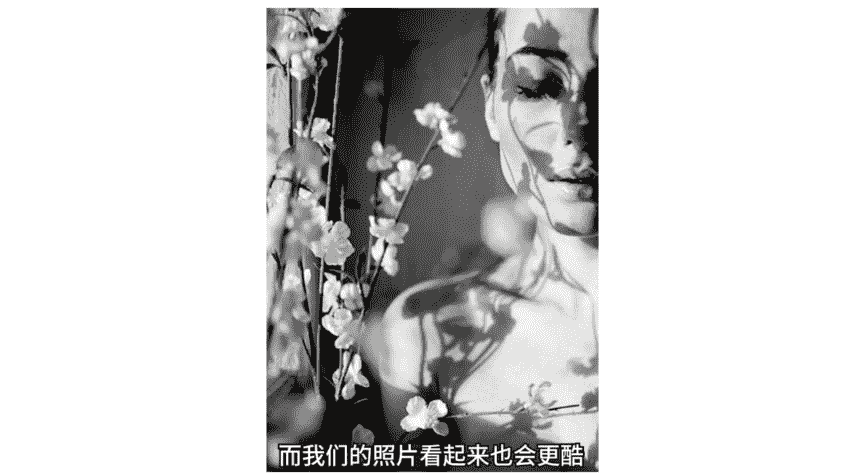

# 小北手机摄影课堂：11期：综合实战：教男友拍出酷酷的自己！📸


在本节课中，我们将学习如何拍摄并后期处理酷酷风格的照片。课程将分为三个核心部分：**服装搭配**、**拍照姿势**以及**后期修图**。我们将从前期准备开始，逐步深入到拍摄技巧和图片调整，帮助你掌握一套完整的酷照拍摄流程。

---

## 第一部分：服装搭配 👕

上一节我们介绍了课程的整体结构，本节中我们来看看如何通过服装搭配来营造酷感。合适的服装是打造酷照风格的第一步。

以下是打造酷酷造型的服装搭配要点：

1.  **首选黑色系**：黑色能体现内敛、神秘和强大的气场，是营造酷感最直接有效的颜色。即使不露脸，一套黑色搭配也能拍出酷酷的照片。
2.  **运动风元素**：棒球服、连帽衫等运动风衣着能体现少年感。拍摄时可以让模特面无表情地戴上卫衣帽子，按下快门即可。
3.  **利用服装细节**：可以借助卫衣上的金属元素或帽子细绳等细节来辅助造型。
4.  **展现身材优势**：如果你身材较好，穿着健身衣进行拍摄，效果会很酷。
5.  **尝试 Oversize 风格**：宽松的男友风衣服不仅能拍出酷感，还能带来安全感。或者，披上一件酷酷的黑色大衣。
6.  **制造视觉层次**：利用内外衣的长度差，可以在视觉上提高腰线，让腿显得更长。
7.  **巧用拍摄角度**：如果背景普通（如砖墙），可以从人物前侧面45度角拍摄，营造纵深感，从而突出主体。


除了服装，一些配饰也能极大提升酷感。以下是推荐的扮酷单品：

*   **鸭舌帽**：常与时尚风结合，是许多时尚达人的搭配利器。
*   **墨镜/时尚镜框**：墨镜能自带冷酷感，修饰眼神。在阳光不强时，可以选择时尚的大镜框，同样能扮酷并修饰脸型。
*   **牛仔衣**：披在肩上即可轻松变酷，正面或背面拍摄都适用。
*   **纹身（贴）**：纹身个性十足。如果不想永久纹身，可以使用纹身贴。
*   **滑板**：代表年轻、力量与自由，是很好的酷感道具。

---

## 第二部分：拍照姿势与构图 🕶️

掌握了服装搭配后，我们需要学习如何摆出酷酷的姿势。避免千篇一律的“剪刀手”，尝试以下姿势会让你的照片更有风格和情绪。

以下是针对不同情况的拍照姿势建议：

*   **冷漠脸/面瘫脸**：不需要刻意做表情，保持平常的面无表情即可。爱笑的人只需注意“憋住不笑”。
*   **抬头与低头**：
    *   **抬头**：做出抬高头仰视一切的姿势，显得居高临下。
    *   **低头**：做低头不开心的表情，或用头发遮住大部分侧脸，带有文艺气息。
*   **侧脸拍摄**：侧对镜头，拍摄冷漠的侧脸。可以尝试将人物置于画面左侧三分之一处，增加情绪感。
*   **抓拍自然状态**：对于羞涩的模特，可以先通过抓拍转头、甩头发等瞬间让其进入状态。
*   **不露脸拍法**：
    *   **用道具遮挡**：用手机、帽子等道具挡住脸部。
    *   **拍摄背影**：将人物融入环境，形成有故事的画面，无需管理表情。
*   **自然抬手**：不经意地抬起手，增加照片动感和自然度。注意动作幅度要小。
*   **借助环境光影**：捕捉或利用阴影（如窗户纹理、花朵投影），能让照片更有故事感和情绪。

除了具体姿势，针对日常的站、坐、蹲姿，可以记住三个口诀：

1.  **站姿歪头**：头部和身体向同一方向倾斜，酷感十足。可以随意晃动寻找最自然的状态。
2.  **坐姿翘腿**：翘起二郎腿，可以不动声色地秀出腿型，带着一点小心机。
3.  **蹲姿双脚撑**：双脚着地蹲着或坐在地上，搭配冷漠脸，在帅气和冷酷间切换。

---




## 第三部分：后期修图与调色 🖌️

完成前期拍摄后，后期修图是强化酷感风格的关键。本节我们将学习如何使用修图软件进行人像修饰和色调调整。

### 人像形体塑造

我们使用**瘦脸瘦身**功能来优化体型，塑造更完美的身材。核心思路是：**推拉形体，同时注意光影和周围环境的协调**。

以下是操作步骤：

1.  **分析问题**：打开照片，观察人物体型需要优化的部位（如手臂臃肿、背部厚实）。
2.  **调整手臂**：
    *   选择适当的笔刷力度，将粗壮的手臂部位向内、向下推。
    *   **关键点**：同时调整手臂上的光影，使其随着形体变化而自然移动，避免失真。公式可以理解为：`调整后光影位置 ≈ 原始光影位置 + 形体位移向量`。
3.  **调整背部与肩线**：将背部向右推以显薄，同时注意保持肩带平直，如果推弯了需要手动修正。
4.  **调整头部与发型**：如果头发显得厚重，可以向下、向内推，让头部视觉上更小巧精神。
5.  **优化服装与环境**：不局限于修饰人体，酷感的服装（如牛仔外套）也可以适当向外拉伸，增加画面张力。同时注意修正因推拉导致的环境线条（如墙壁）变形。

### 照片色调调整

酷照的色调通常对比强烈、清晰，并带有冷峻或胶片感。我们通过基础调整工具来实现。

以下是调色步骤与参数思路：

1.  **基础曝光**：如果原图较暗，适当增加`曝光补偿`。
2.  **增强对比**：大幅增加`对比度`，让照片明暗反差更强烈，这是酷照的关键。
3.  **提升清晰度**：增加`锐化`值，让人物发丝等细节更清晰。
4.  **营造胶片感**：适当增加`褪色`，为照片加入灰度，模拟胶片质感。
5.  **调整色彩倾向**：
    *   **色温**：向**左**滑动（降低色温），让画面偏**冷**色调。
    *   **色调**：根据喜好微调，向左偏绿，向右偏紫。
6.  **突出主体**：增加`暗角`，使画面四周变暗，让视线更集中于中心人物。

**调色参数示例（仅供参考，需根据原图调整）**：
```
曝光补偿：+2
对比度：+25
锐化：+5
褪色：+15
色温：-5
暗角：+10
```

---

## 总结 📝

本节课我们一起学习了欧美风酷照的完整创作流程。我们从**服装搭配**入手，选择了黑色系、运动风等单品；然后学习了多种**拍照姿势**，如冷漠脸、侧脸、背影以及站坐蹲的口诀，避免了单一的剪刀手；最后，通过**后期修图**，我们塑造了更佳的形体，并调整出对比强烈、清晰冷峻的酷感色调。

希望大家能根据本节课的内容多加练习，将理论转化为实践。记住，拍照时可以面瘫，但请别再比剪刀手了。