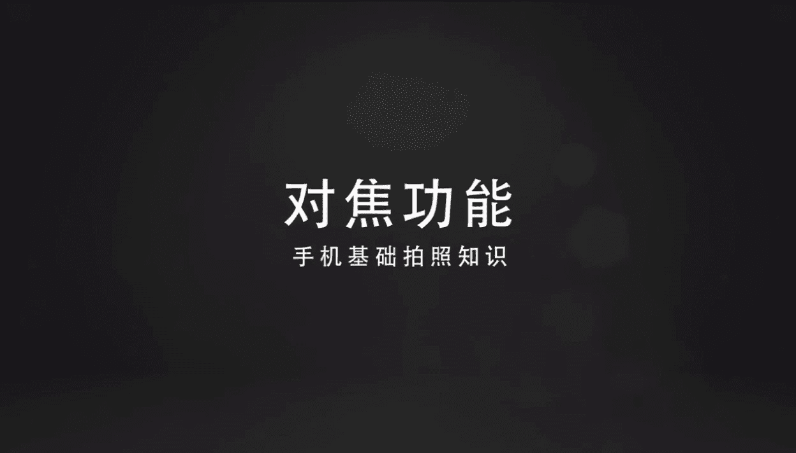
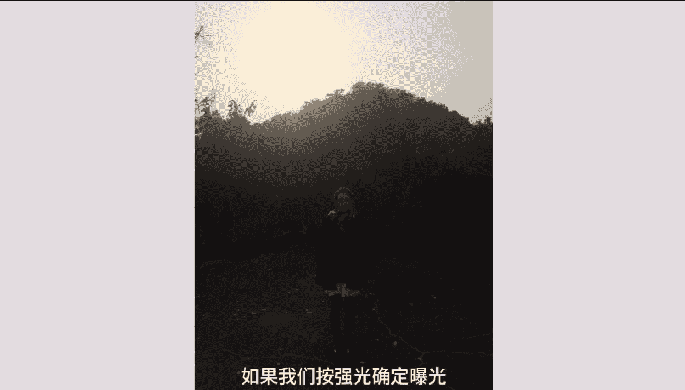
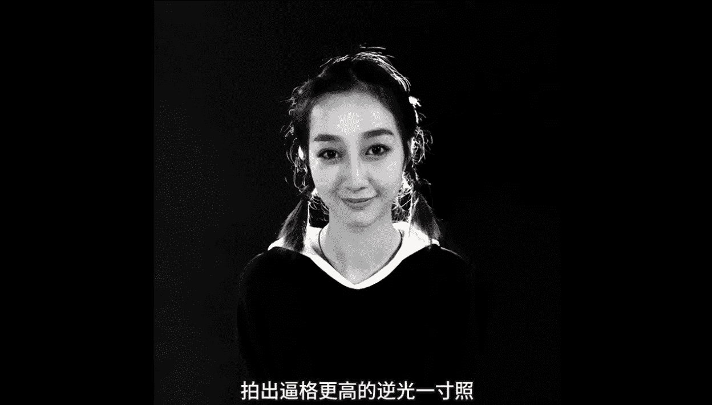
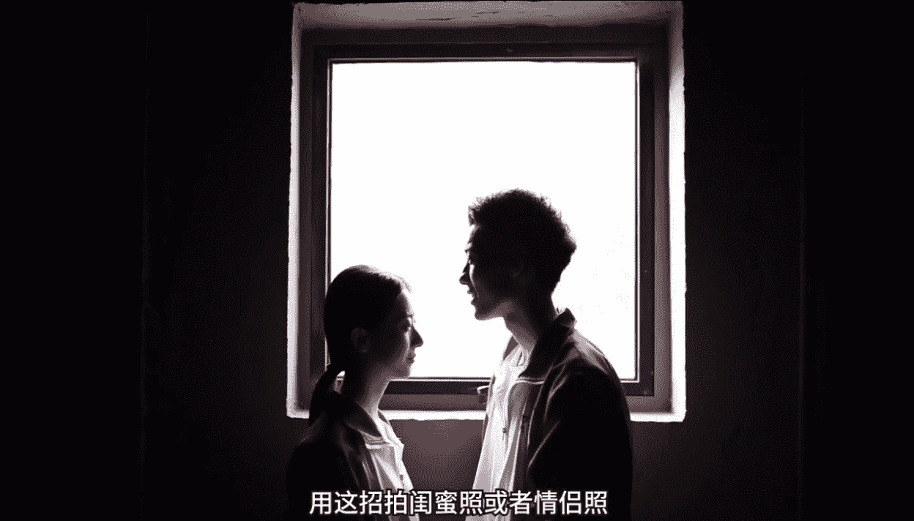
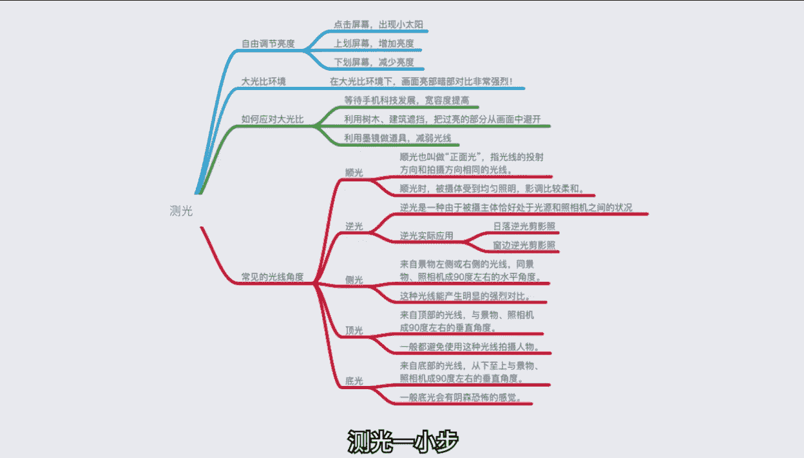
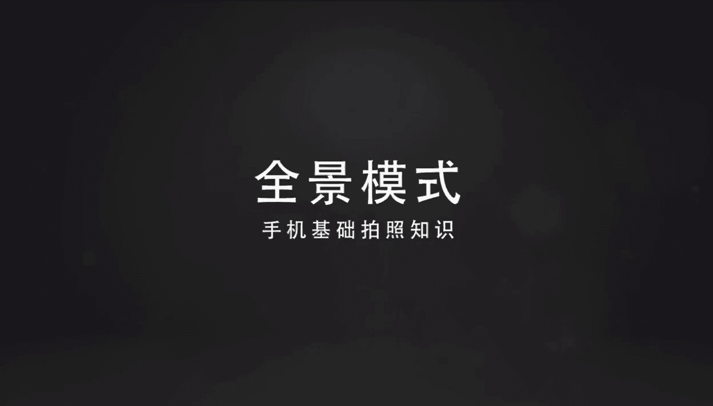
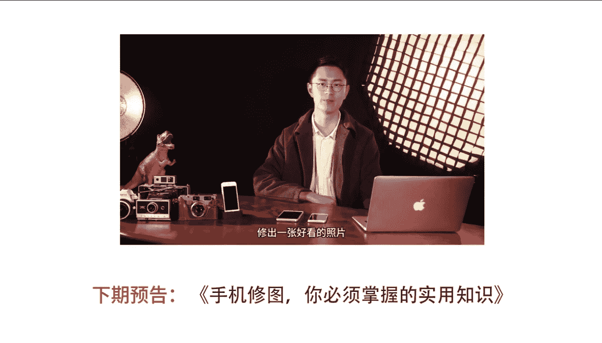

# 手机摄影正课：第1期：第一节：熟悉你的手机相机 📱

在本节课中，我们将从零开始，学习手机摄影最核心的基础操作。你将了解如何利用手机的对焦、曝光控制、拍摄模式等基础功能，拍出清晰、有创意的好照片。

---

## 对焦：拍出清晰主体的关键 🔍

对于日常拍照记录生活，最基本的要求是把主体拍清晰，也就是对焦准确。对焦，也叫对光聚焦，是通过相机内的对焦结构变动物距和像距的位置，使被拍物体成像清晰的过程。通常我们都希望拍摄的主体是**实焦**清晰的。

好消息是，现在几乎所有主流智能手机都可以通过点击屏幕的方式进行对焦。**点击哪里，就对焦哪里**。例如，当画面中有前后两个人时，点击后面的人，手机就会对焦到后面的人，前面的人就会虚化；再点回前面的人，后面的人就会虚化。

下面我们以桌面上的前后两台相机为例，演示如何只用一部手机拍出具有虚实对比的照片。

1.  **回顾对焦过程**：打开手机相机，两指滑动屏幕放大一些，便于观察。
2.  **点击对焦**：点击后面的相机（小白），小白就变得实焦清晰了。点击前面的相机（小红），小红就变得实焦清晰，而这时小白就虚焦模糊了。

明白了实焦和虚焦之后，我们要做的很简单：**点击屏幕进行对焦，然后按下快门拍照即可**。利用这个功能，我们可以轻松拍出具有虚实对比、突出主体的照片。

---

## 虚焦：创造朦胧美感的艺术 🌌

那么，是不是一定要对焦准确的照片才是好照片呢？当然不是。有时候我们故意制造一些虚焦效果，照片也会很出彩。例如，晚上饭店外面的灯光在虚焦效果下会变成色彩斑斓的光斑，可以把平常杂乱的场景变成一种朦胧的美感。

手机如何拍出虚焦效果呢？以下是两种常用方法。

### 方法一：使用专业模式（适用于有该模式的手机）

以下是操作步骤：

1.  打开手机相机，准备拍摄。
2.  点击右上角或类似图标，选择进入相机的**专业模式**。
3.  找到**焦距**（MF）选项，然后横向拨动焦距滑块。

此时，画面会因为焦距的变化而产生虚实变化。如果放大画面，效果会更明显，周围环境的灯光会变成彩色光斑。

**原理分析**：焦距滑杆左边端点写着“近”，右边写着“远”。
*   当我们将滑块从“远”拉向“近”时，对焦点在近处，近处实焦，而远处的灯光就虚焦变模糊了。
*   当我们将滑块从“近”拉向“远”时，对焦点到了远处，远处的灯光就变清晰（实焦）了。

目前OPPO、vivo、华为、小米、努比亚等部分机型都内置了专业模式。

### 方法二：锁定近处对焦（适用于所有手机，包括iPhone）

如果手机没有专业模式，可以尝试此方法：

1.  打开相机，此时画面中的灯光都是实焦的。
2.  让小伙伴把手放到手机镜头前很近的地方。
3.  点击屏幕，对手部进行对焦，然后**用手指长按屏幕约1.5秒**，锁定对焦。
4.  将手移开，放大画面，就会看到原来实焦的灯光变虚了。

**关键点**：长按屏幕锁定对焦在近处的手上。移开手后，对焦点依然锁定在近处，因此远处的灯光就自然虚化了。

---

## 错位摄影：对焦与透视的趣味结合 🤹

对焦功能结合“近大远小”的透视原理，可以拍出好玩的错位照片。

*   **示例一**：近处放置一个水瓶，远处的小伙伴假装踢到水瓶。拍摄时，手机尽量保持低角度，并确保**对焦点在远处的人物身上**。
*   **示例二**：让一个远处的小伙伴原地举起“1吨空气”，近处的小伙伴脚跟撑地，拍出要被踩死的图片。同样，要保证对焦点在人物身上。

**拍摄要点分析**：在拍摄错位照片时，前景（如水瓶、脚）和后景（人物）之间必然有距离，手机会不可避免地虚化其中一部分。因此，**将对焦点设置在后景人物身上**，保证人物清晰，照片的错位效果才会显得真实。

掌握了这个技巧，可以发挥更多创意，比如在前景放置一只恐龙玩具，设计好动作，拍出“打恐龙”的趣味照片。

---

## 曝光控制：掌握照片的明暗 🌞

说完了对焦，我们再讲讲同样能够决定照片成败的光线控制。我们常会遇到光线过亮或过暗的情况。其实你的手机可以自由控制曝光。

操作很简单：**点击屏幕进行对焦后，在焦点旁会出现一个小太阳图标。向上拖动小太阳可以增加亮度（补光），向下拖动可以降低亮度（减光）**。

虽然手机可以调光，但我们拍照时还是要尽量避免在**大光比**的环境下拍摄。大光比是指画面中亮部和暗部的亮度差异极大。

*   **问题**：如果按强光处确定曝光，暗部就一片死黑；如果按暗部确定曝光，亮部就一片死白。“死黑”和“死白”意味着后期也无法挽回细节。
*   **解决办法**：
    1.  **避开过亮部分**：将过亮的天空从画面中避开，或用树木、建筑等遮挡，从而减小光比。
    2.  **使用辅助工具**：可以给手机镜头戴上墨镜或使用ND滤镜（相当于给手机戴墨镜），能有效防止过曝。

---

## 光线角度：塑造照片的氛围 💡

除了光比，光线的照射角度也极大地影响照片效果。以下是几种常见的光线角度：

1.  **顺光**：光照方向与拍摄方向一致。画面明亮，细节清晰，但立体感较弱。
2.  **逆光**：光源在被摄主体后方。这是创造氛围的利器。
    *   **逆光发丝**：在室内，可以用手机闪光灯作为逆光光源放在人物正后方，打亮头发边缘。
    *   **剪影**：在日落时或窗前，让被摄主体背对强光。由于背景很亮，前景会变暗形成剪影，强调轮廓和形态。
3.  **侧光**：光源从人物侧面照射。会产生强烈的明暗对比，被称为“质感照明”，能突出物体的纹理和立体感。
    *   **注意**：吃饭时靠窗坐，容易形成“阴阳脸”。只需往里坐一点，让光线更均匀即可。
4.  **顶光与底光**：通常需要避免。
    *   **顶光**（如正午阳光）：会在眼窝、鼻子下产生难看的阴影。
    *   **底光**（从脚下往上照）：会产生阴森、恐怖的效果，慎用。

**总结**：摄影是用光的艺术。了解并运用好不同角度的光线，能让你的照片立刻提升一个档次。

---

## 拍摄技巧：不止是按下快门 ✨

解决了对焦和光线，接下来就是怎么拍。拍照不仅仅是按快门，还有一些提升效率和效果的小技巧。

*   **快门方式**：
    *   自拍时，按音量键可以代替屏幕快门，更方便。
    *   抓拍运动瞬间时，**长按快门键**可以连拍，轻松捕捉完美跳跃照。
*   **拍摄角度**：
    *   拍摄跳跃等动作时，**采用低角度仰拍**，能让跳跃看起来更高、更有冲击力。
    *   尝试将手机举高，摄像头朝上仰拍树林、天空，会发现不一样的视角。
*   **特殊模式**：
    *   **慢动作**：可以将快速动作放慢，适合拍摄水流、飞溅的水花等，创造诗意或戏剧性效果。
    *   **全景模式**：除了拍广阔风景，还能拍“分身照”。拍摄时，模特在镜头扫过前跑到下一个位置摆好姿势，从摄影师身后绕回，重复几次即可。

---

## 视频录制：让动态瞬间更生动 🎥

现在朋友圈也支持上传视频，因此学会用手机录像也很重要。

*   **推荐App：VUE**：操作简单，拥有丰富的滤镜和画幅比例（圆形、电影宽幅等）可供选择，能轻松提升视频质感。
*   **拍摄技巧**：
    *   和对焦一样，点击屏幕选择对焦点。
    *   左右滑动挑选喜欢的滤镜。
    *   引导模特，然后开始录制。
*   **创意技巧**：将塑料袋、烟盒塑料纸等半透明物放在镜头前，可以拍出柔光、朦胧的梦幻效果，适用于视频和照片。

---

## 总结与练习 📝

本节课我们一起学习了手机摄影的几项核心基础操作：
1.  **对焦**：点击屏幕，指哪打哪，是拍清晰照片的基础。
2.  **虚焦**：通过专业模式或锁定近处对焦，可以主动创造朦胧美感。
3.  **错位摄影**：结合对焦和近大远小原理，拍摄趣味照片。
4.  **曝光控制**：拖动小太阳图标，调整画面明暗，避免大光比环境。
5.  **光线运用**：了解顺光、逆光、侧光等不同光线角度的特点及效果。
6.  **拍摄技巧**：利用连拍、低角度、特殊模式（慢动作、全景）提升出片率。
7.  **视频入门**：使用VUE等App和简单技巧，开始记录动态影像。

再复杂漂亮的照片，也是通过这些基础功能组合而成的。希望大家课后多加练习，熟练掌握自己手机相机的这些功能。相信你自己和你手中的手机，没有什么照片是拍不好看的。如果有，我们下节修图课再见！