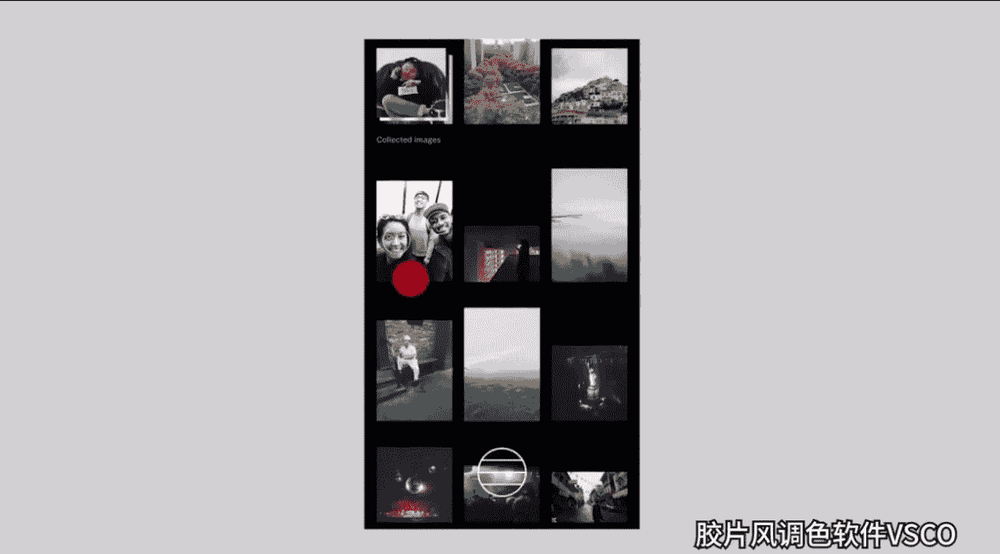
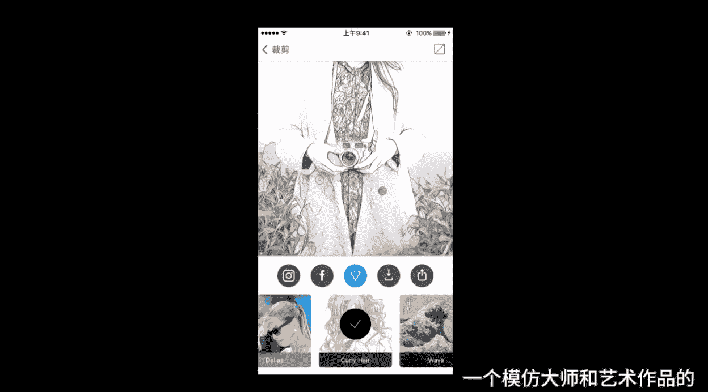
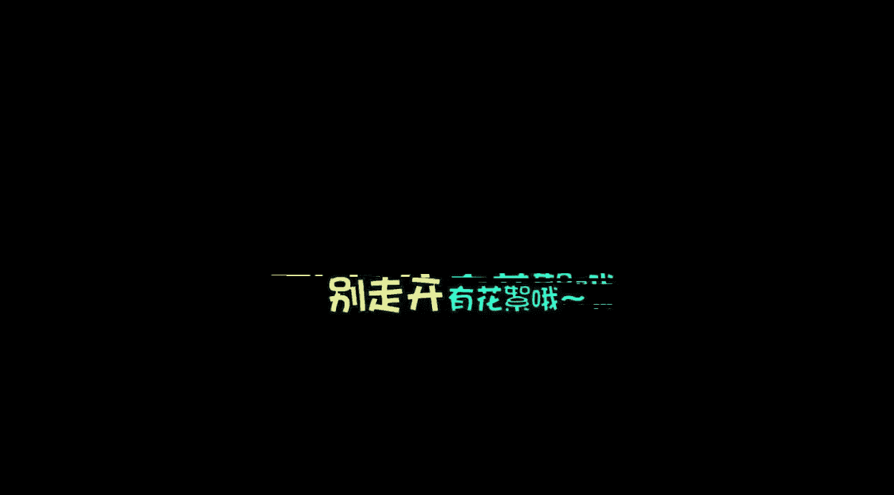

# 小北手机摄影课堂：第2期：第二节：手机修图APP入门与VSCO调色实战 🎨

在本节课中，我们将要学习手机修图的基础知识，了解不同类型的修图APP，并重点掌握使用VSCO进行照片调色的完整流程。课程内容简单直白，旨在让初学者能够快速上手。

## 概述

本节课将分为三个主要部分。首先，我们将系统性地介绍五大类常用的手机修图APP及其核心功能。接着，我们会深入讲解被誉为“滤镜之王”的VSCO软件的基础操作与核心调色思路。最后，我们将通过两个具体的案例——日系小清新风格和暗调城市风格——来实践完整的修图流程。

---

## 常用手机修图APP分类 📱

很多人的手机里装满了各种APP，但常用的可能只有一两款。实际上，修图软件不在多，而在于精。根据核心功能，我将常用的修图软件分为以下五大类。

以下是五大类APP的详细介绍：

1.  **滤镜调色类**
    *   **核心功能**：主要用于照片的色彩、色调和风格调整。
    *   **代表软件**：VSCO、Snapseed、MIX滤镜大师等。
    *   **特点**：用户通过简单操作即可获得风格多样的调色效果。

2.  **美颜自拍类**
    *   **核心功能**：主要针对人像进行美化处理。
    *   **代表软件**：Facetune、B612、美图秀秀、美妆相机等。
    *   **特点**：提供磨皮、美白、瘦脸、祛斑、补妆（甚至模拟各种口红色号）等功能。后续会有专题课详细讲解。

3.  **贴纸标注类**
    *   **核心功能**：为照片添加文字、图形、相框等装饰元素。
    *   **代表软件**：黄油相机、VOUN、In等。
    *   **特点**：拥有丰富的模板和素材库，能快速让照片变得有趣或文艺。

4.  **特殊效果类**
    *   **核心功能**：实现双重曝光、艺术滤镜等特殊视觉效果。
    *   **代表软件**：Fused、Prisma、PixArt等。
    *   **特点**：PixArt功能尤为全面，几乎可以实现你能想到的各种效果。

5.  **拼图排版类**
    *   **核心功能**：将多张照片组合排版，制作海报或杂志风格图片。
    *   **代表软件**：简拼、留白、以及一款模板超多的拼图APP（如Layout from Instagram）。
    *   **特点**：提供大量精美模板，能轻松排布多张照片，尤其适合中文排版。

对于日常修图，无需安装所有APP。每个类别保留3到5款最好用的即可。接下来的课程，我将从每个类别中挑选最值得使用的APP进行详细演示。

---

## VSCO 滤镜调色详解 🎛️

在了解了APP的大致分类后，我们首先来学习修图界的“扛把子”——滤镜调色类APP。这类APP数量众多，该如何选择？我认为有三个关键衡量因素：**滤镜的数量与质量**，以及**留给用户的自定义操作空间**。基于这些，我重点推荐VSCO这款APP。它集相机、相册管理和多种仿胶片滤镜于一身，如果手机里只留一款修图APP，我会选择它。

### VSCO 基础操作指南

首先，我们学习VSCO的基础操作。打开软件后，首先进入的是相册面板。首次使用时，可以点击右上角的“+”号导入图片。VSCO支持批量导入。

> **提示**：导入到VSCO相册的图片独立于系统相册。手机空间不足时，可将喜欢的照片导入VSCO后删除系统原图，以节省空间。同时，使用VSCO管理图片也能提升选图效率。

VSCO相册的操作很便捷：
*   **双击**：查看单张图片。
*   **滑动**：浏览图片。
*   **双指**：放大或缩小图片。
*   **长按**：快速预览大图，松手返回。

**高效选图技巧**：当需要从大量照片中挑选几张时，可以使用“长按预览”功能。长按图片预览，觉得好看就点击一下选中（图片右下角会出现勾选标记），可以连续选择多张。筛选完毕后，点击右下角的“…”按钮，即可**批量导出**到手机相册或**批量删除**不喜欢的图片。

### 调色面板与核心功能

双击进入一张图片，点击底部第二个图标（滑块图标）即可进入调整面板。面板下方是滤镜库，上方是参数调整区。

通过**上滑图片**或**点击底部小三角**可以调出/隐藏底部菜单。菜单包含四个功能：

1.  **第一个图标（星星）**：收藏或查看已收藏的滤镜。
2.  **第二个图标（滑块）**：进入详细的参数调整面板，包括**亮度**、**对比度**、**饱和度**、**褪色**、**色调分离**等。
3.  **第三个图标（撤销箭头）**：撤销上一步操作。
4.  **第四个图标（时钟）**：查看操作历史记录，可以回退到任意一步。安卓版此处是“全部撤销”。

**一个重要的隐藏操作**：在编辑图片时，**长按图片任意位置**可以对比修改前和修改后的效果。这是一个很好的修图习惯。

> **小技巧**：除了内置滤镜，VSCO商店里还有几个免费的滤镜包可供下载，例如HB系列滤镜就非常实用。

---

## 实战案例一：调出日系小清新风格 🌿

掌握了基础操作后，我们进入实战环节。本节我们将学习如何调出日系小清新风格的照片。首先，我们需要理清思路：这种风格通常具有**画面明亮**、**反差小（柔和）**、**色彩清淡**三大特点。我们的调整将围绕这三点展开。

### 风格特点与参数对应

1.  **画面明亮**：对应提高 **`曝光度`**。也可以使用 **`阴影补偿`** 功能有针对性地提亮暗部。
2.  **反差小，画面柔和**：对应降低 **`对比度`**。还可以使用 **`高光减淡`** 来压暗过亮的高光区域，进一步减少反差。
3.  **色彩清淡**：可以适当降低 **`饱和度`**。更推荐使用 **`褪色`** 功能，它能给画面蒙上一层灰色，柔和地降低色彩鲜艳度，效果更自然。

### 推荐修图流程：原始调整 → 添加滤镜 → 最终调整

很多人修图会直接套滤镜，但常发现效果不好。问题往往出在照片本身的曝光、对比等基础参数不佳。因此，我推荐以下流程：

**第一步：原始调整**
根据上述风格特点，先对原图进行基础校正。
*   提高 **`曝光度`**，让画面变亮。
*   使用 **`阴影补偿`** 提亮暗部（如案例中的草原）。
*   降低 **`对比度`**，减小明暗反差。
*   增加 **`高光减淡`**，压暗天空等高亮区域。
*   微降 **`饱和度`**，并增加一些 **`褪色`**，让色彩变淡雅。
*   此时画面可能过于柔和，可轻微增加 **`清晰度`** 和 **`锐化`**，让轮廓更清晰（人像照片慎用高清晰度）。

**第二步：添加滤镜**
完成基础调整后，再进入滤镜库选择滤镜。这时你会发现，大多数滤镜的效果都比直接套用好很多。选择一款喜欢的滤镜应用。

**第三步：最终调整**
添加滤镜后，照片可能有些变化，需要进行微调。
*   再次微调 **`曝光`**、**`对比度`** 等参数。
*   调整 **`色温`**，控制画面冷暖倾向（小清新风格通常偏冷）。
*   可以添加 **`暗角`**，突出画面中心。
*   尝试 **`阴影色调`** 和 **`高光色调`**，为暗部或高光区域增添一抹颜色（如为天空的高光加一点蓝色）。

> **效率技巧**：当需要批量处理同一风格的多张照片时，修好一张后，点击右下角“…”选择 **`复制编辑`**，然后选中其他图片，再点击“…”选择 **`粘贴编辑`** 即可一键应用相同调整，非常方便。

---

## 实战案例二：调出暗调城市风格 🏙️

上一节我们学习了明亮的日系风格，本节我们来看看如何调出另一种流行的风格——暗调城市风。这种风格的特点是**整体亮度较低**、**反差较大**、**色彩厚重而不艳丽**。

我们以一张火车站照片为例。原图看起来灰暗平淡，我们的目标是让它变得有质感。

**第一步：原始调整**
*   降低 **`曝光度`**，压暗整体画面。
*   增加 **`对比度`**，解决“发灰”问题，增强反差。
*   轻微增加 **`褪色`**，防止暗部死黑。
*   增加 **`清晰度`** 和 **`锐化`**，让建筑轮廓更硬朗清晰。
*   降低 **`饱和度`**，让色彩不那么鲜艳。

**第二步：添加滤镜**
完成基础调整后，添加适合暗调风格的滤镜。VSCO中的 **F2**、**HB1**、**HB2** 等滤镜都是不错的选择。

**第三步：最终调整**
*   根据感觉再次微调 **`曝光`** 和 **`对比度`**。
*   如果反差过大，可再用 **`褪色`** 缓和。
*   最后添加 **`暗角`**，强化氛围感。

通过这个流程，一张普通的照片就能转变为富有质感的暗调城市风格作品。

---

## 其他优秀调色软件推荐：MIX滤镜大师 ✨

除了VSCO，还有许多优秀的调色软件。这里再推荐一款功能强大且易用的APP——**MIX滤镜大师**。它同样适用于苹果和安卓系统。

其界面底部有三个主要菜单：
1.  **裁剪**：可进行旋转、更改比例、拉伸、透视校正等操作。
2.  **滤镜**：滤镜库非常丰富，并按“反转胶片”、“电影色”、“人像”等具体风格分类，更直观易懂。
3.  **编辑**：这是功能工具箱，包含 **`曲线`**、**`色相饱和度`**、**`色调分离`**、**`色彩平衡`** 等高级调整工具。

**MIX的特色功能**：
*   **效果**：可为照片添加炫光、漏光等光效。
*   **纹理**：可以模拟“雨滴”、“天气”（下雪、下雨）等非常有趣的效果。

如果大家对MIX或其他软件的具体功能有深入学习的需求，可以在课程下方留言。

---

## 总结

本节课中，我们一起学习了手机修图的基础知识。首先，我们了解了五大类手机修图APP的分类和特点。接着，我们深入学习了VSCO的操作方法，并通过“原始调整 → 添加滤镜 → 最终调整”这一科学流程，实战演练了如何调出 **日系小清新** 和 **暗调城市** 两种不同风格的照片。最后，我们还认识了另一款功能强大的调色软件 **MIX滤镜大师**。

修图调色的关键在于多观察、多分析优秀作品的风格特点，并加以练习。希望大家能灵活运用本节课所学的流程和方法，多多实践。

> **提示**：如果需要课程中的图片素材进行练习，可以关注相关资源获取渠道。修完图后，也欢迎分享你的作品。