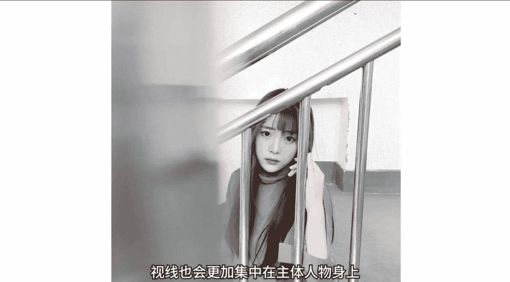
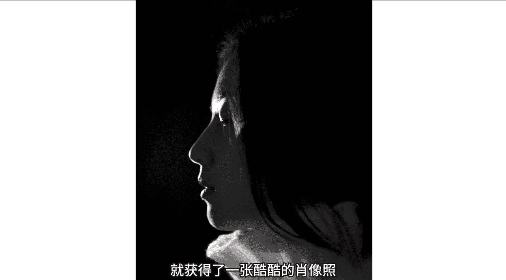
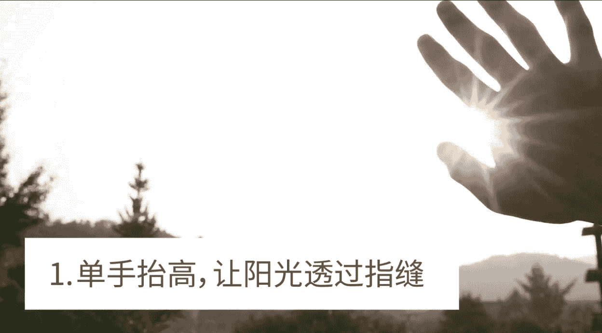

# 小北手机摄影课堂：第3期：第三节：在普通场景中拍出好照片 📸

在本节课中，我们将学习如何利用身边普通的场景和道具，结合摄影技巧，为照片增添色彩。上节课我们学习了手机摄影的基础操作，如对焦、测光和快门使用。本节课我们将重点探讨如何观察和利用环境，拍出构图巧妙、富有层次感的照片。

## 利用环境辅助构图 🏙️

上一节我们介绍了手机的基础操作，本节中我们来看看如何利用环境本身的特点来辅助构图。

首先，我们来到一个常见的破旧楼道场景。随手一拍的照片可能平淡无奇，像一张普通的“游客照”。

我们可以利用环境的特性去辅助拍照。例如，充分借助栏杆的延展性，从栏杆的一端采用低角度斜向拍摄。这时延伸出去的栏杆，刚好可以分割画面。

简单的变换角度，本来不起眼的栏杆就起到了辅助构图的作用。而之前的拍法，前面的栏杆部分反而显得多余，成了画面的阻碍。

另外需要特别提示，人们习惯或无意识地看到栏杆就想往上靠。作为一个新技巧，胳膊不要实实在在地放在栏杆上，而是可以偷偷地藏在后面，用手腕轻轻倚靠栏杆，这样手臂就不会那么抢戏。

在这里还要借助栏杆再补充几句。栏杆因为是直线型，所以很容易分割画面。我们在生活中也要多多留意。

以下是需要留意的线条状事物：

*   **电线**：头顶上普通的电线是典型的直线形，它可以很好地帮助我们分割画面。只要找到合适的位置，一条对角线也可以简单干净地将图片的主体（如小鸟）展现出来。
*   **斑马线**：人行道斑马线也是由一条条直线构成的，而大多数时候被我们踩在脚下，拍不出它的特点。当我们站在高处从上向下俯拍人行道时，就会发现一道道直线将整体画面进行了漂亮的分割。

我们在拍照时还要善于发现环境的特点，比如楼梯环境。

我们除了正面平拍，还可以充分利用楼梯特点，从高处向下俯拍。平常在外面找个高台俯拍很麻烦，而楼梯有天然的高低差，我们可以轻松得到一张俯拍视角的图片。

当我们找到了一个平常不经常使用的俯拍视角，先别着急。拍照时，我们仍然要时刻记得借助环境去辅助构图，比如利用栏杆切割画面。俯拍加对角线分割，马上就能跳出常规构图模式。

其实很多同学问我构图应该怎么去学习。我认为构图在很大程度上就是要善于发现环境特点，并加以利用。

这里教给大家一个练习构图的小方法。比如我想练习对角线构图，那么什么都不要想，这周只看只拍对角线构图的图片，一周下来必定会有所收获。所以想要学好构图的同学，咱们先给自己定个小目标，比如先拍它一个星期。

## 营造前景增加层次 🌿

在我们结合环境进行拍照时，还有一个常用的技巧就是营造前景。前景可以辅助构图，同时也可以使画面更有前后层次。

例如，我们将手机靠近栏杆，将它作为画面前景，找到合适的遮挡位置进行拍摄即可。

通过遮挡，视线也会更加集中在主体人物身上。其实我们生活中有很多地方可以利用到前景遮挡技巧。

以下是前景遮挡的应用实例：

*   **小树林**：拍照时，不要傻站着直接拍。我们尝试用竹子作为前景，手机贴近竹节即可。
*   **划分空间**：前景遮挡技巧还可以有效地划分画面空间。比如借助楼梯拐角的特点，我们可以将画面放置在一个V字形的空间内，前景遮挡有效地将注意力限制在了主体人物身上。
*   **利用门框**：或者利用两扇门作为前景遮挡，从而划分空间。主体人物由于前景的限制和引导，会更加突出。

## 引导模特与环境互动 😄

上一个章节咱们主要讲了利用环境来辅助构图。而在拍摄中，我们还可以引导模特融入环境，或者与环境产生互动，消除拍照时模特的紧张感和拘束感。

在我们的生活场景中，餐厅或者商场外面的玻璃窗、玻璃门随处可见。大多数时候我们与玻璃的互动就是拍个推门出来。

这里教大家一个利用玻璃逗开心大法，男女老少通用，专治各种不开心。很简单，我们引导模特把鼻子靠在玻璃上，这样你就得到了一个长着猪鼻子的小伙伴。

拍摄时，我们最好从正面平拍，以便突出猪鼻。

一般而言，当我们找到一个环境拍照时，首先要观察一下这些环境的特点。比如在咖啡厅这种偏文艺的场景，记住口诀：一杯咖啡一本书，一个慵懒的午后。当然，我们最好让模特坐在窗边，借助玻璃照片会更加文艺。

以下是文艺场景的拍摄思路：

*   **全景记录**：拿起咖啡眺望远方，我们拍摄全景将环境和人物纳入画面。
*   **特写记录**：或者从前侧45度记录认真看书的他。

另一个比较容易拍出慵懒文艺照片的是居家场景。

*   **生活瞬间**：早上起床伸个懒腰，开始美好的一天。
*   **安静时刻**：或者端起一杯热牛奶，安静的看几页杂志，享受属于自己节奏的生活。

另外，窗帘营造的朦胧效果，加上居家场景中的慵懒感觉，我们可以轻松拍出带有情绪的照片。

要特别注意的一点是，由于模特身后是窗外，窗外的光线比较亮，而我们是从室内向他拍摄，室内的光线又比较暗，所以我们要点击屏幕对焦，然后向上拖动滑竿，提升画面亮度，保证拍出的照片不会过暗。

很多人问，照片如何更好地表达情绪呢？其实很简单，我们要做的只是真的全身心地融入到某一个场景中。即使我们手中只有一个简单的ins相框道具，那么也要告诉自己，我就是网红，每一张照片就要接受万人点赞。

还有一个办法，我们可以将自己设置成一个旁观者的角色，让模特在某个环境中自由发挥，去展现自己最真实的那一面。

*   **记录真实**：如果早晨的树林很冷，那么我们需要的只是按下快门，静静地去记录他的每一个表情和情绪。
*   **捕捉状态**：或是在阳光很好的某天，我们安静地趴在树林一侧，假装没有在拍照，在他最真实的状态下去记录此时此刻。

当然，画面也许是很美好的。但是为了我们“不打扰的温柔”，上一条视频的实际情况是这样藏在草丛中露出来的。

如果大家喜欢用镜头记录生活，记录自己和家人最真实的生活状态，在这里推荐大家两个日本摄影师。

*   **川岛小鸟**：和很多父母一样，他拿起相机记录生活也是因为家庭中诞生了新成员。但是和大多数人不同，你在他的图片中不会看到像儿童写真那样，小朋友站在画面中间，爸爸妈妈在旁边发号施令，让他们摆出各种俏皮可爱的姿势。川岛小鸟认为，摆拍无法真实表达出小朋友当下的情绪。他说：“我总是保持旁观的角度来拍照，而孩子们的自然表现总是出乎我的期待。我希望通过我的照片，能让所有人感受到照片传递出的美好与幸福。”
*   **森友治**：一对夫妻，两个孩子，三只狗，一个再普通不过的现代家庭。而那些吸引和感动人的部分，就是那种为我们所忽略的日常生活细节，那种与家人朝夕相处所可能发生的生动片段，那种传统浓郁的家庭故事和亲密情感。这种看似与我们毫不相干的私人生活场景，在某种程度上放大了我们对简单朴实生活本身的漠视，也唤起了我们对家庭生活的回归与发现。森友治说：“在摄影上，我不强求很多专业技术，我只是忠于我的内心喜好，做自然而然的事情。人生大半都是再普通不过的日常，如果能够做到对这样的平凡乐在其中，我想也就能够做到对人生乐在其中。”

## 互动技巧缓解紧张 🤝

有时候我们在拍照片时，模特比较拘束，也不知道做什么动作好。这时候我们可以找一个理由和模特互动起来，就可以有效地缓解紧张情绪。

比如还是借助玻璃场景，我们站在窗外引导模特和我们互拍。当模特玩起来时，紧张感也就没那么强烈了。

或者告诉模特一个有趣的小技巧，让他试试看。比如告诉模特：“你试试往玻璃上哈气，然后画个心出来。”在他画心的过程中，我们可以进行抓拍，这样就不用再担心拍不出自然的照片了。

我们还可以让模特模仿有趣的动作。比如在抓娃娃时，好不容易抓出一个娃娃，这时候让小伙伴模仿娃娃的大耳朵，他可能也会忘记紧张。

## 培养观察生活的眼睛 👀

我们前面学习了如何借助环境构图，如何更好地与环境互动。那么其实最重要的是要培养一双善于观察生活的眼睛。

只要用心观察，再普通不过的建筑物也可以为我们拍照所用。比如每天下午的日落时刻，有房檐的建筑会因为夕阳西下而产生阴影。

我们可以利用这一特性，将光影元素融入图片拍摄中，提升照片格调。只要留心观察，我们可以发现很多阴影之美。还是那个小计划，尝试给自己一周的时间全力发现身边的阴影之美。

那么除了阴影以外，生活中还有很多倒影。

*   **墙面倒影**：比如有些比较光滑的墙面，可以映出清晰的人物倒影，并且不管怎么动，始终都是中心对称的。拍照时，手机紧贴墙面就可以轻松捕获带有倒影的图片。
*   **水面倒影**：除此之外，我们还可以借助湖面的倒影进行拍照。找到一面较为平静的湖水，我们就可以轻松获得一个清晰的人物倒影。

我们的生活中充满了各式各样的倒影，比如雨后积水的倒影，或者借助高脚杯获得杯中倒影等等。

最后希望大家能够热爱生活，能够用心观察生活。哪怕一张最简单的白纸也能为我们拍照所用。

*   **白纸补光**：比如托起一张白纸可以起到反射光的作用。那么我们借助白纸，就可以轻松为人物的面部进行补光，不需要任何附加摄影道具。
*   **书本反光**：与白纸反光类似，在我们低头看书时，光滑的书本也会向面部反光。当我们在户外拍照时，翻动手中的书页，就可以明显地看到脸部光线的明暗变化。这种反光的原理是太阳光照射在书页上面，而书页朝向背光人脸的时候，光线就刚好可以作为补光。书页越白，纸质越光滑，反光效果就越好。这里提示一下，让你的朋友像神经病一样乱翻，观察效果最明显。

书本其实是我们在户外拍照时，一个性价比很高的道具。

以下是书本作为道具的用法：

*   **趣味互动**：我们可以让模特把书放在头上，双手护在两旁感觉不稳定的样子。
*   **装可爱**：也可以握住书本，装装可爱。
*   **抓拍瞬间**：或者我们去抓拍瞬间，直接让模特扭啊扭，把头上的书扭掉。我们在现场拍摄时呢，最好不要直接给扭掉，可以引导模特：“你先扶着它，然后看我笑一下……然后端不稳……”

还记得我们上节课提到的虚焦拍摄吗？手机无法像单反一样有那么大的虚化效果。但是我们借助一个普通的近视镜，也可以达到类似的大光圈虚化效果。

**操作原理**：首先我们设置虚化对焦，然后眼镜就可以帮助我们的手机“缓解近视”。其实和我们自己戴眼镜是一个道理。

还有，如果你足够细心，我们只借助手机的闪光灯，也可以拍出酷酷的肖像照。

**操作步骤**：
1.  选择在晚上，保证环境足够黑。
2.  从侧面使用手机闪光灯照射，找到合适的光源位置即可。
3.  我们只需要将照片处理成黑白，就获得了一张酷酷的肖像照。

## 总结 📝

本节课中，我们一起学习了如何利用环境进行构图和拍照。核心内容包括：利用线条（如栏杆、电线）分割画面、寻找特殊视角（如俯拍）、营造前景增加层次、引导模特与环境互动以捕捉自然情绪，以及培养观察力去发现光影和倒影之美。

希望大家在课后能够好好练习，别忘了每周给自己定下一个小目标。大家也可以将作业发送至相关平台进行交流。最后，更希望大家能够通过这节课认真生活，发现生活之美，用摄影去记录自己生命中独一无二的精彩瞬间。