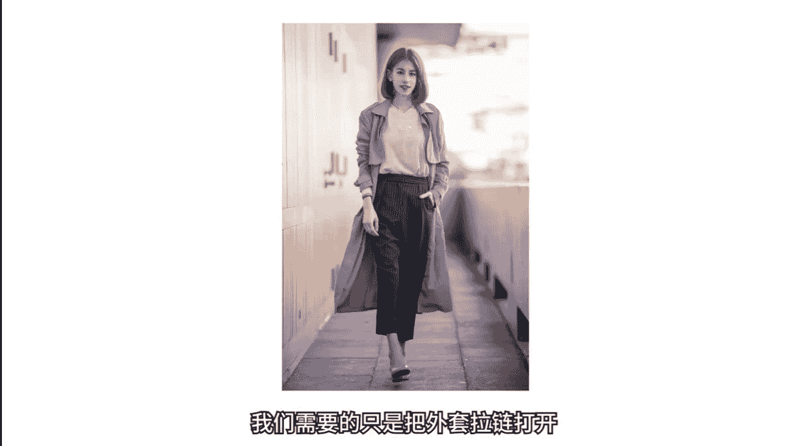
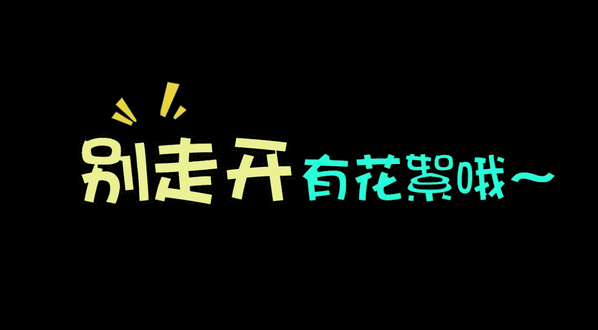
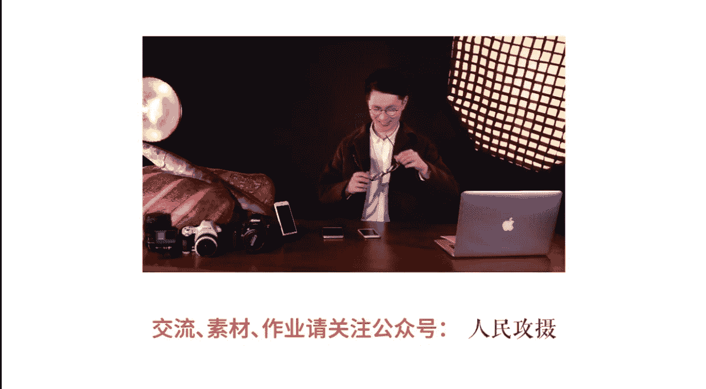

# 小北手机摄影课堂：第5期：学会这几招，分分钟拍出大长腿

在本节课中，我们将要学习如何通过服装搭配、前期拍摄技巧以及后期修图，来拍出显高显瘦的“大长腿”效果。课程将分为两个主要部分：第一部分讲解如何通过穿搭和拍摄角度优化身材比例；第二部分介绍如何使用手机APP进行后期修饰，让腿型更加完美。

---

## 第一部分：服装搭配与前期拍摄技巧

上一节我们学习了从普通场景中发现美。本节中，我们把目光聚焦到一个具体的拍摄主题——如何拍出大长腿。想要拍出大长腿，仅懂拍照技巧是不够的，合适的服装搭配同样至关重要。

### 核心原则：提高腰线

影响身材比例视觉观感的最关键因素是**腰线的位置**。一个简单的公式可以概括核心思路：

**视觉腿长 ≈ 从腰线到脚底的长度**

因此，我们的目标是**在视觉上提高腰线**，营造“腰部以下全是腿”的效果。

#### 错误示范与正确方案

以下是两种常见的穿搭对比：

*   **错误搭配**：上衣和下装长度接近，形成“五五分”身材。这会严重压缩腿部视觉长度，即使本人实际身高不矮，也会显得腿短。
*   **正确搭配**：选择高腰款式的下装（如高腰裤、高腰裙），将上衣扎进去，明确标出较高的腰线位置。这能在视觉上大幅增加腿长比例。

#### 具体穿搭技巧

根据“提高腰线”原则，可以衍生出以下实用技巧：

1.  **鞋子的选择**：搭配高跟鞋时，优先选择**露脚背**的款式。脚背的裸露能与腿部线条连成一体，进一步在视觉上延伸腿长。
2.  **长款外套的穿法**：拍摄穿大衣或长外套的照片时，应避免单纯拍摄背影，因为背影会完全掩盖腰线。正确的做法是：
    *   **敞开外套**，露出内搭。
    *   确保**内搭遵循高腰线原则**（例如内搭上衣扎进高腰裤）。
    *   从**正面或侧面**拍摄，这样既能展示外套的修长，又能突出内搭带来的优秀身材比例。

---

## 第二部分：拍摄角度与姿势

掌握了穿搭技巧后，我们来看看具体的拍摄方法。错误的拍摄角度会毁掉所有的穿搭努力。

### 常见错误角度：俯拍

大多数人习惯站立着将手机举到面前，**从上往下（俯拍）** 拍摄。这种角度会：
*   拉长和突出上半身。
*   压缩和缩短下半身。
*   导致照片中的人物显得“头重脚轻”，腿短。

### 正确核心技巧：低角度仰拍

纠正方法很简单：**降低机位，从低处向上（仰拍）**。
*   让拍摄者蹲下或降低身体，将手机置于被拍者的**腰部或更低位置**。
*   仰拍视角会自然拉伸和强调腿部线条，使其显得更修长。
*   **注意事项**：仰拍角度不宜过大（即手机不要离腿太近），否则会导致腿部畸形变粗。需保持适当距离，找到显腿长又不夸张的平衡点。

### 进阶拍摄技巧：反向持机

在低角度仰拍的基础上，还有一个增强效果的小技巧：**将手机倒置（摄像头朝下）拍摄**。
*   操作时，只需将手机上下翻转，快门键会跑到上方，但屏幕成像依然是正的。
*   这样做的目的是让摄像头更贴近地面，从而获得更极致的低角度和更明显的腿部拉伸效果。

### 利用环境：楼梯场景

楼梯是拍摄大长腿的天然利器，可以轻松创造高度差，无需拍摄者大幅蹲下。
*   让被拍者站在台阶上，拍摄者在下方平地即可获得仰拍视角。
*   可以引导被拍者**向前或向下伸腿**，使腿型更修长。
*   也可以抓拍被拍者**从楼梯上走下来**的瞬间，迈步时腿部的伸展能很好地展示腿长。

### 摆姿指南

正确的姿势能让“长腿效果”事半功倍。以下是几个简单易学的姿势：

1.  **向前伸腿**：一条腿向前伸直，**脚尖用力绷直点地**，使整条腿形成一条直线。这是最基础有效的姿势。
2.  **交叉腿**：站立时双腿交叉。这个姿势能立刻让腿在视觉上变细变长，几乎无需后期。
3.  **走路抓拍**：进行动态抓拍。要求：**迈大步、挺直上身、后腿绷直**。走路的动感能营造自然的长腿效果。
4.  **坐姿技巧**：坐着拍照时，切忌“实坐”。
    *   只坐椅子或台阶的**前三分之一边缘**。
    *   腿部**全力向前或向画面角落延伸**。
    *   可以配合交叉腿姿势。
    *   避免大腿肌肉完全压平在座位上。
5.  **倚靠垫脚**：倚靠墙壁或物体时，可以**偷偷垫起脚尖**。从正面看毫无破绽，但能悄悄增加腿长。

---

## 第三部分：后期修图塑形

即使前期拍摄得很成功，适当的后期修饰也能让照片更加完美。我们主要使用“美图秀秀”APP进行演示。

### 拉长腿部

1.  打开「美图秀秀」，进入「图片美化」。
2.  在「人像美容」分类中找到「增高塑形」功能（可能也叫“长腿”或“增高”）。
3.  使用调整框**选中腿部区域**。
4.  滑动进度条，**向右滑动即可拉长选中区域**。
    *   **技巧**：建议分多次、分区域微调。例如先整体拉长小腿到脚踝，再单独微调大腿区域，这样效果更自然，避免比例失调。

### 修饰腿型

拉长腿部后，可能还需要对腿型进行细微调整，使其更直、更匀称。

1.  在「人像美容」中找到「瘦脸瘦身」功能。
2.  双指放大图片，以便精细操作。
3.  将笔刷对准需要调整的腿部线条（例如小腿外侧弯曲处），**沿着理想直线的方向轻轻推动**。
4.  **关键**：每次推动幅度要小，通过多次轻微调整叠加出理想效果，避免一次性推得过多导致变形失真。
5.  可以结合「增高塑形」功能，综合调整长度和形状，达到最佳效果。

---

## 课程总结

本节课中，我们一起学习了拍出“大长腿”的完整流程：

1.  **前期准备（穿搭）**：牢记 **“提高腰线”** 的核心原则，通过高腰下装、露脚背鞋子、正确穿着长外套来优化身材比例。
2.  **中期拍摄（角度与姿势）**：掌握 **“低角度仰拍”** 这一关键技巧，避免俯拍。灵活运用反向持机、利用楼梯环境，并搭配向前伸腿、交叉腿、走路抓拍等有效姿势。
3.  **后期修饰（修图）**：使用手机APP的「增高塑形」功能拉长腿部，并用「瘦脸瘦身」功能对腿型进行精细化塑形，使最终效果更加自然完美。

记住，拍出大长腿是穿搭、拍摄角度、姿势和后期共同作用的结果。多加练习，你就能轻松掌握这些技巧，为自己或朋友拍出令人羡慕的长腿照片。