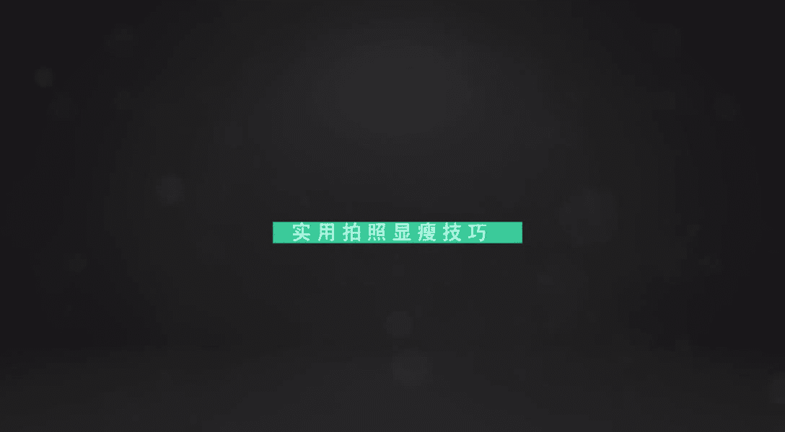
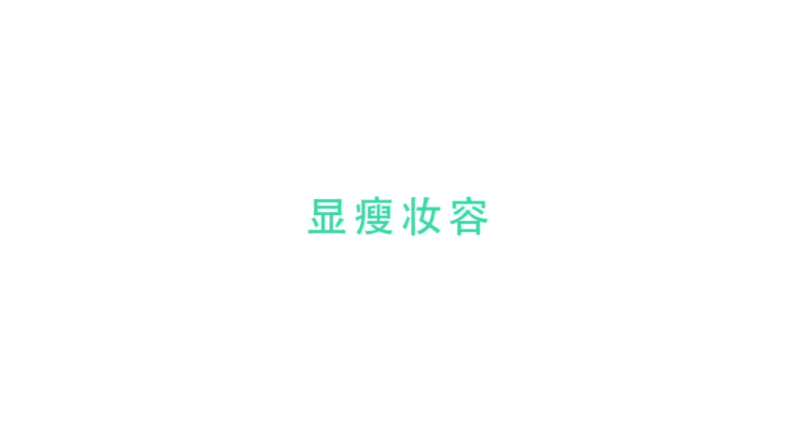
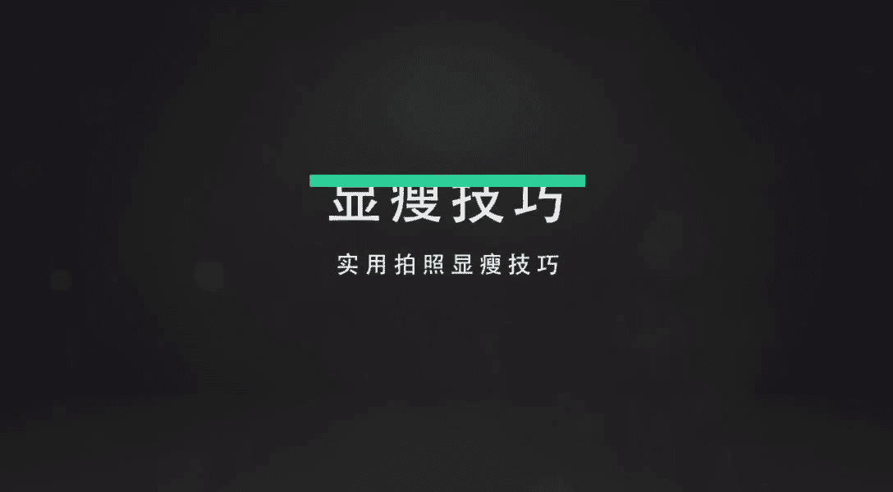
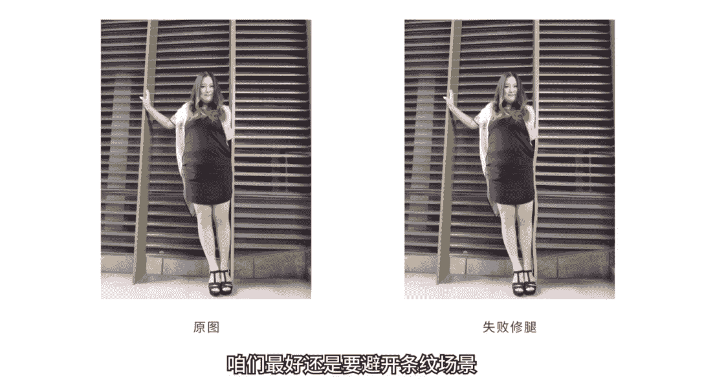
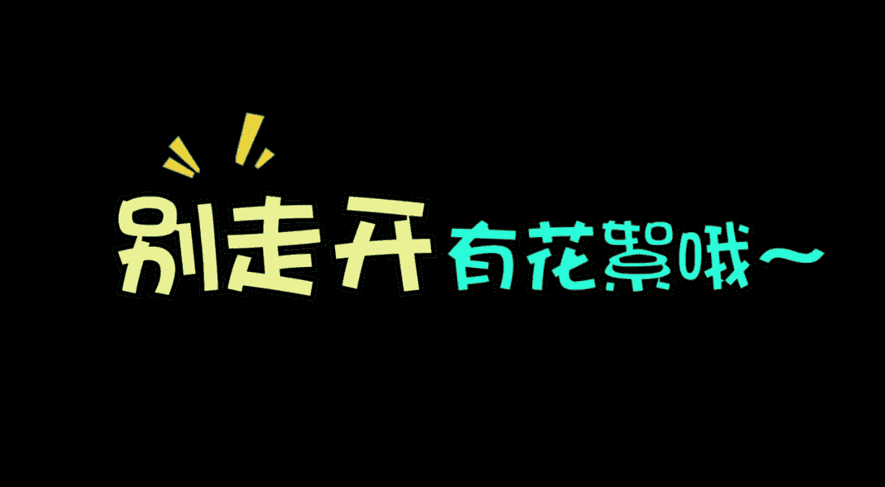

# 小北手机摄影课堂：第7期：拍照显瘦技巧与角度全解析

在本节课中，我们将系统学习如何利用化妆、穿搭和拍照姿势，在照片中达到显瘦的效果。课程内容分为两大板块：前期准备与拍摄技巧，旨在帮助大家掌握实用方法，拍出更自信、更优美的照片。

## 第一部分：化妆与穿搭基础

上一节我们介绍了课程的整体框架，本节中我们来看看如何通过化妆和穿搭为拍照打下良好的基础。

### 妆容修饰：瘦脸技巧

以下是专业彩妆师分享的瘦脸妆容步骤，重点在于通过化妆转移视觉焦点，修饰脸型。

1.  **底妆与定妆**：使用气垫BB打好底妆后，需进行定妆。定妆粉主要分为三种：
    *   **粉饼**：遮瑕效果最强，适合妆感较浓或需要持久妆容时使用。
    *   **散粉**：主要功能是让妆容看起来更透亮。
    *   **蜜粉**：具有提亮高光的效果，但遮瑕力最弱。
    *   **手法**：对于油性肌肤，在易出油部位（如T区、眼部）采用**点压**手法多上粉饼，以控制油分，防止妆容晕染。

2.  **画眉技巧**：圆脸型应强调眉毛弧度，以转移对脸宽的注意力。画眉定点分为三步：
    *   **眉头**：位于鼻翼与内眼角的垂直延长线上。
    *   **眉峰**：位于瞳孔外侧边缘的垂直延长线上。
    *   **眉尾**：位于鼻翼与外眼角的斜向延长线上。
    *   **画法**：连接三点，眉头颜色要浅，眉尾可稍深，最后用眉刷轻扫，使眉毛自然。

3.  **眼影层次**：使用3-4种同色系眼影（如大地色）打造层次感，能增加眼部深邃度，从而吸引视线。
    *   先用浅色（带微珠光）打底。
    *   再用深色加深眼睑底部。
    *   最后用更深色在眼窝处轻微晕染。

4.  **修容与高光**：这是塑造面部立体感、显瘦的关键。
    *   **侧影（阴影）**：使用珊瑚色等温和颜色，打在额头两侧、发际线、脸颊及颧骨下方。定位颧骨阴影的方法是：咬紧牙齿，凸出的骨头位置即为需要打阴影的地方。
    *   **高光**：打在T区、额头、眉骨、人中、下巴及嘴角暗沉处，提亮面部中央，视觉上更立体。
    *   **鼻影**：画在眼睛内眼角与鼻梁中间的部位，并用指腹晕染自然。

## 第二部分：拍照姿势与角度技巧

掌握了前期的修饰方法后，本节我们来看看在拍摄瞬间，如何通过姿势和角度优化，达到最佳的显瘦效果。

### 核心呼吸法：123吸气法则

首先让我们学习一个简单但至关重要的拍照细节。许多人在拍照时只注意表情，忽略了身体控制。

*   **错误示范**：拍照时身体放松，尤其是腹部，容易显得臃肿。
*   **正确技巧**：在摄影师喊“123”时，同步进行**吸气**和**挺胸**。可以将“123”与“吸气”建立条件反射：`听到“123” -> 吸气挺胸`。这个小动作能立刻让身形显得更挺拔、更瘦。

### 环境利用：遮挡与构图

当人物直接站立时，身材缺点容易暴露。我们可以巧妙利用环境。

*   **技巧**：身体略微侧向遮挡物（如墙壁、柱子），一手叉腰，明确腰线。
*   **作用**：遮挡物不仅能掩饰身材局部，还能辅助构图（如形成对称或框架），让画面更丰富、不单调。

### 手臂处理：创造空间感

拍摄半身或全身照时，手臂的处理非常关键。

*   **错误示范**：手臂紧贴身体或自然下垂，会将肉压扁或堆叠，显胖。
*   **正确技巧**：让手臂与身体之间保持一定空隙。可以叉腰或轻微抬起，创造层次。记住：**大臂压下去，再瘦也会堆出肉**。

### 蹲姿技巧：藏肚显腿

蹲姿容易堆积腹部赘肉，但用对方法也能拍出好照片。

*   **错误示范**：正面蹲下，用胳膊勉强遮挡肚子。
*   **正确技巧**：
    1.  身体侧转约30度面对镜头。
    2.  双腿一前一后，前腿向镜头方向伸展。
    3.  穿宽松裙子遮盖腹部。
    4.  上半身微微前倾并低头，避免双下巴。
    5.  采用低角度仰拍，拉长腿部线条。

### 面部管理：告别双下巴

双下巴是拍照常见问题，可以通过调整头部姿势改善。

*   **错误示范**：直接低头，挤压下巴和脖子之间的空间。
*   **正确技巧**：先**微微向前探头**，拉长下巴与脖子的距离，然后再**低头收下巴**。这样能有效避免挤出多余的肉。

### 发型与手势：遮挡脸型

利用头发或手势进行遮挡，是显脸小的直接方法。

*   **长发技巧**：将头发拨到一侧，同时侧脸朝向镜头。微微仰头效果更佳。
*   **通用技巧**：用手遮挡自己认为不够完美的一侧脸。注意：弯曲的手臂可能显胖，可通过后期裁剪只保留脸部。遮挡粗手臂时，五指分开轻搭，并让双臂保持一高一低的倾斜角度，打破平衡。

### 姿势原则：多斜线，少直线

僵直的姿势会显得呆板且显胖。

*   **错误示范**：正面站立，肩膀、眼睛呈水平直线。
*   **正确技巧**：侧身约45度站立，让肩膀线、眼睛视线都形成**斜线**。这样视觉上更放松、灵动，也能自然显瘦。

### 穿搭心法：扬长避短

穿衣搭配直接影响拍摄效果。

*   **口诀**：**不好的地方要会藏，好看的地方要会露**。
*   **举例**：手臂粗可搭配薄纱外套或披肩；深色衣服配亮色披肩，既能藏肉又能提亮色彩。

### 坐姿要点：控制与伸展

坐姿拍照需格外注意身体形态。

*   **两大要点**：
    1.  **拒绝瘫坐**：立刻进入拍照状态，吸气挺胸，身体微向前探。
    2.  **注意腿与角度**：用裙子适当遮挡大腿；腿部向远处**斜向伸展**；摄影师应采用**低角度仰拍**，避免俯拍（除非人物在低处做伸展动作，俯拍可显腿细）。

### 后期提醒：避开条纹背景

如果计划后期修图，选择背景很重要。

*   **问题**：在竖条纹背景前拍照，修图拉瘦身体时容易导致背景线条弯曲穿帮。
*   **建议**：尽量选择纯色或纹理不规则的背景，以便于后期调整身形。

## 课程总结

本节课我们一起学习了从前期准备到拍摄实战的全套拍照显瘦技巧。关键在于**通过化妆修容转移视觉焦点**，以及**在拍摄时运用呼吸、姿势、角度和环境来优化身体线条**。记住核心原则：创造空间、多用斜线、扬长避短。摄影不仅是记录，更是表达自信的方式。希望这些技巧能帮助你展现出更美的自己。

---
（注：教程已根据要求，删除了原文中的语气词，整理了结构，并为关键步骤添加了强调。原文中关于APP推广及与课程核心关联度不高的视频片段内容已省略，以确保教程聚焦于“拍照显瘦”主题。）