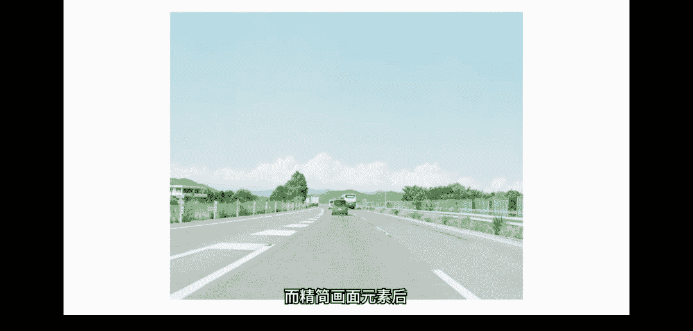
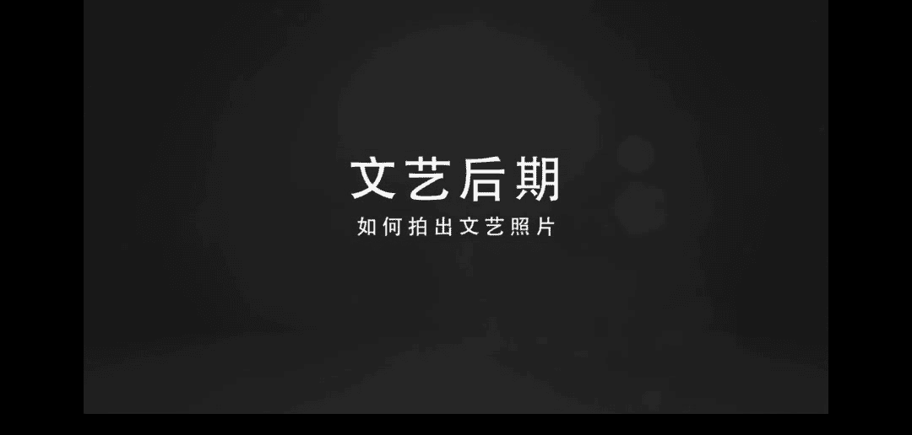

# 小北手机摄影课堂：第9期：文艺清新照片攻略

在本节课中，我们将学习如何拍摄和后期处理文艺清新风格的照片。我们将从理解其三大核心特性开始，然后通过具体案例，结合前期拍摄技巧与后期修图操作，一步步教你掌握这种风格。

## 文艺清新照片的三大特性

上一节我们介绍了课程概述，本节中我们来看看构成文艺清新照片的三个核心特性。

### 1. 色彩统一性
文艺清新照片的第一个特性是色彩的统一性。这意味着照片整体的色彩风格和谐一致，没有强烈的色彩冲突或偏差。例如，许多日系风格的照片倾向于呈现明亮、舒服且自然的色调，画面中不会出现大面积的黑色或暗沉色块。

**核心概念**：画面内主体（如人物服装、场景、道具）的色彩与环境色彩需和谐统一。

### 2. 情境统一性
文艺清新照片的第二个特性是情境统一性。这指的是人物的动作、表情和情绪，需要与拍摄时的场景氛围相契合。照片不只是色调的呈现，情绪和意境同样重要。色调只是表达画面的一种手法，而根本在于捕捉人物在特定时刻的真实状态。

**核心概念**：人物的情绪与动作应与拍摄情境和谐统一。

### 3. 元素精简性
文艺清新照片的第三个特性是元素精简性。这个特性很容易理解：画面中的元素过多会显得杂乱。元素繁杂不仅会破坏我们上面提到的色彩统一性和情境统一性，还会增加构图的难度，因为颜色越多越难管理。

**核心概念**：精简画面元素，有利于构图和色彩管理。

所以，在拍照前我们可以花一点时间挑选合适的场景，并主动精简镜头内的元素。

## 案例实操：海边文艺照

刚刚我们一起了解了文艺清新照片的三大特点。下面我将通过一个在海边拍摄的具体案例，教大家如何从前期构思到后期处理，得到一张理想的文艺清新照片。

首先，我们来看最终要达成的照片效果。这张照片拍摄于海边。当我路过这个场景时，最初觉得如果左侧没有障碍物，画面会更简洁。后来我发现一个路牌，它恰好可以放在画面中间分隔构图，并且使元素变得精简，于是我拍下了这张照片。

拍摄时，路过的黑色汽车颜色过重，不利于画面整洁和色彩统一。避开汽车后，我拍了一张。但我在想，能否有更好的效果？最终，我拍出了一张追求“海天一色”、色彩更统一和谐的照片。之前人物黑色的衣服虽影响不大，但略显沉重。

接下来，我们一起观察和分析这张照片的原图，看看哪些地方可以改进。

以下是原图中可以精简的多余元素：
*   左上角的树杈。
*   图片左侧的路牌一角。
*   右下角的一些花丛。

这些前期未注意到的细节，需要在后期处理中去除。

## 后期处理实战

刚刚我们简单指出了原图中存在的问题。接下来，我们按照三大原则，使用三款软件对图片进行后期处理。

**使用的软件**：
1.  **VSCO**：用于全局的色彩和色调调整。
2.  **Snapseed**：用于局部的精细调整。
3.  **黄油相机**：用于添加边框、文字等装饰效果。

### 第一步：VSCO 全局调整
我们首先在 VSCO 中打开图片，针对“色彩统一性”进行调整。我们希望得到文艺小清新的色彩，其第一个特征就是亮度较高。

以下是具体操作步骤：
1.  **提高亮度**：打开曝光补偿，向右滑动增加亮度。例如，增加到 **+3** 或 **+4**。
2.  **降低对比度**：稍微降低对比度（例如 **-0.5**），可以使画面的明暗对比不那么强烈，更显柔和。
3.  **裁剪构图**：使用裁剪工具（如选择 **3:2** 比例），避开左上角和右下角的杂物，并确保路牌位于画面中心，左右留白对称。
4.  **调整水平**：使用“旋转”工具调整海平线，使其保持水平。
5.  **提亮阴影**：进行阴影补偿，将暗部提亮（例如 **+53**），让画面更通透。
6.  **增加胶片感**：可以尝试增加一些“褪色”效果，并轻微增加“颗粒”（颗粒不宜过多）。
7.  **锐化**：最后增加锐化，使照片看起来更清晰。

完成以上操作后，我们得到了一个初步调整后的画面。对比原图，整体已经明亮、柔和了许多。

### 第二步：Snapseed 局部精修
在 VSCO 调整后，我们发现路牌颜色仍然偏暗，与画面不协调，并且海面上有一截船只显得突兀。针对这些问题，我们使用 Snapseed 进行局部处理。

以下是具体操作步骤：
1.  **去除杂物**：使用“修复”工具，涂抹海面上那截多余的船只，即可将其去除。
2.  **局部提亮**：使用“局部”工具，点击路牌，选择“亮度”，然后向上滑动屏幕以提高路牌的亮度，使其与整体画面更融合。

### 第三步：黄油相机添加装饰
最后，我们使用黄油相机为照片增加一些文艺装饰。

以下是具体操作步骤：
1.  **添加白边**：为照片增加一个白边，调整画布比。
2.  **微调滤镜**：可以选择一个合适的滤镜（如“日常”），强度调整到 **20** 左右。
3.  **最终亮度调整**：添加白边后，如果觉得照片偏暗，可以再次微调亮度参数。

经过这三个步骤，我们就得到了一张完整的文艺小清新风格照片。

## 进阶技巧与灵感拓展

掌握了基础方法后，我们来看看更多应用场景和进阶技巧。

### 服装与环境的色彩搭配
在青海湖拍摄时，面对简洁的蓝白画面，我想到如果人物穿着与大海或蓝天颜色相近的衣服，会非常好看。于是我拍下了这张照片：主体人物的衣服颜色与环境和谐统一，人物动作舒展，符合当时开阔的情境。

**要点**：在浅色背景下，也可以选择比较鲜艳的服装，这样主体会非常突出。

### 利用道具营造氛围
生活中，我们可以借助道具自己营造文艺环境。白色窗帘就是一个很好的选择。

以下是白色窗帘的好处：
*   遮挡窗外杂乱的景物，精简画面元素，聚焦人物。
*   营造朦胧的光影效果，增加照片的文艺气息。

**后期强化思路**：精简元素、统一色彩、强化朦胧感。这里可以运用 Snapseed 的“魅力光晕”功能来增强阳光下的柔和光晕效果，然后再用 VSCO 进行整体色调调整（如增加暖色色温），最终营造出居家慵懒的情绪氛围。

### 文艺情侣照拍摄
对于情侣，也可以拍摄文艺风格的照片。Instagram 上著名的“济州岛夫妇”就是很好的例子。

以下是拍摄文艺情侣照的要点：
1.  **背景简洁**：选择整洁、对称的背景。
2.  **动作设计**：人物在画面中心一左一右站开，做一致且对称的动作。
3.  **服装搭配**：服装颜色尽量与环境保持一致。
4.  **自然情绪**：露出最真实的笑容。

**后期处理**：强化“日常感”。在 VSCO 中，可以降低对比度（如 **-1.5**）、稍微增加曝光、裁剪掉多余元素（如柱子），并增加暖色色温（**+1.5**）和适量褪色（如 **+6**），使照片呈现温暖、明亮、柔和的日常效果。

### 静物摄影的文艺感
文艺感不仅限于人像，静物也值得记录。之前我发布过一组咖啡馆照片，很多人询问调色方法。

**前期要点**：
1.  **画面整洁**：“一白遮百丑”同样适用于静物摄影。
2.  **最佳构图**：结合静物特征构图。例如，借助楼梯拍对角线构图，借助吊灯拍对称构图，借助货架拍九宫格构图等。

**后期难点与解决**：静物场景往往元素复杂（前景、中景、背景），亮度不一（如白墙和暗色物体）。常规的全局曝光调整容易导致白墙过曝。

此时需要引入 **曲线工具** 和 **局部调整**。
*   **曲线**：在曲线中间打点并上提，可整体提亮画面。如果亮部（如灯）过曝，则在曲线右侧高点下压，控制高光。
*   **局部调整（HSL）**：在 Mix 等软件中，使用“色相/饱和度”功能，针对画面中主要的颜色（如橘黄色的灯）单独调整其“明度”和“饱和度”，实现精准控制，使各种颜色元素的亮度达到和谐统一。

虽然局部调整看起来步骤稍多，但掌握后能应对绝大多数复杂场景，自由修出想要的效果。

## 课程总结

本节课中，我们一起学习了文艺清新风格照片的完整创作流程。

我们首先理解了构成这种风格的三大核心关键词：**色彩统一**、**情境统一** 和 **元素精简**。然后，通过海边人像的案例，详细拆解了从前期取景到后期使用 VSCO、Snapseed、黄油相机进行处理的每一步。最后，我们还拓展了服装搭配、道具使用、情侣照以及静物摄影的文艺感营造技巧，并介绍了处理复杂光线场景的曲线和局部调整方法。

希望你能掌握这些要点，并多多实践练习。如果你有任何问题或想分享作品，欢迎到我的微信公众号“人民公社”进行交流。共同学习，共同进步。

感谢大家收看。我是想和大家一起帅三代美三代的小北，我们下次再见。