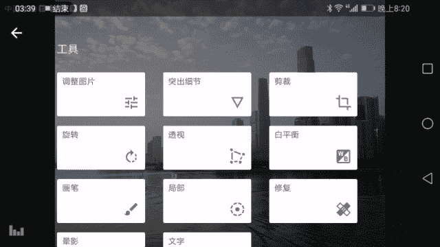
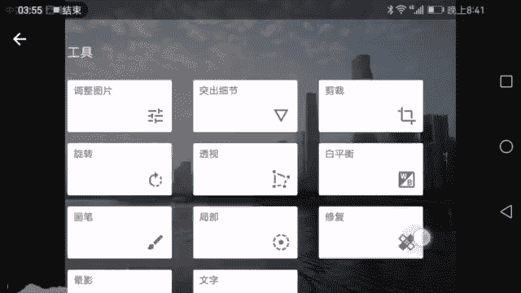
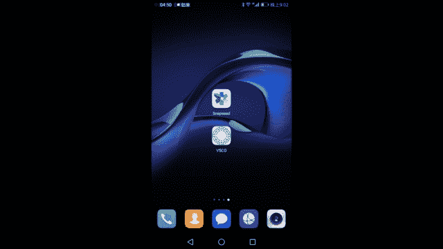

# 木西-用普通手机拍出专业级照片（完结）：01：手机摄影基础知识 🎯

在本节课中，我们将要学习手机摄影的基础知识，包括手机摄影的潜力与局限、必要的配件使用方法，以及前期拍摄与后期处理的核心应用。通过本课，你将建立起对手机摄影的全面认识。

我是摄影师木西，一名90后风光与建筑摄影师。我拥有经济学背景，在摄影领域已探索五年，取得了一些成绩，例如成为中国创意摄影展的十佳创意摄影师，以及CN的签约摄影师。我的作品曾发表于《摄影旅游》、《中国国家地理》等专业杂志，并被多家厂商与企业选用。

从今年初开始，我尝试使用手机拍照。传统观念认为专业拍摄需要大型器材并翻山越岭，但随着科技进步，手机带来了截然不同的拍摄体验，并在最大程度上保证了画质。今年，我在手机摄影领域也取得了一些成果，例如在美国国家地理全球摄影大赛手机组获得优秀奖，并参与了华为Mate9全球发布会的样片拍摄。此外，我全年测评了十余台不同品牌的旗舰手机，在手机摄影领域积累了一定经验。

本课程将覆盖从拍照基本原理到实战操作的完整流程。我们将学习手机（作为相机）的基本拍摄原理、手机操作方法，并在实战中掌握风光、城市建筑、人像与美食的拍摄技巧。同时，我也会介绍能提升拍摄效果的必备配件与小工具。课程最后设有答疑环节，并根据实际情况可能进行直播拍摄演示。

下面，我将展示一些今年内使用不同品牌手机拍摄的作品，让大家直观感受手机摄影的可能性。

第一张是广州的夜景。照片中，城市呈现出流光溢彩的状态，楼宇幕墙的反光、地面的车流、路灯以及其他城市细节都清晰可辨。

这是一张在香港彩虹邨拍摄的照片，采用了典型的对称式构图，画面清新漂亮，对称给人以安稳感。

这张照片摄于挪威奥斯陆市政厅（诺贝尔和平奖颁奖地）。画面中明暗与色彩过渡自然，暗部保有细节，亮部不过曝，人物面部的反光处理得当，整体呈现出温润如油画的质感。

这是一张抓拍到的蜜蜂在荷花上采蜜的画面。

这是在去色达路上，于格尔登寺酥油茶坊拍摄的清晨场景。一盏灯照亮蒸汽，一位僧侣从中走出，另一位正在装桶。这张照片获得了今年美国国家地理全球摄影大赛手机组的优秀奖。

这是在贝加尔湖拍摄的一只小猫，在午后阳光下挠脸，画面生动可爱。

同样在奥斯陆市政厅，我记录下一扇漂亮的门及其花窗、大理石门框。我等待片刻，恰巧有人推门而入，为静态画面增添了动感。

这是冰岛的斯科加瀑布。画面通过人与瀑布的尺寸对比，凸显了人在自然面前的渺小，同时人物向瀑布行进的身影又传达出一种奋发精神。

这张街拍摄于意大利锡耶纳。一位牵狗的行人与一位骑自行车的人动静结合，他们的头部在画面中恰好重叠，朝向一致，形成了有趣的对比。

这是上海南北高架与延安路高架交汇处的著名“龙柱”夜景。这张照片入选了华为Mate9全球发布会样片。画面光线平衡，高光与暗部细节丰富，建筑立体感与质感俱佳。

这张使用类似技术拍摄于东京世贸中心观景台，展现了东京铁塔与城市面貌，细节同样精细。

这是东京的夜景，城市的规划与良好的空气共同呈现出充满科技感的都市景象。

这是在川西拍摄的溪流落叶。清澈无污染的山间流水与几片落叶结合，营造出岁月静好的氛围。

这是九寨沟景点“静海”在一个秋雨过后的早晨。我使用了模仿长曝光的工具进行拍摄，获得了云雾缭绕、宛如仙境的画面。

这是一张使用手机拍摄的人像作品，我们后续课程中也会专门讲解人像拍摄。

通过以上作品可以看到，从自然风光、城市夜景、街头抓拍，到建筑、静物小品乃至弱光环境下的场景，手机都能胜任。

---

看到这些令人惊叹的手机作品后，我们也要客观认识手机的局限性。本节将诚实地探讨手机在哪些场景下难以拍摄或效果不佳。

首先需要说明，以下举例的照片均是我本人使用专业相机拍摄的作品。

第一类是**大规模的银河星空**。在伸手不见五指的漆黑夜晚，手机虽能拍到星空，但难以达到专业相机所呈现的纯净画质与丰富细节。

第二类是**航拍画面**。这类由无人机从空中拍摄的视角，手机无法实现。

第三类是**超长焦场景**。例如这张从山谷对面山坡使用400毫米左右长焦镜头拍摄的小镇全景。目前市面上的手机附加镜头也难以达到如此长的焦距。

第四类是**超广角场景**。这张广州城市风光作品由两张16毫米超广角照片接片而成，即便手机使用全景模式或附加广角镜，也无法拍出如此广阔且细节丰富的夜景。

第五类是**极弱光环境**。例如这张仅靠一盏烛光照亮人脸的场景，是使用光圈高达f/1.2的专业全画幅相机拍摄的，手机难以在如此微弱光线下实现良好画质。

除此之外，一些人像特写、体育抓拍等场景，手机也难以达到同等画面效果。了解这些局限后，我们可以主动避开（如改善光线、改变取景或拍摄局部），从而在旅途与生活中，用手机顺利拍摄人像、城市景观等绝大多数题材。

---

上一节我们认识了手机的潜力与局限，本节我们来看看如何通过配件来拓展手机的拍摄能力。在学习摄影时，我们常需借助各种配件和镜头来获得更好画面。

使用专业相机时，为了拍摄更远画面需要长焦镜头，为了获得更大虚化需要大光圈镜头，为了稳定画面需要三脚架。这些配件往往非常沉重。

那么，手机摄影是否也需要类似配件？是否会同样复杂沉重？我们通过对比来看。

对比非常鲜明：一边是庞大的相机三脚架和镜头，另一边是手机的小型三脚架和附加镜头。手机配件的整体体积和重量远小于相机，全套手机装备的重量可能不及一只相机长焦镜头。因此，即便使用配件，手机在便携性上仍具有巨大优势。

下面，我将简要介绍这些配件的使用方法（更详细的使用将在后续实战课程中讲解）。

**最重要的配件无疑是三脚架**。它能提供稳定视角，对手机和相机都至关重要。

以下是手机三脚架的基本使用方法：
1.  展开三脚架的三只脚，将其放置于平稳表面。
2.  可适当升高中轴以调整高度。
3.  使用专用的夹子结构将手机固定在三脚架上。

完成以上步骤，即可获得稳定的拍摄平台，有效避免手持抖动。

---

讲解了手机三脚架的使用后，我们知道手机镜头通常无法像相机镜头那样进行光学变焦。手机通过滑动屏幕实现的“数码变焦”实质上是裁剪放大，会损害画质。

那么，如何实现无损的视角变化呢？**手机附加镜头**就起到了这个作用。

常见的手机附加镜头主要有**长焦镜头**和**广角镜头**，此外还有鱼眼、微距等特殊镜头。

以下是两种主要的安装使用方法：
1.  **通用夹子式**：使用一个万能夹子将镜头夹在手机摄像头前，然后打开手机拍照应用，即可观察到视角的变化。
2.  **特定卡口式**：某些镜头设计为套在特定型号的手机上，通过卡口固定。安装后同样能改变镜头焦段。

---

现在，我们了解了配件的基本用法。回想手机的拍摄过程，尤其是像iPhone这类系统，通常只能直接按快门拍照，对比相机丰富的手动模式（如光圈优先、快门优先），手机似乎功能欠缺。

本节将介绍一些可下载安装的、能辅助我们进行前期拍摄的APP。

拍摄类APP非常重要，尤其对于iPhone这类原生相机功能较简单的设备。例如在暗光环境下，iPhone会自动调高ISO，导致照片噪点多、细节差。

以下是几款重要的前期拍摄APP：

*   **ProCam（专业相机）**：这款APP的核心作用是弥补iPhone没有手动模式的不足。它可以手动调节**ISO**（可降至50或100）和**曝光时间**（最长1/4秒），虽然不及安卓相机长达30秒的曝光，但已是iPhone上最好的选择之一。它还可以选择摄像头、设置HDR、选择照片格式（如TIFF或RAW）和图像大小等。
*   **Pro HDR X**：当我们需要更自主地控制HDR（高动态范围）效果时，可以使用这款APP。它能让我们手动选择多张不同曝光度的照片进行合成，从而获得理想的HDR图像。
*   **Cortex Camera**：这款APP可以模拟长曝光效果。它支持长时间曝光计时（如30秒），可选择多种输出格式，并能拍摄光轨等特效。

以上三款APP是iPhone上常用的前期拍摄工具。

---

我们已经学会了使用前期APP来拓展手机拍摄功能。在获得照片后，后期处理在当今社交媒体时代至关重要。

本节将介绍常用的手机后期APP，帮助大家美化照片。更多详细内容将在专门的后期课程中讲解。

首先介绍一款重量级APP：**Snapseed**。

打开Snapseed并导入照片后，界面右下角有一个编辑图标。编辑功能分为两大部分：
*   **工具**：这是我们学习的重点，用于手动逐步调整照片。
*   **滤镜**：可以一键实现风格化效果。但在认真学习摄影的过程中，我们应尽量忽略风格化滤镜，专注于掌握手动调整技能。

以下是“工具”栏中的主要功能简介：
*   **调整图片**：进行基础调节，包括**亮度**、**对比度**、**饱和度**、**氛围**、**高光**、**阴影**、**暖色调**等参数。
*   **突出细节**：增强画面细节清晰度。
*   **剪裁**：裁切画面构图。
*   **旋转**：调整画面角度。
*   **透视**：校正或调整画面透视关系，实现类似3D变换的效果。
*   **白平衡**：调节画面的冷暖色调分布。
*   **画笔**：对画面进行精细的局部调节。
*   **局部**：自动识别画面内容进行局部调节（与“画笔”作用不同）。
*   **修复**：常用于人像或景物，可模仿周围纹理去除污点。
*   **晕影**：为画面添加暗角，以突出中心主体。
*   **文字**：添加文字。

“滤镜”部分中，“魅力光晕”、“色调对比度”、“复古”等滤镜可能偶尔用到，但多数滤镜易破坏画面，正常修图时可忽略。“美颜”功能效果一般，可不作重点。

点击右上角菜单，有以下实用选项：
*   **应用上次修改**：将上一次的调整设置一键应用于新照片，便于批量处理。
*   **导出**：保存处理后的照片。
*   **图片信息**：查看照片的EXIF信息，如拍摄参数。

左下角有一个类似图表或信号标志的图标，这是**直方图**。直方图是摄影中用于判断画面曝光状况的重要工具。其横轴从左到右代表亮度从纯黑（0）到纯白（255），纵轴代表像素数量。通过观察直方图中像素的分布，我们可以了解画面的整体明暗情况。例如，像素偏右说明画面较亮，偏左则较暗。在调整亮度时，直方图会实时变化，帮助我们避免局部过曝或欠曝，从而精准控制整体曝光。

---

介绍完Snapseed后，我们来看另一款重量级APP：**VSCO**。

VSCO的设计逻辑与Snapseed不同。它需要先导入照片，然后主要通过选择并调整滤镜来进行处理。

进入VSCO后，向右滑是VSCO官方推荐的杂志图片，向左滑则进入个人创作空间。点击左上角加号导入照片，选中照片后点击右下角编辑图标（或类似标志），即可进入滤镜选择页面。

VSCO提供了大量以胶片风格命名的滤镜（如M3、P5）。点击任意滤镜可预览效果，并可通过滑动条调整滤镜强度。点击下方菜单，还可以进行更细致的参数微调，如曝光、对比度、暗角等，但调整精度通常不如Snapseed。

处理完成后，点击导出图标，选择“保存到相册”即可将成品保存至手机。另一个“发布”选项可将照片投稿至VSCO社区，但由于网络原因，国内用户使用可能不便。

常规的修图流程可以是：先用**Snapseed**进行精确的基础明暗、色彩调整，然后导入**VSCO**添加喜欢的胶片风格滤镜，最后导出保存。我个人99%的时间仅使用Snapseed，因为风光摄影通常要求更准确的颜色还原。

---

本节课已接近尾声。我们一起学习了手机能拍出怎样的画面，了解了手机拍摄的基本功能、常用配件如三脚架的使用方法，并介绍了前期拍摄APP与后期处理APP。

在课程最后，我想分享一下对手机摄影的感受。我认为，手机成为未来影像器材的发展方向是历史的必然。回顾摄影器材百余年的发展史，它从笨重的实验室设备，逐渐演变为可随身携带的街头相机、傻瓜相机，直至今天的数码相机。手机摄影的出现，使得拍摄、查看、分享影像变得空前便捷，这正符合人类获取、生产和分享信息的内在规律。我期待有一天，我们能随时随地用手机这样简单的设备，拍出媲美专业相机的画质，以更高效的方式创作影像。

第一节课到此结束。本节课我们学习了基础功能与附件，但我知道听完这些你可能还不会实际拍摄。下一节课，我将带来详尽的手机拍摄实操课程，从最基本的摄影原理入手，一步步教你如何拍好照片。