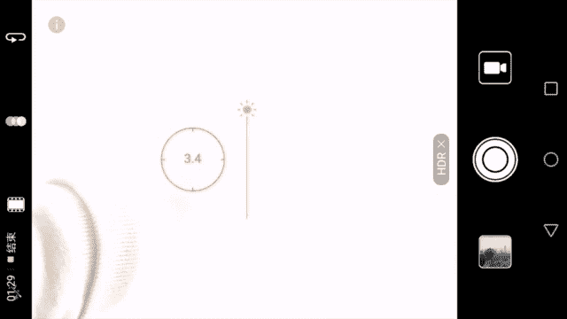

# 木西-用普通手机拍出专业级照片（完结）：02：手机拍照方法

在本节课中，我们将深入学习手机摄影的核心原理。我们将从相机成像的基本过程开始，了解光圈、快门、ISO和焦距如何共同作用。接着，我们会探讨如何正确曝光和测光，并学习如何运用光线与构图来提升照片的专业感。课程内容将循序渐进，确保初学者也能轻松掌握。

## 相机是如何成像的？

上一节我们了解了手机拍照的基本功能和配件。本节中，我们来看看相机（包括手机和人眼）是如何完成一次成像的。

我们的眼睛、相机和手机都是通过一套光学结构来“看到”世界的。在这个小节中，我们将学习光圈、快门、ISO以及焦距，它们彼此之间的关系，以及它们是如何影响最终画面的。

以下是成像过程的核心部件及其作用：

*   **光圈**：光圈是镜头内部一个可以收缩或放大的结构，用于控制进入镜头的光线强度。其工作原理类似于人眼的瞳孔。公式上，光圈大小用 **f值** 表示，如 **f/1.8**、**f/2.8**。**f值越小，光圈开孔越大，进光量越多**。
*   **快门**：快门是位于感光元件前的一个“门”。它打开的时间（即快门速度）决定了光线照射感光元件的持续时间。**快门速度越慢（如1秒），进光时间越长，照片越亮；快门速度越快（如1/1000秒），进光时间越短，照片越暗**。
*   **ISO（感光度）**：ISO衡量感光元件对光线的敏感程度。**ISO值越高（如3200），感光元件对光越敏感，在弱光下也能获得较亮的画面，但会产生更多噪点（画面颗粒感）；ISO值越低（如100），画质越纯净，但需要更长的曝光时间或更强的光线**。
*   **焦距**：焦距决定了镜头的视角，即能拍多广或多远。改变焦距可以实现画面的放大（拉近）或缩小（推远）。

需要特别注意的是，由于手机镜头体积限制，其**光圈通常是固定不可变的**，永远处于最大状态。同时，大多数手机的**光学焦距也是固定的**，若想改变视角，通常需要依赖数码变焦或附加镜头。

## 什么是正确的曝光？

了解了成像的基本部件后，我们来看看它们如何协同工作，以获得一张亮度合适的照片，即“正确曝光”。

人眼能自动适应从黑暗到明亮的环境变化，相机和手机也有类似的自动调节过程，这被称为“自动曝光”。它以环境中某种亮度为标准，通过调整ISO和快门速度（手机光圈固定），使最终照片的亮度看起来“正常”——既不过亮（过曝），也不过暗（欠曝）。

然而，机器并非总是聪明。当你觉得自动曝光的结果不符合预期时，可以使用“曝光补偿”功能进行手动干预。

以下是曝光相关的核心操作：

*   **对焦**：通过点击屏幕，让相机将焦点对准你希望拍清晰的物体。这是保证主体清晰的第一步。
*   **测光**：相机以你对焦的区域为标准，来判断整个画面的明暗。通常，**对焦点与测光点是联动的**。点击暗处，整体画面会变亮；点击亮处，整体画面会变暗。
*   **曝光补偿**：在对焦框旁边，通常有一个“小太阳”图标（或类似滑块）。**向上滑动增加曝光，画面变亮；向下滑动减少曝光，画面变暗**。这是在自动测光基础上的人为修正。
*   **HDR（高动态范围）**：当场景中明暗反差极大时（如明亮的天空和黑暗的地面），使用HDR功能。手机会快速拍摄多张不同曝光的照片并合成一张，从而尽可能保留亮部和暗部的细节。**注意：拍摄快速运动的物体时不宜使用HDR，可能导致重影**。

## 如何运用光线？📸

掌握了控制光线强度（曝光）的方法后，我们来看看光线的方向如何塑造物体，这也是“摄影是用光的艺术”这句话的重要体现。

光线从不同方向照射主体，会产生截然不同的效果。下面我们以三种主要光位为例：

*   **顺光**：光线从拍摄者背后射向被摄体。**优点**是能清晰展现被摄体正面细节；**缺点**是缺乏明暗对比，画面立体感较弱。
*   **侧光**：光线从被摄体侧面射来。**优点**是能产生强烈的阴影和高光，极大增强物体的立体感和质感，是塑造形态的常用光位。
*   **逆光**：光线从被摄体背后射向镜头。**优点**是能勾勒出被摄体的轮廓，适合拍摄剪影；**挑战**是容易导致主体正面曝光不足，需要结合对焦、测光和曝光补偿来拍摄，或使用HDR功能。

## 如何安排画面？🎨

光线决定了画面的明暗和质感，而构图则决定了画面的结构和美感。构图是前期拍摄中容错率最低的环节，因为一旦拍下，就很难在不损失画质的情况下进行大幅调整。

构图的核心是安排“趣味中心”，即观众第一眼会关注的地方。以下是几种常见且实用的构图方法：

*   **三分法（九宫格构图）**：将画面用两条横线和两条竖线分为九等份，把重要的元素放在这些线条的交点或沿着线条放置。这能带来和谐与平衡感，是最通用也最安全的构图法则。
*   **三角形构图**：将画面中的主要元素排列成或隐含一个三角形结构。三角形具有稳定性，能给人沉稳、有力的视觉感受，常用于建筑摄影或多人合影。
*   **对称构图**：让画面左右或上下对称。这种构图能营造出庄严、宁静、稳定的氛围，常用于拍摄建筑、倒影等场景。
*   **对比与重复**：
    *   **对比**：在相似的画面中寻找差异（如大小、明暗、色彩、动静），能制造趣味和视觉冲击力。
    *   **重复与节奏**：相似的形状、线条或图案在画面中有规律地重复出现，能产生节奏感和韵律感，引导视线，增强画面的形式美。

## 夜景拍摄实战

夜晚光线微弱，是对手机摄影的极大挑战。直接手持拍摄往往会导致照片模糊、噪点多。要提升夜景画质，关键在于使用三脚架并手动控制参数。

以下是夜景拍摄的核心步骤：

1.  **使用三脚架**：这是保证画面绝对清晰的基础。
2.  **切换到专业/手动模式**：在相机设置中找到“专业模式”或“手动模式（M档）”。
3.  **手动设置参数**：
    *   将 **ISO 设置为最低值**（如50或100），以最大限度减少噪点。
    *   **快门速度（曝光时间）相应延长**。由于使用了三脚架，不用担心手抖。可以从1秒或2秒开始尝试。
    *   **光圈** 手机是固定的，无需调节。
4.  **试拍与调整**：拍摄后回看照片。如果太亮（过曝），就缩短快门速度；如果太暗（欠曝），就延长快门速度。通过反复调整，找到曝光合适的设置。
5.  **获得效果**：通过上述操作，你不仅能得到一张画质干净、细节丰富的夜景照片，长时间曝光还能将车灯轨迹记录为美丽的“车轨”。

## 课程总结

本节课中，我们一起学习了手机摄影从原理到实践的完整知识体系。

我们首先剖析了相机成像的基本过程，理解了**光圈、快门、ISO和焦距**这四个核心参数如何影响照片。接着，我们学习了如何通过**对焦、测光、曝光补偿和HDR**来控制光线强度，实现正确曝光。然后，我们探讨了光线方向的奥秘，了解了**顺光、侧光、逆光**不同的造型效果。最后，我们掌握了构图的艺术，运用**三分法、三角形构图、对称构图以及对比与重复**等技巧来安排画面元素，提升照片的美感。在实战部分，我们还特别讲解了如何使用**三脚架和手动模式**来拍摄高质量的夜景照片。

记住，摄影是理论和实践的结合。掌握了这些基本原理和技巧后，请拿起你的手机，多多练习和观察，你也能用普通设备拍出令人赞叹的专业级照片。下一节课，我们将进入后期处理环节，学习如何利用APP让照片变得更加出彩。