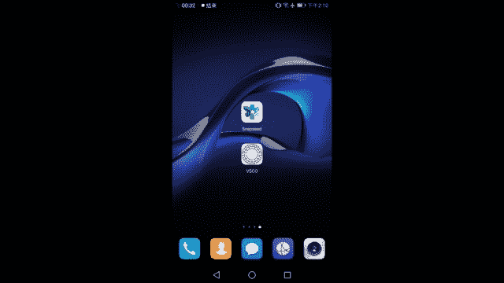
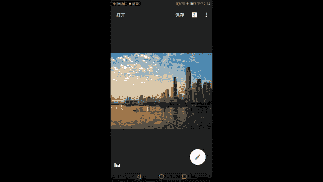
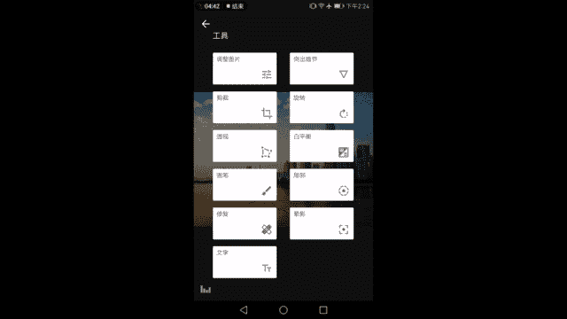
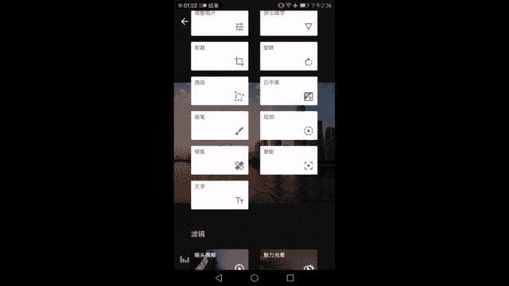

# 木西-用普通手机拍出专业级照片（完结）：03：手机照片后期处理（1）

在本节课中，我们将要学习如何使用手机APP对照片进行基础的后期处理。我们将从理解直方图开始，掌握调整照片明暗与色彩的核心原则，并学习使用两款主流修图APP的基础工具，让照片更具专业感。

## 理解直方图：照片的“健康报告” 📊

上一节我们学习了如何正确曝光和用光，本节中我们来看看如何评估和调整一张照片的“健康状况”。直方图就是照片的“健康报告”。

直方图分为左右两端。左端代表画面中最暗的部分，最左边的点意味着该区域没有任何光线信息，即纯黑。右端代表画面中最亮的部分，最右边的点意味着该区域光线信息达到最高值，即纯白，不再包含任何细节。

中间部分是从最暗到最亮的过渡。直方图中像小山一样的白色区域，代表照片中不同亮度的像素分布。它们按照从暗到亮的顺序排列，直观地展示了画面中哪些区域更亮，哪些区域更暗。

一张曝光良好的照片，其像素应比较均匀地分布在亮度区间内，避免大量像素堆积在最左（死黑）或最右（死白）两端。通过观察直方图，我们可以明确知道画面中暗部和亮部的比例，从而进行有针对性的调整。

## 后期处理的核心原则 🎯

在开始动手修图前，我们需要了解几个核心的调整原则。这些原则将指导我们如何让照片变得更好看。

### 明暗调整原则

以下是调整照片明暗时需要遵循的两个主要原则：

1.  **明暗协调**：指直方图的左右两端都不要完全“顶死”，即避免出现大面积的纯黑或纯白区域。这能保证画面细节的完整保留。
2.  **立体感与反差**：在保证细节的同时，需要适度的整体反差和局部反差。对比度过低会让照片显得灰蒙蒙，缺乏质感。适度的反差能让画面更有立体感。

### 色彩调整原则

以下是调整照片色彩时需要遵循的两个主要原则：

1.  **符合观察习惯**：照片应大致反映真实世界的色彩状态。例如，黄昏场景不应调得过冷或过黄，否则会让人感觉不真实、不协调。
2.  **色彩本身协调**：色彩的色相和饱和度要适度。过高的饱和度会让颜色显得夸张、刺眼，同样不协调。

在遵循以上大原则的基础上，你可以根据自己的审美偏好进行微调。例如，你可以让黄昏更温暖以表达欢快心情，或让色调偏冷以传达伤感情绪，但都需控制在“真实感”的框架内。

## 实战演练：基础调整步骤 📱

现在，我们以一张在广州猎德大桥拍摄的黄昏照片为例，使用Snapseed进行基础调整。

### 第一步：基础曝光与色彩调整

首先进入 **`工具`** -> **`调整图片`** 功能。以下是具体的调整步骤：

1.  **亮度**：由于原图偏亮，我们稍微向左滑动降低亮度，让直方图两端都留出空间，像素更多分布在中间调区域。
2.  **对比度**：降低亮度后画面可能偏灰。向右增加对比度，让该黑的地方黑，该亮的地方亮，同时注意最亮处不要过曝。你可以按住右上角的对比按钮（👁️）来快速查看调整前后的效果。
3.  **饱和度**：原图色彩惨淡，不符合黄昏的视觉印象。向右适当增加饱和度，让夕阳呈现金色，天空呈现蓝色。
4.  **氛围**：这个工具可以智能平衡画面明暗。向右增加“氛围”，可以使高光部分不那么刺眼，阴影部分提亮细节，从而增强建筑等主体的立体感。
5.  **高光与阴影**：这是更精细的局部调整。你可以根据喜好单独调节。例如，降低高光可以让云层细节更丰富；提高阴影可以让建筑暗部窗户的细节显现出来。调整时需观察直方图，避免阴影提得过高导致画面发灰，或降得过低导致暗部细节丢失。
6.  **暖色调**：最后，可以微调“暖色调”滑块，让画面更暖（向右）或更冷（向左），以符合你对场景氛围的设定。

长按屏幕可以对比调整前与调整后的效果。

### 第二步：增强细节与清晰度

基础调整后，我们进入 **`工具`** -> **`突出细节`** 功能，让照片看起来更清晰、更有质感。

以下是“突出细节”功能中的两个核心工具：

*   **结构**：`结构 = 增加局部反差`。它通过增强物体边缘的反差来让画面看起来更立体、更有质感。但需注意，加得过多会在明暗交界处（如建筑与天空之间）产生难看的白边。
*   **锐化**：`锐化 = 增加整体锐度`。它无差别地增加画面的颗粒感，让整体看起来更锐利。加得过多会让画面显得粗糙。

调整时，应以不破坏画面自然感、不产生白边为上限，适度增加一些结构和锐度，视觉上照片就会显得清晰很多。

### 第三步：校正透视与构图

有时因为拍摄角度问题，建筑会看起来倾斜。我们需要使用 **`工具`** -> **`透视`** 功能进行校正。

在安卓版Snapseed中，透视调整非常自由，可以单独拖动画面的四个角。校正的目标是让建筑线条与软件提供的网格参考线平行，尤其是垂直线条要竖直。

调整时请注意：

1.  最好一次只拖动一个角，慢慢调整，避免同时拖动多个角导致画面混乱。
2.  调整后画面边缘可能出现空白或扭曲。软件默认会启用“智能填充”来填补空白，但效果往往不理想。通常建议关闭此功能，或者通过裁剪来获得规整的画面。

### 第四步：精细色彩控制——白平衡

**`工具`** -> **`白平衡`** 提供了比“暖色调”更精细的色彩控制。

它分为两个部分：

*   **色温**：调节画面偏黄还是偏蓝。
*   **着色**：调节画面偏品红还是偏绿。

例如，如果你觉得画面偏绿，除了降低色温（加蓝），还可以通过增加着色（加品红）来中和绿色。这为你提供了更灵活的调色手段。

### 第五步：局部调整工具精讲

Snapseed提供了强大的局部调整功能，允许你对画面的特定区域进行修改。

#### 画笔工具

**`工具`** -> **`画笔`** 允许你用手指像画笔一样涂抹画面进行局部调整。

画笔有以下几种模式：
*   `加光减光`、`曝光`、`色温`、`饱和度`

你可以调整画笔的“浓度”（影响单次涂抹的强度）和“方向”（增加或减少）。点击“眼睛”图标可以显示/隐藏你涂抹过的区域（以红色蒙版显示），方便你精确控制调整范围。

#### 局部工具

**`工具`** -> **`局部`** 比画笔更智能。你只需在画面某处点击一下，软件会自动识别并选中与该点亮度、颜色相近的区域进行调节。

局部工具可以调节 **`亮度`**、**`对比度`**、**`饱和度`**。你可以添加多个控制点，分别对天空、建筑、水面等不同区域进行独立调整。这完美实现了我们之前提到的“局部反差”调整原则。

## 总结 📝

本节课中，我们一起学习了手机照片后期处理的基础流程。我们从解读直方图开始，明确了明暗协调与色彩真实两大核心原则。随后，我们通过实战演练，逐步掌握了使用Snapseed进行基础曝光调整、细节增强、透视校正以及局部精细调整的方法。

记住，后期处理的目的是优化照片，而非无中生有。在遵循基本美学规律的基础上，大胆融入你的个人风格，才能让照片真正拥有生命力。