# 木西-用普通手机拍出专业级照片（完结）：04.手机照片后期处理（2）

在本节课中，我们将要学习Snapseed中几个重要的局部调整工具和滤镜的使用方法，包括修复、晕影、文字以及几个实用的滤镜。我们还将探索强大的蒙版功能，它可以将全局调整变为局部调整，让后期处理更加精细。

## 修复工具：移除画面小瑕疵

上一节我们介绍了局部调整工具，本节中我们来看看修复工具、晕影和文字工具如何使用。

修复工具用于对画面中的小细节进行修改，例如去除污点或不需要的小物体。

以下是修复工具的使用方法：

1.  选择修复工具，会出现一个带圆圈的画笔。
2.  通过缩放画面来调节画笔的大小。
3.  点击或涂抹想要移除的物体（如示例中的浮标），应用会自动识别并采样周围的像素来覆盖它。

**核心概念**：修复工具的原理是**采样周围像素进行覆盖**。它适用于移除小瑕疵，如人脸上的污渍或画面中的小杂物。如果要移除的物体过大（如一艘船或一栋楼），周围没有足够多的相似信息来填补，就会产生不自然的效果或“bug”。

## 晕影工具：为照片添加氛围

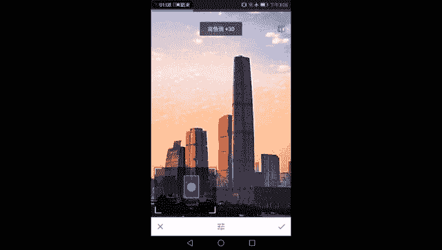

晕影，通常被称为暗角或亮角，是指画面边缘变暗或变亮的效果。

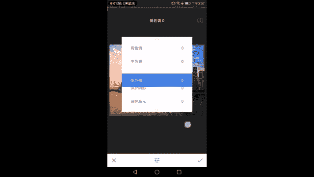

Snapseed的晕影工具比许多APP更智能，它可以分别调整内部和外部的亮度。

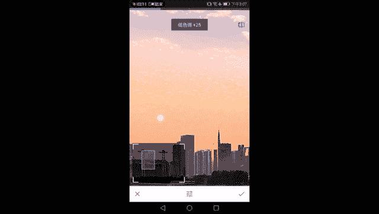

以下是晕影工具的参数：

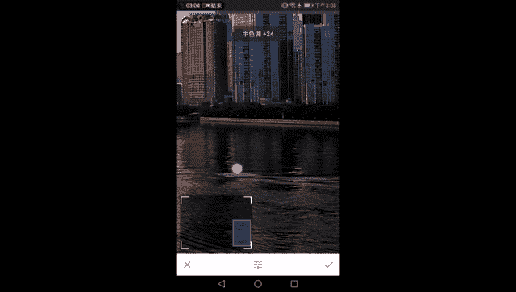

*   **外部亮度**：向左滑动使画面外围变暗（暗角），向右滑动使外围变亮（亮角）。
*   **内部亮度**：调整画面中心区域的亮度。
*   **晕影大小**：通过缩放画面来调整晕影效果覆盖的范围。

这个工具常用于突出画面中心主体，或为照片增添特定的风格氛围。

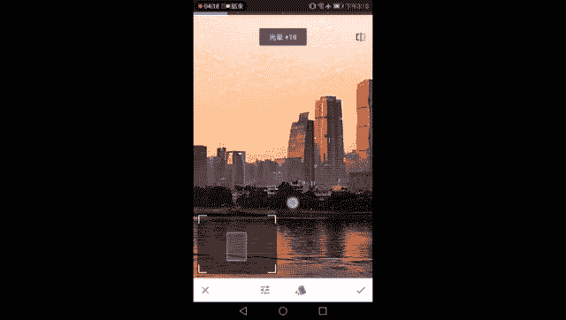

## 文字工具：添加水印与文字

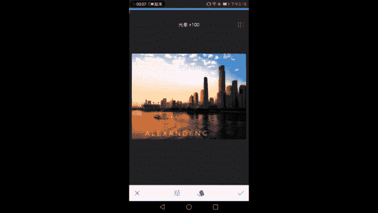

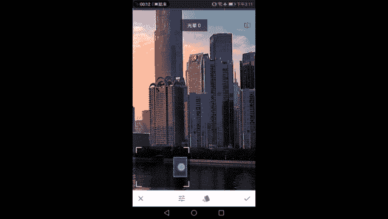

文字工具用于在画面上添加水印或文字信息。

以下是文字工具的调节选项：

*   **颜色**：选择文字的颜色。
*   **不透明度**：控制文字显示的透明程度。向左滑动更透明，向右滑动更清晰。
*   **倒置**：将不透明度效果反转，形成一种镂空效果，让文字区域透出背景画面，有时能突出文字。
*   **字体与样式**：选择不同的字体。除了常规字体，还有一些特殊的图形样式（如圆圈、六边形），可以用来制作Logo式的水印。

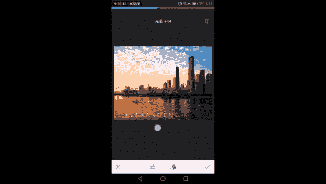

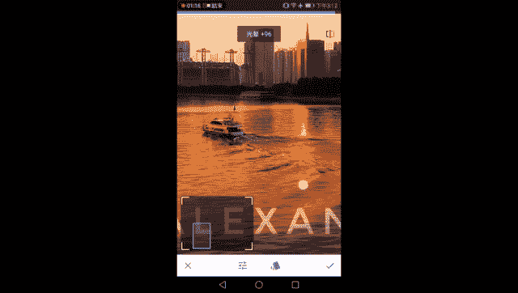

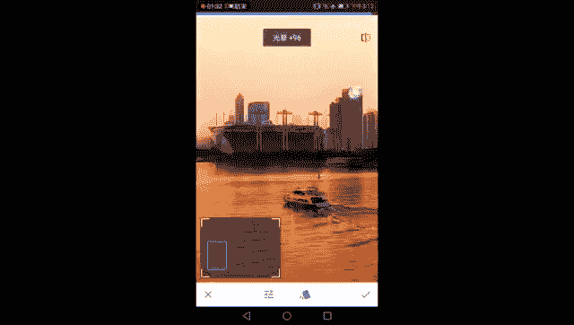

## 精选滤镜：提升画面质感

虽然不推荐滥用滤镜，但Snapseed中有几个滤镜非常实用，可以精细地提升画面质感。

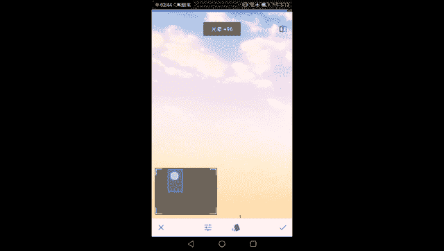

### 色调对比度：增强局部立体感

普通的对比度调整是针对整个画面的，容易导致亮部过曝、暗部死黑。色调对比度滤镜则将画面按亮度分为**高光、中间调、阴影**三个部分，允许我们分别调整它们的对比度。

**核心概念**：`局部立体感 = 分区域调整对比度`。例如，只想让建筑（多处于阴影区）更立体，就只增加“低色调”对比度；只想让天空（多处于高光区）的云层更有层次，就只增加“高色调”对比度。这样可以实现非常精细的立体感塑造。

### 魅力光晕：营造柔和过渡

魅力光晕滤镜可以为画面添加柔光效果，让边缘过渡更自然、温柔。

它的作用主要有两个：

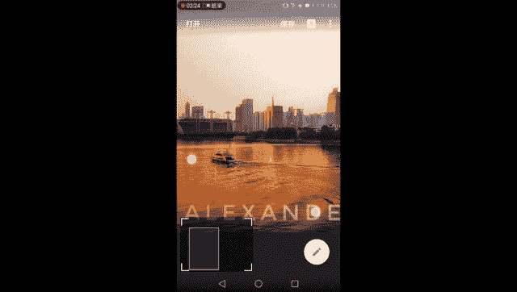

1.  **软化硬朗边缘**：让建筑等物体尖锐的明暗交界线变得柔和，增添一份朦胧美。
2.  **修复过度锐化**：如果之前调整导致画面出现粗糙的色斑或颗粒（非ISO噪点），魅力光晕可以显著减缓这一现象，让天空等柔和部分的过渡恢复自然。

**核心概念**：`魅力光晕 ≈ 添加柔光 + 平滑过渡`。使用时需注意“度”，避免让画面过于模糊。其参数中的“饱和度”和“暖色调”也可根据喜好微调。

### 复古滤镜（12号）：无损增强反差

复古滤镜下的众多预设大多会改变画面色彩。但“12号”预设是一个例外，它主要作用是**增加画面的整体反差和立体感**，且不会引入偏色。

**核心概念**：`复古12号 ≈ 强化整体反差`。你可以将其视为一个增强立体感的“无损”滤镜，并可通过“样式强度”滑块控制其效果强弱。

## 蒙版工具：实现局部精细调整

调完上述所有步骤后，如果你希望某个效果只作用于画面的特定区域，就需要使用蒙版工具。

蒙版可以将任何全局调整（如魅力光晕、色调对比度）转化为局部调整。

以下是使用蒙版的方法：

1.  点击右上角的“编辑步骤”按钮（显示为数字，如“9”），查看所有已进行的调整步骤。
2.  选择想要局部应用的那一步（例如“魅力光晕”），点击中间的“蒙版”图标（像画板和笔）。
3.  进入蒙版界面后，默认整个画面都受到该效果100%的影响（显示为红色覆盖层）。
4.  使用画笔进行擦除：
    *   **画笔数值为0**：完全擦除效果。
    *   **画笔数值为100**：完全添加效果。
    *   中间数值（25， 50， 75）代表不同程度的效果。
5.  通过缩放调整画笔大小，仔细涂抹你不想让该效果影响的区域（例如，用0数值画笔擦除建筑，只保留天空和水面的柔光效果）。
6.  点击“眼睛”图标可以查看/隐藏蒙版覆盖区域，方便检查。
7.  调整完成后打勾确认。

**核心概念**：`蒙版 = 选择性应用效果`。通过蒙版，你可以实现诸如“只让天空变蓝”、“只让水面更暖”、“只对建筑进行锐化”等复杂而精细的局部调整，让后期控制力大大提升。

## 总结与回顾

本节课中我们一起学习了Snapseed中几个核心的后期处理技巧：

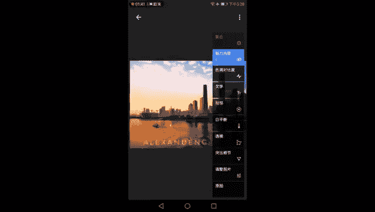

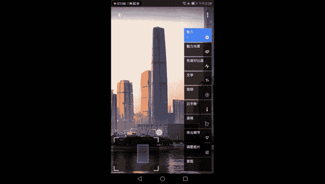

1.  **修复、晕影、文字工具**：用于移除瑕疵、添加氛围和水印。
2.  **三大实用滤镜**：
    *   **色调对比度**：分高光、中间调、阴影增强局部立体感。
    *   **魅力光晕**：添加柔光，软化边缘，修复过度锐化。
    *   **复古（12号）**：无损增强画面整体反差。
3.  **强大的蒙版功能**：将任何全局调整变为局部调整，实现像素级精细控制。

我们完成了一套完整的城市风光后期流程：从基础明暗、色彩校正，到透视矫正、局部增强，再到利用滤镜提升质感，最后用蒙版进行局部微调。掌握这些工具的组合使用，你就能让手机照片呈现出专业级的视觉效果。