# 木西-用普通手机拍出专业级照片（完结）：05：手机照片后期处理（3）

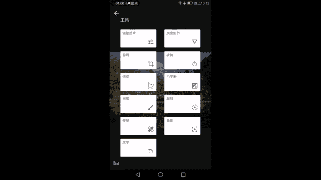

在本节课中，我们将要学习自然风光和人像照片的后期处理流程。我们将延续上一节城市建筑风光的思路，并针对不同题材的特点，调整后期策略，最终获得专业级的照片效果。

## 自然风光后期处理 🌄

上一节我们介绍了城市建筑风光的后期处理，并详细讲解了Snapseed工具的功能。本节中我们来看看自然风光的后期。自然风光与城市建筑在后期处理上有许多相似之处，它们都涉及宏观场景、自然光线以及我们无法改变的地形或建筑形态。

### 核心处理原则回顾

在处理明暗和色彩时，我们遵循以下核心原则：
*   **明暗调节**：目标是亮的区域不过曝，暗的区域不死黑，同时画面保有良好的对比度和细节。
*   **色彩调节**：目标是色彩接近真实观感，并可融入适度的个人风格，但需避免在色温、色调或饱和度上过度调整。

掌握“适度”的尺度，需要通过大量观摩优秀作品和持续练习来培养。

### 实战演练：雪山湖泊调整

现在，我们以一张在毕棚沟拍摄的雪山湖泊照片为例，开始实际操作。

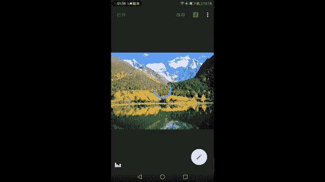

首先，点击右下角工具菜单，选择“调整图片”。

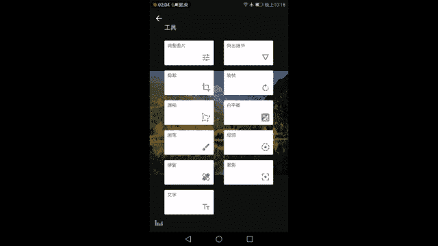

**1. 基础明暗与色彩调整**

以下是调整图片的具体步骤：

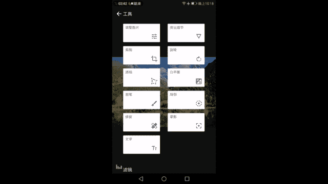

*   **亮度**：观察直方图，原图整体偏暗。向右增加亮度，使画面变亮。
*   **对比度与氛围**：增加对比度后，高光区域可能过曝，阴影可能过黑。此时使用“氛围”功能来平衡光比，它能提亮阴影并压暗高光，使直方图向中间集中，减弱生硬的明暗对比。
*   **饱和度**：增加饱和度，还原高原天空应有的湛蓝色。
*   **高光**：降低高光，恢复云朵的细节。注意避免降得过多，否则会在物体边缘产生不自然的亮边。
*   **阴影**：稍微降低阴影，让画面该暗的部分暗下去，以增强立体感。确保直方图最左侧不贴墙，保留暗部细节。
*   **冷暖色调**：本例白平衡准确，无需调整。

完成以上步骤后，打勾进入下一步。

**2. 增强细节**

进入“突出细节”工具。

*   **结构**：谨慎增加结构，以增强山体和树林的质感，但需避免加得过多导致画面脏乱。可先加到30-40，观察天空是否出现色块，再微调至合适值（如30）。
*   **锐化**：适当增加锐化，让画面看起来更清晰。

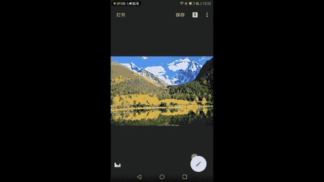

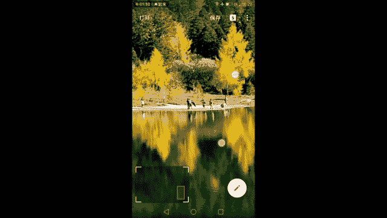

**3. 构图与透视校正**

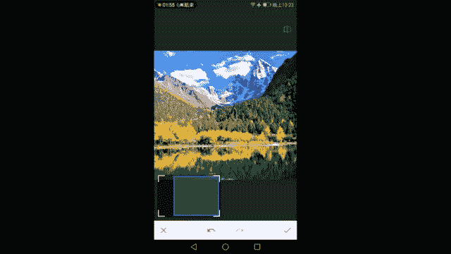

进入“裁剪”和“透视”工具。

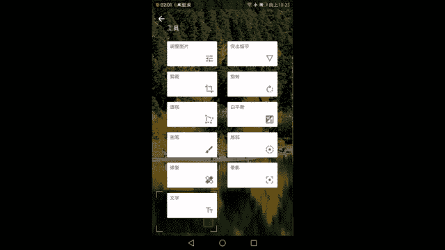

*   **裁剪**：本例构图已遵循三分法，上方三分之二是主体。若需调整，可略微裁剪下方水面，进一步突出雪山。
*   **旋转**：检查地平线是否水平，进行微调。
*   **透视**：自然风光中的山脉本身具有近大远小的自然透视，无需像建筑一样进行垂直校正。

**4. 局部调整**

进入“局部”工具。

*   针对感觉偏灰的山体，添加局部调整点。
*   **操作**：提高对比度，降低饱和度，必要时降低亮度。通过增强山体明暗对比来塑造立体感。
*   可以添加多个局部点，覆盖不同的山体区域，进行类似调整。

**5. 修复瑕疵**

进入“修复”工具。

*   可以尝试抹去画面中较小的游客。
*   **注意**：修复大面积或复杂区域容易产生BUG（如重复元素、残留影子），需谨慎使用。

**6. 色调对比度与魅力光晕**

*   **色调对比度**：使用此工具局部增强质感。增加“高色调”以增强云朵反差；增加“低色调”以增强山体和树林暗部的立体感。调整需适度。
*   **魅力光晕**：适当添加魅力光晕（如强度44），可以使天空和水面的过渡更加柔和自然，增添氛围。避免过度使用导致画面过软。

**7. 最终风格化**

进入“复古”滤镜。

*   选择“复古12号”样式。
*   添加暗角，并调整滤镜强度，整体微调画面亮度和对比度，使立体感和影调更符合预期。

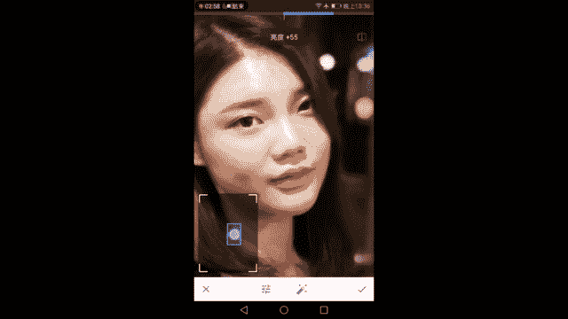

### 风光后期总结

回顾整个流程，我们通过以下步骤将一张灰蒙蒙的原图变为通透的风光大片：
1.  **基础调整**：平衡明暗（亮度、对比度、氛围、高光、阴影），增强色彩（饱和度）。
2.  **细节增强**：适度增加结构和锐化。
3.  **构图优化**：进行裁剪和旋转。
4.  **局部塑形**：使用局部工具增强山体立体感。
5.  **质感与氛围**：用色调对比度强化质感，用魅力光晕柔化过渡。
6.  **风格定调**：使用复古滤镜添加暗角并统一影调。

照片后期的首要目的是弥补相机与人眼的差距，使照片更接近真实观感。其次是在符合人眼视觉规律的基础上，进行个性化的适度调整。

---

## 人像摄影后期处理 👧

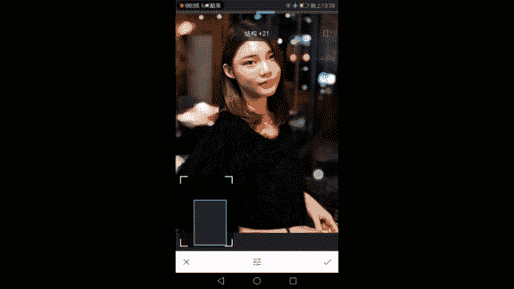

讲完了自然风光，我们最后来看看人像摄影的简单后期。与人像相比，风光建筑更依赖时机和角度，而人像拍摄中，模特的状态、光线、造型等前期因素至关重要。

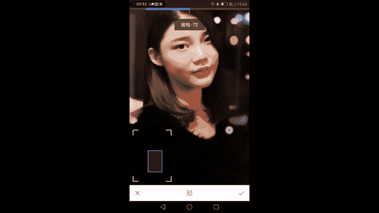

### 人像后期核心原则

人像后期的核心标准是**人物的皮肤和面部**，一切调整以此为中心，甚至可能因此放弃对直方图的追求。原则是：皮肤宁可略微过曝显白，也切勿欠曝显黑；对比度和饱和度要适度，以保持皮肤质感与健康肤色。

### 实战演练：室内人像调整

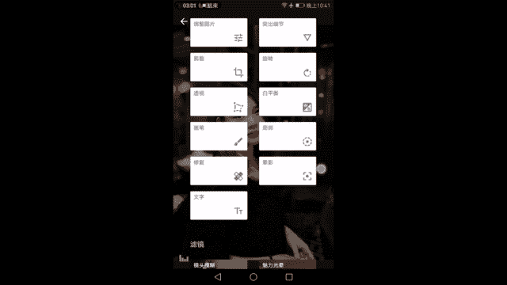

我们以一张室内人像为例。

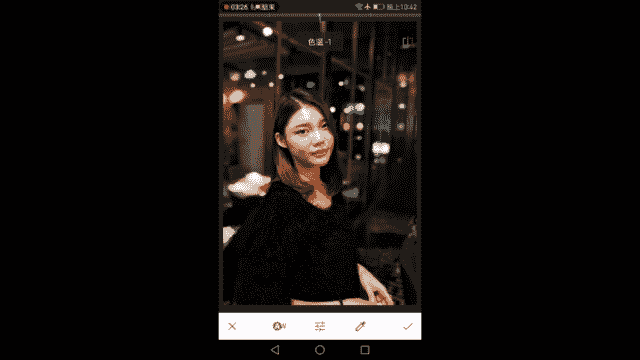

**1. 基础调整**

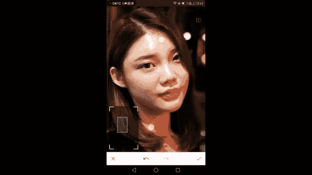

进入“调整图片”工具。

*   **亮度**：以模特脸部为准进行提亮，使其白皙且有细节。
*   **对比度**：适当增加，增强五官立体感，但避免过高丢失皮肤细节。
*   **饱和度**：谨慎增加，使唇彩等色彩更突出，同时密切观察皮肤颜色是否变得不自然。

**2. 细节处理**

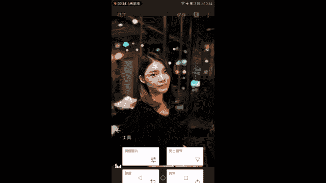

进入“突出细节”工具。

*   **结构**：轻微增加，可使发丝、眉眼更清晰。**关键技巧**：结构值向**左**滑动（负值）可起到磨皮效果。
*   **锐化**：轻微增加。

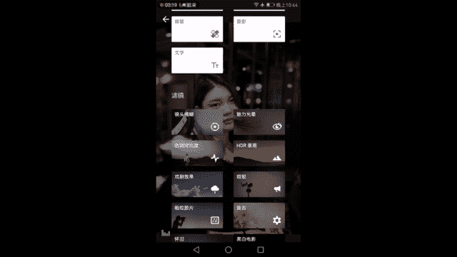

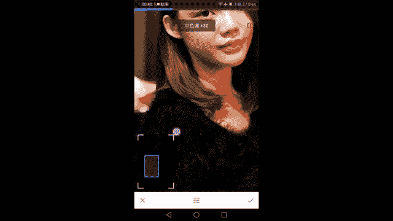

**3. 构图与白平衡**

*   **裁剪**：按照黄金分割等构图法裁剪，注意不要裁掉手部等重要部位。
*   **白平衡**：向左（冷调）微调可使皮肤更显白，向右（暖调）微调可使气色更红润。根据需求把握平衡。

**4. 瑕疵修复**

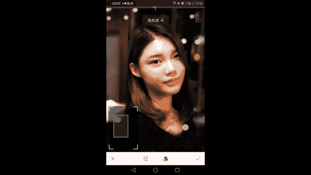

进入“修复”工具。

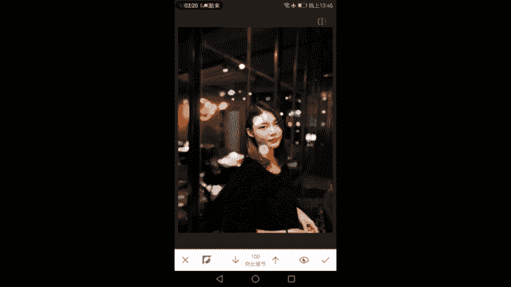

*   点除面部明显的痘痘、小瑕疵。
*   **注意**：处理面部较大阴影区域时需小心，避免造成肤色不均。

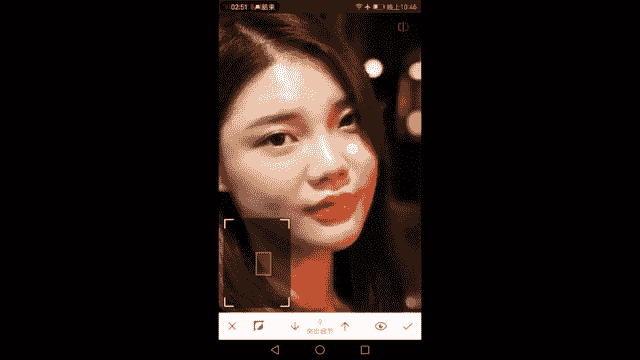

**5. 突出主体与增强质感**

*   **晕影（暗角）**：可轻微添加暗角，使环境稍暗，突出人物主体。
*   **色调对比度**：增加“中色调”和“低色调”，增强头发、衣物面料的质感。**切记**：将“高色调”对比度降至最低，以免破坏面部皮肤。

**6. 皮肤柔化与局部蒙版应用**

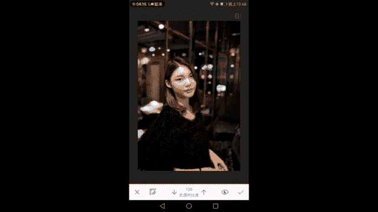

这是人像后期的关键步骤。

*   **魅力光晕**：添加魅力光晕可使皮肤过渡更柔和。但会影响整体画面。
*   **蒙版局部调整**：使用蒙版功能，选择性应用或减弱效果。
    *   **突出细节蒙版**：将“结构”效果通过蒙版**擦除**在皮肤区域，实现局部磨皮，同时保留头发等处的质感。
    *   **色调对比度蒙版**：同样用蒙版**擦除**面部皮肤区域，避免质感工具影响皮肤光滑度。
    *   **魅力光晕蒙版**：用蒙版**擦除**头发、背景等不需要柔化的区域，并可调整面部光晕的作用浓度（如设为50%-75%），实现自然柔肤。

### 人像后期总结

回顾人像后期流程：
1.  **基础美化**：以皮肤为准调整亮度、对比度、饱和度。
2.  **细节控制**：微调结构（可正可负）和锐化。
3.  **构图与色温**：优化构图，调整白平衡改善肤色。
4.  **瑕疵修复**：点除明显瑕疵。
5.  **质感与氛围**：用暗角突出主体，用色调对比度增强发丝、衣物质感。
6.  **局部精修**：**核心步骤**，利用蒙版对“突出细节”、“色调对比度”、“魅力光晕”等效果进行局部控制，实现磨皮、柔肤而不影响画面其他部分的质感。

---

## 课程总结 🎯

本节课中，我们一起学习了自然风光和人像摄影的后期处理。
*   对于**风光**，我们延续了全局调整的思路，并加入了局部工具来强化主体，最后用滤镜统一风格。
*   对于**人像**，我们确立了以人物皮肤为核心的调整原则，并重点学习了使用**蒙版**进行局部精修的高级技巧，从而在美化人物的同时保持画面质感。

通过这三节课的学习，你已经掌握了使用Snapseed对各类题材照片进行基础曝光、色彩、细节和构图调整的方法。这为后续进行更复杂的风格化处理打下了坚实基础。