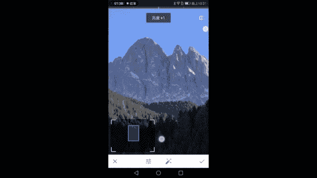
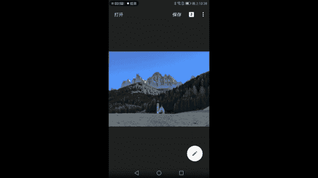
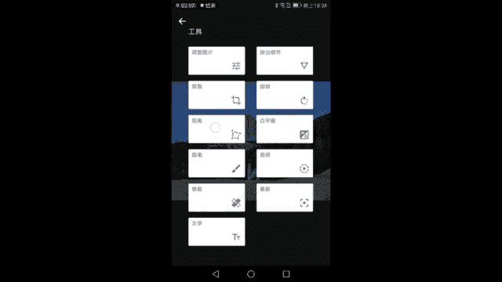
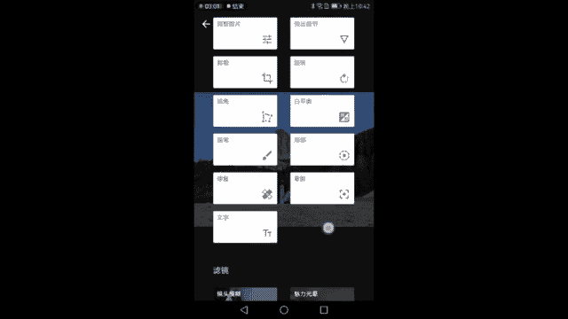
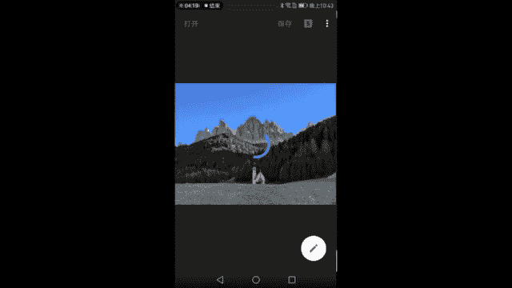
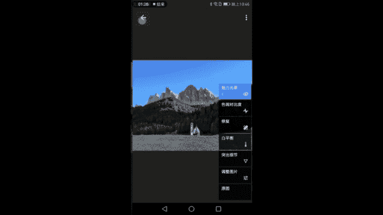

# 木西-用普通手机拍出专业级照片（完结）：06：拍摄城市风光、自然风光

在本节课中，我们将学习风光摄影的核心技巧，包括构图、测光、透视以及后期处理。我们将以意大利多洛米蒂山区的教堂与群山为例，演示如何用手机完成从拍摄到修图的完整流程。

## 构图基础：三分法与主体摆放

上一节我们介绍了风光摄影的重要性，本节中我们来看看如何构建一个平衡的画面。构图是风光摄影的基础，因为它决定了画面的结构和视觉引导。

以下是构图时需要考虑的几个要点：

*   **三分法**：将画面横竖各分为三等份，形成九个区域和四个交点。将重要的线条（如地平线、山脊线）放在三分线上，将视觉焦点（如教堂）放在交点上，可以使画面更平衡。例如，让天空占上三分之一，中间的山体森林带占中三分之一，地面占下三分之一。
*   **主体与背景**：浅色主体（如白色教堂）放在深色背景（如墨绿色森林）前，可以形成鲜明对比，突出主体。
*   **主体位置**：主体可以放在画面的黄金分割点（左或右三分之一处）或正中心。需要通过实际观察来判断哪种位置更合适。例如，将教堂放在右侧时，可能会让画面左右重量失衡；放在中心则能获得更稳定、对称的构图。
*   **焦段选择**：如果主体过小，可以使用数码变焦（手机）或光学变焦（相机）进行放大，让画面更充实，同时保留足够的天空和地面来营造空间感。

## 准确曝光：测光与HDR模式

构图完成后，我们需要确保画面曝光正确。这涉及到测光点的选择，尤其是在光比较大的场景中。

以下是关于测光和曝光的核心操作：

*   **测光点选择**：在明暗反差大的场景中（如明亮的天空和阴暗的森林），选择不同的测光点会导致画面过曝或欠曝。**最佳策略是选择画面中亮度居中的区域进行测光**，例如一块既不太亮也不太暗的山坡。
*   **使用HDR模式**：**HDR（高动态范围）** 模式可以同时捕捉亮部和暗部的细节，是风光摄影中应对大光比环境的必备功能。
*   **曝光补偿**：如果对自动曝光结果不满意，可以手动拖动曝光补偿滑块（屏幕上显示为小太阳的图标）来增减整体亮度。

## 透视与机位：用脚步寻找最佳视角

透视规律（近大远小）在风光摄影中同样重要，尤其是当画面中有明确的前景主体时。

理解并运用透视，可以帮你控制画面中元素的比例关系：

*   **改变距离**：通过前后移动来改变前景主体（如教堂）与背景（如山体）的大小比例。离主体越近，它显得越大；离得越远，则显得越小。
*   **寻找前景**：在拍摄现场要多走动，寻找可以遮挡杂乱背景（如未完工的滑雪场、不协调的建筑）的前景元素，哪怕是一个小小的土坡。放低机位，让这个前景刚好挡住干扰物，能使画面变得干净、简洁。
*   **环绕观察**：不要只停留在第一个看到的机位。围绕主体多走一走，从不同角度观察，你可能会发现更平衡、更有趣的构图。例如，通过移动找到一个能让教堂位于画面更中心、背景群山分布更匀称的位置。

## 实战后期处理：从原片到成片

前期拍摄完成后，我们进入后期处理环节，让照片的色彩、质感和立体感达到最佳状态。我们将使用手机修图软件逐步调整。

以下是本次后期处理的核心步骤与思路：

1.  **基础调整（调整图片）**：
    *   检查直方图，确认曝光是否合理。本例中原片整体偏暗，反差不足，显得有些“灰”。
    *   适当增加 **对比度** 和 **氛围**（或去雾）功能，增强画面整体立体感。
    *   增加 **饱和度**，还原景物色彩。如果觉得色彩偏冷（阴影泛蓝），可以微调 **色温** 向暖色调偏移，使画面更自然。

2.  **强化细节（突出细节）**：
    *   增加 **结构** 和 **锐化** 可以大幅提升山体质感和树林细节。但直接全局调整可能会在天空与山的交界处产生难看的“白边”。
    *   **解决方案是使用蒙版工具**：在“突出细节”调整步骤中，使用画笔蒙版，只将效果涂抹在山体和树林区域，避开天空，从而精确控制调整范围。

3.  **局部色彩优化（白平衡蒙版）**：
    *   如果觉得山体的颜色不够理想（例如不够金黄），可以再次使用 **白平衡** 配合 **蒙版**。
    *   新建一个白平衡调整，将色温调暖，然后通过蒙版只将暖色调应用在山体部分，而不影响天空和地面的颜色。

4.  **修复瑕疵与增强质感**：
    *   使用 **修复** 工具点掉地面上分散注意力的杂乱草皮或杂物。
    *   使用 **色调对比度** 功能，分别对高光、中间调、阴影的对比进行微调，可以进一步增强岩石的质感和树林的层次。

5.  **添加氛围与最终定调**：
    *   使用 **魅力光晕** 可以为阳光直射下对比强烈的部分添加柔和的光晕过渡，提升画面氛围。同样建议用蒙版控制应用范围。
    *   最后，使用 **复古滤镜**（如12号滤镜），适当增加样式强度以强化整体立体感，并轻微添加一点 **晕影（暗角）**，将观众的视线引导向画面中心的教堂和山体。

处理前后对比效果显著：

*调整前：画面偏灰，色彩平淡，缺乏立体感。*

*调整后：色彩鲜明，山体质感突出，光影层次丰富，主体更引人注目。*

## 总结

本节课中我们一起学习了风光摄影的完整流程。我们从**三分法构图**和**主体摆放**开始，构建了稳定的画面基础。接着，我们探讨了如何通过**选择测光点**和**启用HDR模式**来获得准确曝光。然后，我们理解了**透视规律**，并强调通过**多走动、多观察**来寻找最佳机位和前景的重要性。最后，我们完成了一套系统的**手机后期处理**流程，包括基础调色、蒙版局部调整、细节强化和氛围渲染，将一张普通的原片转化为质感十足的风光作品。记住，前期是根基，后期是升华，两者结合才能用手机拍出专业级的照片。