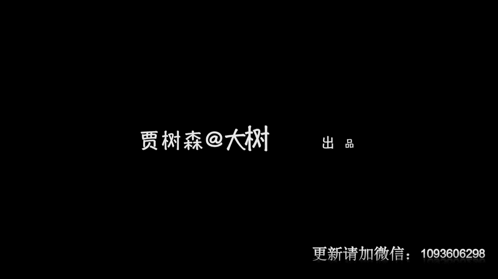

# 手机摄影高手：1：【0基础】手机拍摄功能详解：第一讲 你知道手机摄影的4个真相吗 📱

在本节课中，我们将要学习手机摄影的四个核心真相。我们将对比手机与单反相机的优缺点，探讨手机摄影的本质，并了解如何正确看待摄影器材。无论你是摄影新手还是希望提升手机拍照技巧，本节课都将为你奠定坚实的基础。

## 手机摄影的优势与劣势

上一节我们介绍了课程主题，本节中我们来看看手机摄影的核心特点。手机摄影最大的特点是其便利性。

以下是手机摄影的主要优势：

*   **便携性极强**：手机体积小巧，可以轻松放入口袋随身携带。相比之下，单反相机需要装入较大的摄影包，并携带机身、多个镜头及闪光灯等附件。
*   **即时处理与分享**：拍摄完成后，可以立即在手机上进行修图，并快速分享给朋友或社交平台。而单反拍摄的照片需要导出到电脑处理，再传回手机，流程较为繁琐。

然而，手机摄影也存在一些明显的短板。

以下是手机摄影的主要劣势：

*   **续航与响应**：手机耗电较快，且快门响应速度通常不如单反相机迅速。
*   **画质局限**：尤其在弱光环境下，手机拍摄的照片画质较差，噪点（颗粒）明显。单反相机在此方面表现更优。
*   **抓拍能力**：对于运动速度极快的物体，手机的抓拍能力稍弱。
*   **环境适应性**：在寒冷环境下长时间使用手机拍摄，体验不佳。

## 像素的真相：不必盲目追求高像素

了解了手机的基础特性后，我们来看看关于像素的常见误区。手机摄像头像素从最初的200万发展到如今的千万级别，厂商间曾展开激烈的像素竞赛。

但手机传感器尺寸（CMOS）很小，单纯追求超高像素意义有限。目前主流的一千多万像素已完全足够日常使用，画质平衡性良好。因此，不必盲目相信厂商的高像素宣传。

## 手机与单反：认清器材的定位

既然像素不是唯一标准，那么手机能取代单反吗？近年来，双摄像头等技术的出现，使手机也能拍摄背景虚化的人像照片。

但以当前技术，手机的拍照功能**无法全面超越**单反相机。广告宣传需要理性看待。每种器材都有其定位和局限性。

*   **单反相机**：适用于对画质、像素有极高要求的**商业摄影**，如杂志印刷、大型广告、名人肖像等。其公式可表示为：**高画质 + 高可控性 = 专业创作**。
*   **手机摄影**：更适合**日常生活记录**，如旅行风光、街头随拍、家庭瞬间等。其公式可表示为：**便携性 + 即时性 = 生活记录**。

## 手机摄影的本质：观察与感受生活之门

最后，也是最重要的一点，我们来探讨手机摄影带来的真正改变。手机摄影提供了一种前所未有的可能性，推动了“全民摄影”的时代。

它让更多人能够便捷地记录生活、发现美、表达感悟。提升摄影水平的关键并非在于拥有多昂贵的手机。

以下是一个核心观点列表：

*   **器材不是决定性因素**：千元级别的手机已具备强大的拍照功能。照片的好坏差异，主要源于拍摄者的**观察力、审美和技巧**。
*   **大脑比镜头更重要**：最重要的不是手机本身，而是手机后面的那颗**脑袋**。通过持续学习和练习，每个人都能拍出好照片。

本节课中我们一起学习了手机摄影的四个真相：明白了手机的便利性与局限性，看穿了高像素的营销迷雾，清楚了手机与单反各自的定位，并最终认识到提升摄影水平的关键在于拍摄者自身。记住，手机摄影是一扇帮助你更好地观察世界、感受生活的神奇之门。