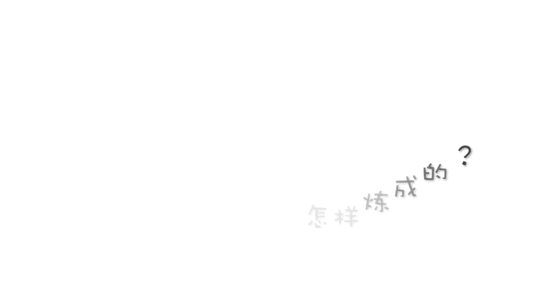
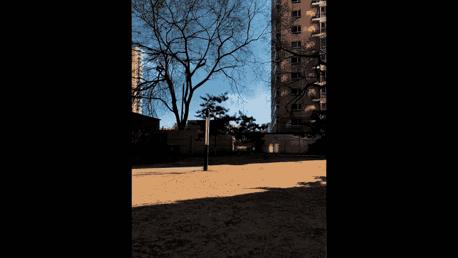

# 贾树森-手机摄影高手（完结）：1：【0基础】手机拍摄功能详解：第三讲 摄影之眼是怎样炼成的？👁️

在本节课中，我们将要学习如何评判照片的好坏，并掌握美国纽约摄影学院提出的三条核心标准。通过这些标准，你将学会如何像专业摄影师一样观察世界、取舍画面，最终拍出主题明确、主体突出、画面简洁的好照片。

## 好照片的三条黄金标准 📜

照片拍得好与坏，有一个评判标准。虽然艺术无法完全用标准化衡量，但美国纽约摄影学院的教材给出了三条明确的规则。

以下是关于好照片的三条核心标准：

1.  **主题必须明确**：一幅好照片必须有一个明确的主题。这张照片到底拍的是什么，是人、事物还是风景，必须让观者一目了然。
2.  **主体必须突出**：一幅好照片必须把观者的注意力引向被摄主体。需要通过构图、用光等方法，让目光瞬间聚焦在主体上。
3.  **画面必须简洁**：一幅好照片的画面只包括那些有利于把视线引向被摄主体的内容。对于容易分散注意力的元素，应尽量排除或弱化。

建议大家将这三条原则多读几遍，仔细琢磨。从这些基本原则开始思考，你会用全新的标准去欣赏照片，更重要的是，你会开始用全新的方式观察世界和拍摄画面。你将学会运用真正摄影师的眼光，通过取景器去观察。

## 拍摄前的三个自问 🤔

在按下快门之前，尝试问自己三个问题，这能有效提升你的出片率。

以下是按下快门前需要思考的三个关键问题：

*   **第一**：这张照片我想要表现的主题是什么？
*   **第二**：我怎样才能把注意力集中到被摄主体身上？如何吸引观者的眼球？
*   **第三**：画面是否足够简洁？是否只包括了有利于突出主体的内容？是否去掉了分散注意力的、不必要的元素？

我们来看示例照片。拍摄主题明确是小朋友。主体突出，因为周围环境被压暗，没有分散注意力的元素。画面简洁，通过弱化周围画面，让观者的注意力完全集中在小朋友的脸上。这本质上是一个关于“摄影眼力”的问题，即能否发现并拍出身边的美。

## 用“第三只眼”学习观察 👀

为了更直观地展示如何观察和取舍，老师将一台运动相机固定在额头上，形成“第三只眼”。这个视角将带领大家观看老师是如何观察周围环境、进行取舍，并最终构成画面的。

我们来挑战一下，在冬天的北方，在住所附近寻找好看的景色。

**场景一：光影的局部**
在小区门口，发现阳光透过百叶窗形成的光影。拍摄时，我们只取局部，不拍全部，这样光影对比就特别漂亮。换个角度观察，发现从这个角度看光斑更加好看。通过控制曝光让周围变暗，光斑就显现了出来。

**场景二：寻找最佳角度**
小区里一棵树的投影很漂亮，但初始角度不理想，有遮挡，影子状态也不完美。于是，沿着路转到逆光方向，让太阳在正对面，这时树影的形态就变得漂亮了。我们常常觉得某个东西漂亮，但拍出来不好看，原因就是没有仔细取舍，没有按照好照片的三条标准去经营构图。

**场景三：排除干扰**
例如，栏杆会形成遮挡，但我们穿过栏杆的缝隙去拍摄，就把真正吸引我们的美纳入了画面，而将干扰物排除在外。这样取到的，才是真正闪光的点。

**场景四：弱化干扰元素**
这个景色吸引人的是湛蓝的天空和地上的一条光带。但美中不足的是旁边有一辆垃圾车。这时，通过曝光控制，让垃圾车处于阴影中，从而简化了画面，让视线完全集中在想要表达的内容上。

## 养成时刻观察的习惯 🔍

平时要养成善于观察的习惯。哪怕是一台垃圾车，其车身上的一块白色油漆，与树干的阴影放在一起，也能形成有趣的对比。再比如一个小栏杆在阳光下的投影，光影非常好看。

在拍摄过程中，还可能发现意外之喜。例如，正在拍摄时，发现地上的影子变淡了。一抬头，发现是一片云飘过遮住了太阳，此时云层透出斑斓的光线，特别漂亮。这时需要赶紧拿起手机捕捉这个瞬间。

本节课中，我们一起学习了评判好照片的三条黄金标准：**主题明确、主体突出、画面简洁**。我们掌握了在拍摄前向自己提问的三个关键问题，并通过老师的“第三只眼”视角，学习了如何在日常生活中观察、取舍和构图。记住，培养“摄影之眼”的核心在于**有意识地运用这些标准去观察世界**，并**果断地排除干扰**，只留下最能表达你心中所见的画面。