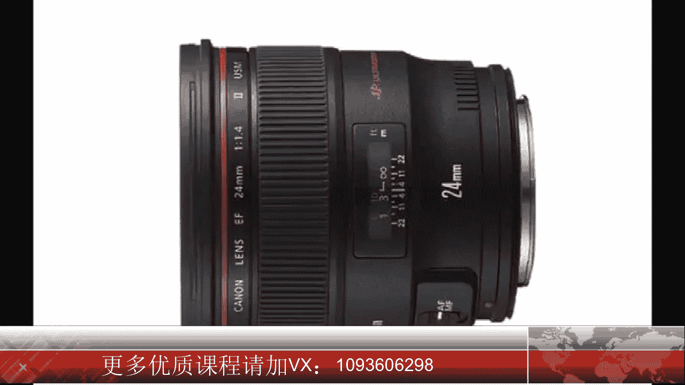

# 手机摄影高手：1：【0基础】手机拍摄功能详解：第二讲 手机摄影要准备哪些辅助道具？📱

在本节课中，我们将要学习手机摄影中常用的辅助道具，包括附加镜头、自拍杆与三脚架，以及如何将手机照片导入电脑进行管理。这些工具能帮助你突破手机原生镜头的限制，获得更稳定、更多样化的拍摄效果。

## 手机附加镜头

上一节我们介绍了手机的基础拍摄功能，本节中我们来看看如何扩展这些功能。手机自带的镜头焦距大约相当于全画幅相机的**24毫米**，属于小广角镜头，能满足大部分日常拍摄需求。

然而，它无法满足所有场景。例如，拍摄远处物体需要长焦镜头，拍摄广阔风景则需要更广的视角。因此，手机附加镜头应运而生。它们可以直接安装在手机摄像头上，提供更多拍摄可能。

随着iPhone 7 Plus和8 Plus等双摄手机的出现，手机本身也提供了约**50毫米**的中焦镜头，用于人像模式拍摄，能将人物拉得更近。

对于拍摄大场景，我通常使用手机的全景拍摄功能，因此之前并未配备附加镜头。大家可以根据自身需求和爱好决定是否购买。

以下是常见的附加镜头类型：
*   **广角镜头**：适合喜欢拍摄风光，觉得手机镜头不够广的用户。
*   **微距镜头**：适合喜欢拍摄微小物体的用户。
*   **人像镜头**：适合没有双摄像头手机，但又想拍摄更好人像效果的用户。

手机镜头价格从几十元到几千元不等。对于初学者，建议购买**两三百元**价位的产品即可。

## 自拍杆与三脚架

除了镜头，稳定设备也是重要的辅助工具。自拍杆品类繁多，容易让人眼花缭乱。

我常用的一款自拍杆功能多样。它不仅可以作为自拍杆使用，其底部还能展开成为一个三脚架。这样，我们可以将自己拍入大场景中，实现“人小景大”的效果。

这个三脚架还配备了一个**无线遥控快门**，通过蓝牙与手机连接，可以远距离控制拍摄，非常适合自拍。但需注意保持遥控器电量充足。

在需要极强稳定性的拍摄场景下，我会使用一个更专业的重型三脚架。它是一个标准的摄像机小三脚架，通过一个专用的**手机夹子**与三脚架连接，稳定性非常好，但便携性稍差。

## 手机摄影的题材与潜力

随着技术进步，手机能拍摄的题材已非常广泛。例如，被誉为手机摄影界奥斯卡的IPPA摄影比赛，其参赛类别包括：抽象、动物、建筑、儿童、花卉、风景、生活方式、自然、全景、人物肖像、系列作品、静物、日落、旅行和树木等。

由此可见，手机摄影的潜力巨大。当然，手机在拍摄快速移动物体或暗光环境时仍有短板。不过，我们可以运用一些拍摄技巧来弥补，例如使用**连拍**功能捕捉动态，或用**追随拍法**拍摄夜景中的车流。只要选对时机、用对技巧，用手机拍摄月亮也并非难事。

## 手机照片导入电脑的方法

对于喜欢用手机拍照的用户，手机存储空间是个大问题。我们需要定期将照片导入电脑保存。以下是不同设备组合下的操作方法：

**安卓手机连接苹果电脑：**
1.  用数据线连接手机和电脑。
2.  电脑会自动弹出安装程序，按提示安装软件。
3.  通过该软件打开手机，在目录中找到 **`DCIM`** 文件夹。
4.  进入 **`Camera`** 文件夹，即可看到照片，将其复制到电脑即可。

**安卓手机连接Windows电脑：**
推荐使用360手机助手等管理软件。
1.  打开软件并连接手机，按提示完成设置（包括开启手机USB调试）。
2.  进入“管理照片”功能。
3.  勾选需要导入的照片，点击导入到指定电脑文件夹。

**苹果手机连接苹果电脑：**
1.  在电脑上打开“照片”应用。
2.  点击左侧边栏中自己的iPhone设备名称。
3.  将手机解锁，照片才会显示。
4.  选择要导入的照片，点击右上角“导入所选项目”或“导入所有新项目”。
5.  导入后，可将照片从“照片”应用中转存到电脑文件夹。

**苹果手机连接Windows电脑：**
1.  在电脑上下载并安装“苹果助手PC版”等管理软件。
2.  连接手机并打开软件，访问手机相册。
3.  勾选需要导入的照片，点击“导入”并选择电脑上的目标文件夹即可。

本节课中我们一起学习了手机摄影的三大类辅助道具：扩展视野的附加镜头、提供稳定和拍摄自由度的自拍杆与三脚架，以及管理作品的照片导入方法。了解并合理运用这些工具，能让你的手机摄影创作如虎添翼。