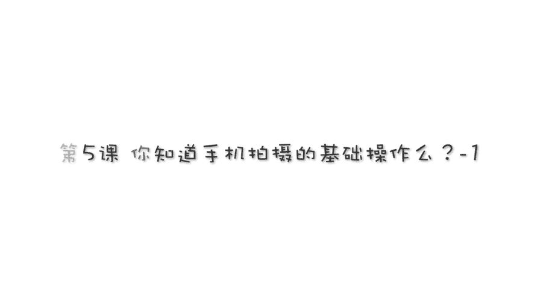
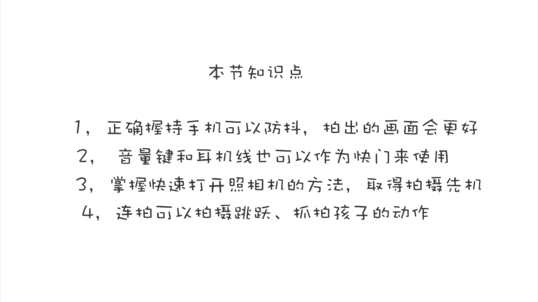

手机摄影高手：1：【0基础】手机拍摄功能详解：第五讲 手机拍照基础操作（上）

在本节课中，我们将学习手机拍照的基础操作，包括正确的持机方式、隐藏的快门键使用、快速启动相机以及连拍功能的应用。掌握这些基础技巧是拍出清晰、稳定照片的第一步。

---

### 正确的持机方式 📱

稳定的持机是拍出清晰照片的基础。以下是几种常见的持机方法及其特点。

**单手操作**
*   **方式**：单手拿手机，并用同一只手按快门。
*   **缺点**：稳定性稍差。
*   **正确姿势**：平拍时，应将手机拿平、拿竖直。俯拍时，根据角度调整握持。
*   **变体**：除了竖握，也可以单手横握手机，这种方式便于快速抓拍。
*   **优势**：空出来的另一只手可以操作手机界面，例如调整**曝光**或**对焦点**。

**双手操作**
*   **方式**：双手握持手机。左手三个手指在手机一侧形成三个支撑点，右手同样以三个手指在另一侧形成支撑点。
*   **优点**：通过六个点固定手机，稳定性最佳。将胳膊肘靠近身体，可进一步减少拍照时的抖动。
*   **操作**：大拇指可用于按快门或在屏幕上进行对焦、调整曝光等操作。
*   **缺点**：对于需要快速抓拍的场景（如拍摄移动的孩子），可能不如单手操作灵活。

---

上一节我们介绍了如何稳定地持机，本节中我们来看看如何更便捷地触发快门。

### 隐藏的快门键 🔘

除了屏幕上的虚拟快门按钮，手机还提供了其他触发快门的方式。

**音量键快门**
*   **操作**：使用手机侧面的**音量增大（+）** 或**音量减小（-）** 键作为快门。
*   **优势**：在单手横握手机时，用手指按压音量键拍照非常方便，易于抓拍。
*   **注意**：部分安卓手机需在相机设置中开启“音量键作为快门”功能。

**耳机线快门**
*   **操作**：使用耳机线上的**音量键**作为快门。
*   **优势**：
    1.  隐蔽性强，便于进行抓拍或偷拍。
    2.  在拍摄夜景或需要慢速快门时，使用耳机线触发可以避免手按屏幕造成的机身晃动，保证画面清晰。

---

了解了多种触发快门的方式后，接下来我们学习如何快速启动相机，以抓住转瞬即逝的拍摄时机。

### 快速启动相机 ⚡

遇到突发场景时，快速打开相机至关重要。以下是不同手机的快速启动方法。

**苹果手机 (iPhone 8 Plus及更早机型)**
1.  按亮屏幕。
2.  在锁屏界面，用手指在屏幕任意位置**向左滑动**，即可直接进入相机。

**苹果手机 (iPhone X及更新机型)**
1.  按亮屏幕。
2.  在锁屏界面，**长按**右下角的**相机图标**，松开后即可进入相机。

**安卓手机**
*   **通用方法**：按亮屏幕后，在锁屏界面找到相机图标（通常在右下角），**向上滑动**该图标即可启动相机。
*   **注意**：不同品牌和型号的安卓手机操作可能略有不同，建议查阅自己手机的说明或探索其独有的快捷操作方式。

---

最后，我们来学习一个能极大提高拍摄成功率的实用功能——连拍。

### 连拍功能的使用 📸

连拍功能可以连续拍摄多张照片，非常适合捕捉动态瞬间。

**操作方法**
*   在相机拍摄界面，**长按快门按钮不放**，即可开始连拍。

**应用场景**
以下是连拍功能发挥作用的典型场景：
*   **拍摄跳跃动作**：从起跳到落地的全过程都能被完整记录，轻松捕捉最佳姿态。
*   **抓拍儿童或宠物**：孩子好动的瞬间、宠物有趣的举动，使用连拍能显著提高捕捉到精彩瞬间的成功率。
*   **捕捉高速瞬间**：例如水花溅起、沙粒飞扬的刹那，单次拍摄很难把握时机，连拍则能轻松应对。

---

本节课中我们一起学习了手机摄影的几项基础操作：稳定持机的双手与单手方法、利用音量键和耳机线作为隐藏快门的技巧、快速启动相机的快捷操作，以及用于捕捉动态画面的连拍功能。掌握这些基础技能，能为你的手机摄影实践打下坚实的根基。

