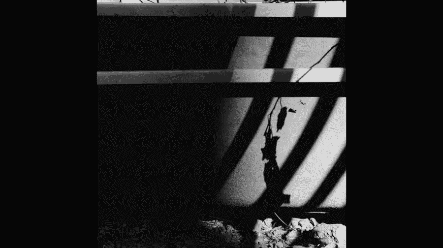
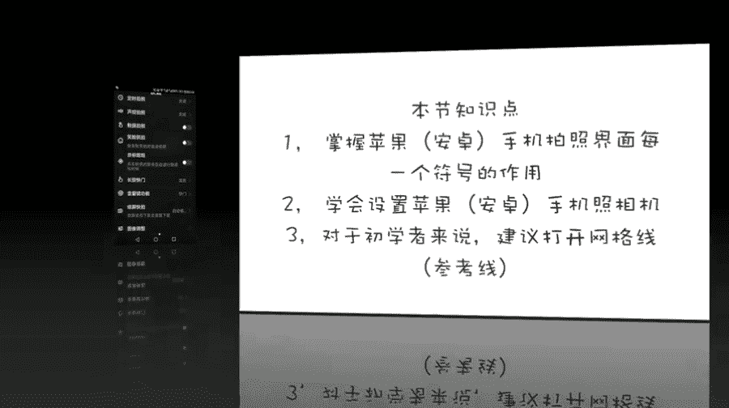
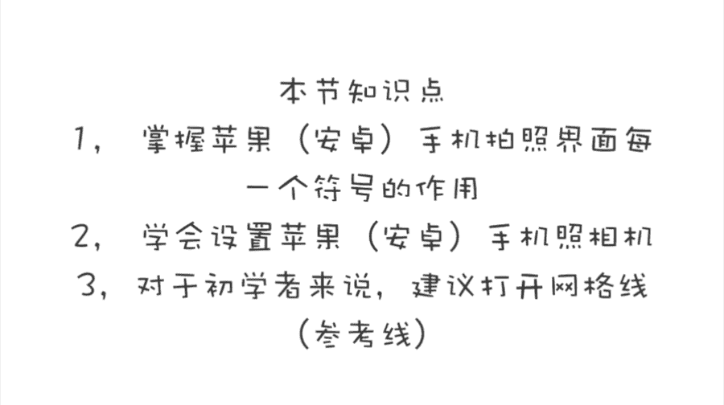

# 手机摄影高手：1：【0基础】手机拍摄功能详解：第四讲 手机拍摄界面的各种符号如何使用？

在本节课中，我们将详细解析手机拍摄界面上各种符号的功能与使用方法。课程将分别介绍苹果手机和安卓手机的拍照界面，帮助初学者快速掌握核心操作。

## 📱 苹果手机拍摄界面详解

上一节我们了解了手机摄影的基础知识，本节中我们来看看苹果手机拍摄界面的具体功能。

苹果手机的拍照界面设计简洁，主要功能符号集中在屏幕的上下边缘。

以下是界面左上角的符号功能：

*   **闪光灯**：图标为闪电符号。点击后有三个选项：**自动**、**打开**、**关闭**。用于在光线不足时补光。
*   **实况照片**：图标为同心圆。开启后，相机会记录按下快门瞬间前后共约1.5秒的动态画面。长按拍好的照片可以播放这段动态效果。
*   **定时自拍**：图标为表盘。用于设定快门延迟时间（3秒或10秒），便于合影或远距离自拍。拍摄完成后，**建议关闭此功能**，以免影响下次正常拍摄。

> **注意**：当“实况照片”功能开启时，**定时自拍**将只能拍摄单张照片，而无法进行连拍。

界面右上角的符号功能如下：

*   **滤镜**：图标为三个叠加的圆圈。点击后可以选择各种预设的色彩滤镜效果进行拍摄。
*   **个人建议**：为了给后期修图保留最大空间，**建议使用“原片”效果**进行拍摄。

界面底部是拍摄模式选择区域，默认进入的是“照片”模式。

以下是各拍摄模式的介绍：

*   **照片**：标准拍照模式。
*   **人像**：用于拍摄背景虚化的人像照片（iPhone 8 Plus及以上机型支持多种光效）。
*   **正方形**：以1:1画幅比例进行拍摄。
*   **全景**：用于拍摄超宽画幅的照片。
*   **视频**：标准视频录制模式。
*   **慢动作**：录制高帧率视频，播放时产生慢镜头效果。
*   **延时摄影**：以间隔拍摄的方式记录时间流逝的效果，后续课程会详细讲解。

## ⚙️ 苹果手机相机设置建议

了解界面符号后，我们还需要进行一些相机设置，以便更好地拍摄。

请进入手机的 **设置 > 相机**。

以下是建议的设置项目：

*   **网格**：**打开**。辅助构图。
*   **扫描二维码**：**打开**。
*   **录制视频/慢动作**：根据需求选择最高可用分辨率。
*   **自动HDR**：**建议关闭**。关闭后，拍摄界面上会显示HDR手动控制按钮。

**HDR功能**用于在**光比大**（如逆光）的场景中，合成多张不同曝光的照片，以保留更多亮部和暗部细节。其选项有：**自动**、**打开**、**关闭**。在连拍模式下，HDR功能不起作用。

## 🤖 安卓手机拍摄界面详解（以某款为例）

现在，我们以一款安卓手机为例，来看看安卓系统的拍摄界面。其逻辑与苹果手机有相似之处，但功能往往更丰富。

界面顶部的符号功能如下：

*   **闪光灯**：选项包括**自动**、**关闭**、**打开**、**常亮**。**常亮**模式让补光灯持续发光，光线更柔和，适合拍摄儿童或美食。
*   **大光圈/背景虚化**：开启后，屏幕上会出现光圈图标（如**f/1.8**）。点击该图标并左右滑动，可以**调整光圈数值**。
    *   **公式**：**光圈数值越小，光圈孔径越大，背景虚化效果越强**。
*   **美肤**：图标为美女头像。可以调整美颜等级，**建议不要调整过度**。
*   **动态照片**：功能类似于苹果的“实况照片”。
*   **滤镜**：三个圆圈叠加的图标，用于直接添加滤镜效果。
*   **切换摄像头**：用于切换前置或后置摄像头。

在拍照状态下，**向右滑动屏幕**可以进入更多隐藏的拍摄模式。

以下是部分特色模式介绍：

*   **专业模式**：可以手动调整快门速度、ISO、白平衡等参数，适合有摄影基础的用户。
*   **超级夜景**：专门用于在暗光环境下拍摄更明亮、清晰的夜景照片。
*   **流光快门**：用于拍摄光轨（如车流轨迹）、水流雾化等特效。
*   **延时摄影**：与苹果手机功能相同。
*   **注意**：超级夜景、流光快门、延时摄影等模式通常需要配合三脚架使用，以防画面模糊。

## ⚙️ 安卓手机相机设置建议

在拍摄界面，**向左滑动屏幕**通常可以进入设置菜单。

以下是一些重要的设置建议：

*   **分辨率**：**设置为最大**（如12MP）。
*   **比例**：建议**4:3**，这是传感器原生比例，画质最佳。
*   **参考线**：**开启**，辅助构图（后续课程讲解）。
*   **拍照静音**：**开启**，便于抓拍。
*   **声控快门**：开启后，可以说出指定口令（如“茄子”）触发拍照。
*   **笑脸抓拍**：检测到笑脸时自动拍照。
*   **长按快门**：**设置为“连拍”**。
*   **音量键功能**：**设置为“快门”**，便于快速拍摄。
*   **息屏快拍**：开启后，在黑屏状态下**快速按两次音量键**，可直接启动相机并拍照，非常适合抓拍。

本节课中，我们一起学习了苹果与安卓手机拍摄界面上各种核心符号的功能，包括闪光灯、HDR、各种拍摄模式以及重要的相机设置。掌握这些符号的含义和设置方法，是运用手机进行创作的基础。安卓手机通常提供更丰富的可调模式和功能，可玩性更高。请根据你的手机型号，熟悉对应的界面，并尝试调整建议的设置。

