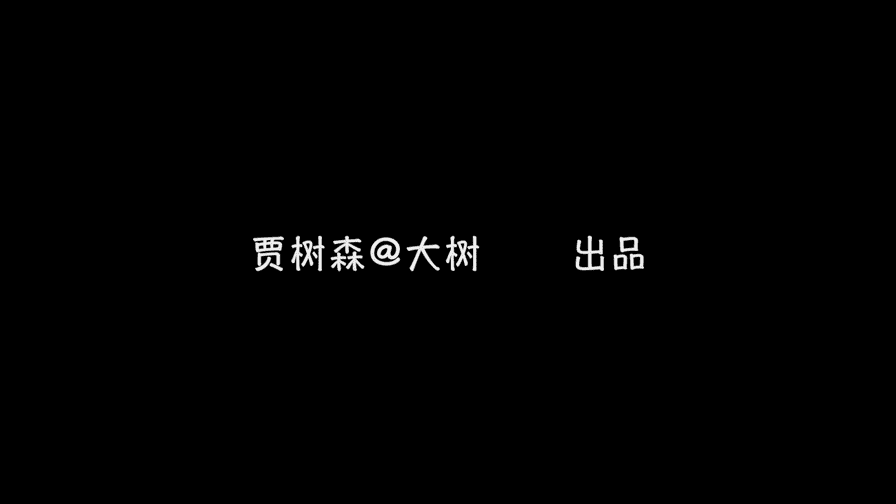

# 贾树森-手机摄影高手（完结）：2：【入门】揭秘光线构图视角运用技巧：第1讲 不同环境中如何运用光线？

## 概述
在本节课中，我们将要学习摄影中一个至关重要的元素——光线。我们将系统地了解不同方向光线的特点、效果，并学习如何在室内外各种复杂环境中，尤其是面对动态主体时，有效地观察和运用光线，从而拍出更出色的照片。

---

## 光线方向的分类与效果
上一节我们概述了光线的重要性，本节中我们来看看光线的几个基本方向及其拍摄效果。光线方向主要分为顺光、侧光、逆光和顶光。

### 顺光
顺光是指光源位于拍摄者身后，光线直接照射在被摄主体正面的情况。光源可能是灯光、太阳或窗户光。
**公式**：光源方向 ≈ 拍摄方向
顺光的好处是能为被摄体提供均匀的照明，减少阴影。正因为它缺乏阴影，所以画面会显得比较“平”，立体感较弱。

### 侧光
侧光是指光线从被摄主体的侧面照射过来。它可能来自正侧面，也可能来自稍偏前方的侧面。侧光是一个范围概念，而非固定角度。
**公式**：光源方向 ⊥ 拍摄方向（或呈一定夹角）
使用侧光拍照的好处是容易使人物或物体产生立体感。侧光还能增强照片的质感，并有助于将主体从背景中分离出来，从而有效突出主体。

### 逆光
逆光是指光源位于被摄主体的正后方或稍偏的位置。例如，太阳位于模特身后。
**公式**：光源方向 ≈ 拍摄方向的反方向
用逆光拍照容易拍摄出剪影效果。逆光也擅长为照片营造特定的氛围和情绪。关于如何具体拍摄剪影，我们会在后续课程中专门讲解。

### 顶光
顶光是指光线从被摄主体的正上方照射下来。例如，室内的筒灯或正午时分的太阳。
**公式**：光源方向 ↓ 被摄主体
这种光线会在人脸上形成难看的阴影，如下眼睑、鼻下等部位的深影，俗称“骷髅光”，通常被认为是不理想的光线条件。

---

## 在复杂环境中把握光线
了解了基本光线方向后，我们来看看如何在动态或复杂场景中运用这些知识。例如，拍摄玩耍中的孩子时，光线条件可能瞬息万变。

以下是应对复杂光线环境的练习步骤：

1.  **从静态主体开始练习**：首先建议使用生活中静止的物体或有趣的光影进行练习，培养对光线的观察力。
2.  **用成人模特进行定向练习**：在掌握基础后，可以请成人配合，有意识地练习顺光、侧光、逆光等不同光效的拍摄，甚至尝试营造特定光线。
3.  **在动态场景中定点观察**：拍摄好动的孩子时，不必盲目跟随。可以先选定一个位置，观察光源方向，等待孩子运动到合适光位（如顺光位）时进行拍摄。
4.  **跟随节奏，把握规律**：在对光线有了一定把控能力后，可以尝试跟随孩子的运动节奏，预判其运动轨迹与光线的结合点，从而在动态中捕捉理想光效。

---

## 善用“黄金时刻”
在室外拍摄时，选择合适的时间段至关重要。拍照的“黄金时刻”通常指日出后两小时内和日落前两小时内。

在这两个时间段，太阳角度较低，光线柔和，不会产生正午时分强烈的顶光阴影。因此，无论是顺光、侧光还是逆光拍摄，都更容易获得效果良好的照片。这个时间段会因季节、地域（南北方）不同而有所变化。

例如，示例照片拍摄于南方三亚下午四五点，此时光线柔和，结合水面反光，人物面部光影非常美妙。我们应尽量选择黄金时刻进行拍摄。

当然，中午并非完全不能拍照。如果必须在顶光条件下拍摄，可以尝试以下方法：

*   **利用阴影与构图**：拍摄风景时，可以巧妙利用建筑物或树木的阴影来构图。
*   **让人物进入阴影区**：拍摄人像时，将人物安排在树荫、屋檐下等阴影处，以改变面部光线条件。需注意背景与面部的光比，以及脸上可能出现的杂乱光斑。
*   **使用曝光补偿或HDR**：当人物在阴影里面背景很亮时，可以使用曝光补偿增加面部亮度，或开启HDR功能来平衡明暗反差。

---

## 室内光线运用策略
室内拍摄常面临光线不足的问题。我们的核心策略是主动寻找并利用最佳光源。

**白天：依靠窗户光**
白天室内最明亮、稳定的光源是窗户。应尽量靠近窗户拍摄，并拉开窗帘让更多光线进入。如果阳光直射过于强烈，可以拉上纱帘使光线变得柔和。窗户光也能营造逆光、侧光等效果。

示例中在越南旅店拍摄的照片，主要光源就是窗户光，经过墙壁、床单的反射，人物面部光线均匀柔和。

**夜晚：主动靠近人造光源**
到了晚上，即使打开所有顶灯，光线也往往不足且平淡。此时需要让人物主动靠近单个光源，如台灯、壁灯。示例中暖色调的台灯不仅提供了足够亮度，还营造了温暖的氛围。通过连拍记录的动图展示了人物靠近或远离光源时面部光线的显著变化。

---

## 总结
本节课中我们一起学习了光线的四大方向（顺光、侧光、逆光、顶光）及其特点，探讨了在动态场景中把握光线的方法，强调了利用室外“黄金时刻”的重要性，并提供了室内白天利用窗户光、夜晚靠近人造光源的实用策略。理解并主动运用光线，是提升摄影水平的关键一步。