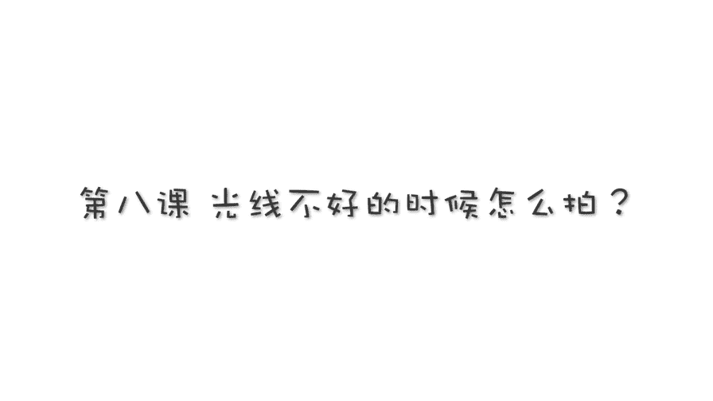
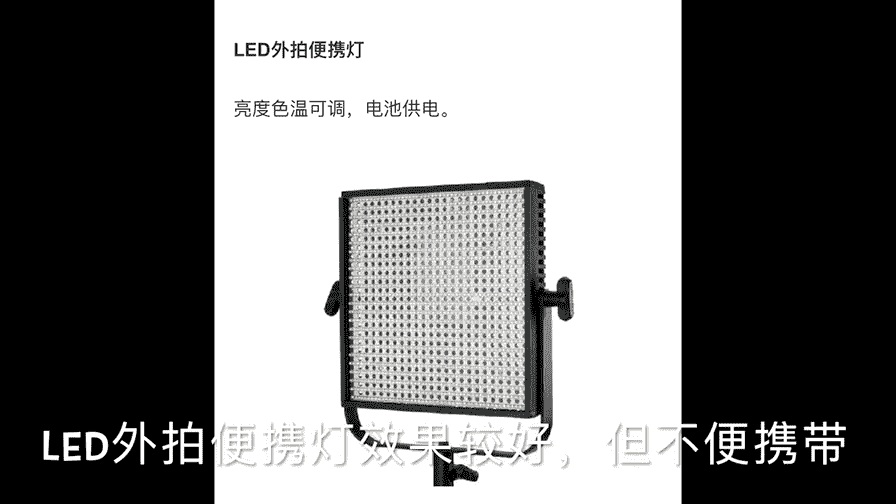
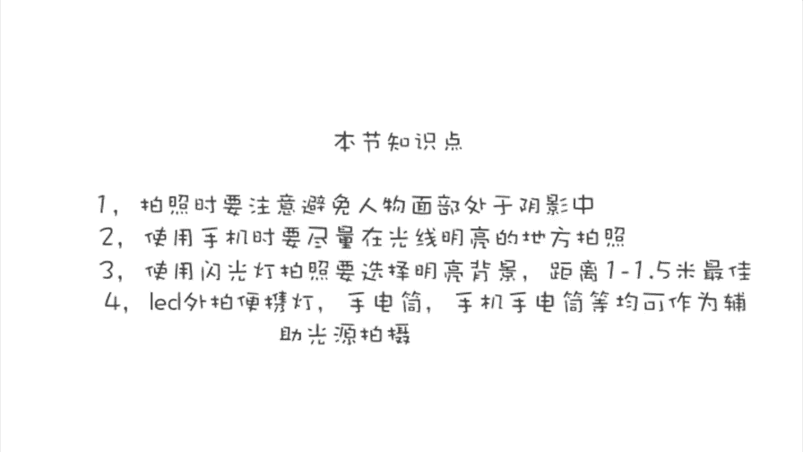

# 手机摄影高手：2：【入门】揭秘光线构图视角运用技巧：第2讲 光线暗的时候怎么拍？ 📸

在本节课中，我们将要学习在光线不足的环境下如何拍摄出清晰、明亮的照片。我们将探讨如何利用自然光、调整手机设置、使用闪光灯以及其他辅助照明工具来克服光线暗的挑战。

## 识别并利用自然光

上一节我们介绍了光线的基础概念，本节中我们来看看如何在光线不佳时主动寻找和利用光源。

模特M先生最初站在阴影中，导致脸部在照片中显得很暗。为了解决这个问题，需要将他移动到有阳光直射的位置。这样，主体亮度得到提升，避免了“黑脸”的情况。

当主体位于大面积浅色背景（如雪地、白墙）前时，即使站在阳光下，相机也可能误判整体亮度，导致主体曝光不足。此时需要进行**曝光补偿**。

以下是操作步骤：
1.  在手机拍照界面，点击或长按屏幕对主体对焦。
2.  出现曝光调节滑块（通常是一个太阳图标）后，向上滑动以增加曝光。

在逆光且背景明亮的场景下（如人物背对天空），主体脸部极易变黑。这种场景适合拍摄剪影。若想让人脸清晰，则需综合调整。

以下是关键操作：
1.  对焦并锁定曝光（在iPhone上，长按屏幕即可锁定）。
2.  向上滑动，提高曝光滑块，增加画面整体亮度。
3.  **打开HDR功能**。HDR（高动态范围）能同时保留亮部（如天空）和暗部（如人脸）的细节。

## 理解曝光三要素与手机局限

要深入理解光线暗时拍照的困难，需要了解决定照片明暗的三个核心参数，即**曝光三要素**。

曝光三要素包括：
*   **快门速度**：控制光线进入相机的时间长短。公式表示为 `曝光量 ∝ 快门时间`。
*   **光圈**：控制光线进入相机的孔径大小。公式表示为 `曝光量 ∝ 光圈孔径面积`。
*   **感光度**：控制相机传感器对光线的敏感程度。常用ISO表示，`ISO越高，对光越敏感`。

在光线充足时，三者协调工作即可。但在光线昏暗时，手机的光圈和快门速度调整范围有限，主要依靠提高ISO来增加亮度。然而，**高ISO会带来明显的噪点和颗粒**，降低画质。因此，手机摄影应尽量选择光线好的环境。

## 使用手机闪光灯

当环境光线不足，又不想使用高ISO导致画质下降时，可以求助于手机内置的闪光灯。

直接使用自动闪光灯，可能导致主体过亮而背景一片漆黑。为了获得更好的效果，请注意以下两点：

1.  **选择明亮背景**：在背景本身有一定亮度的环境下使用闪光灯，可以使主体和背景的亮度更平衡。
2.  **使用强制闪光**：在明亮背景下，相机可能误判光线充足而不启动闪光。此时需手动切换到“强制闪光”模式。
3.  **控制拍摄距离**：手机闪光灯强度有限，最佳工作距离约为**1米到1.5米**。距离太近会导致过曝，太远则作用微弱。

## 利用其他光源进行补光

除了闪光灯，我们还可以利用各种现成或便携的光源进行创造性补光。

*   **另一部手机的手电筒**：这是最便捷的补光工具。你可以自由控制光线的角度（顺光、侧光等），并在屏幕上实时预览效果。注意，手电筒亮度有限，需靠近主体使用。
*   **小型LED灯或玩具灯**：一些小型LED灯光源集中，适合营造局部照明效果。使用时需注意控制距离，避免局部过亮。
*   **App常亮补光功能**：部分安卓手机或第三方摄影App（如VSCO）提供“常亮灯”模式，能将手机闪光灯变为持续照明光源，方便在暗光下对焦和构图。

以下是几个使用辅助光源的实际案例：
*   **傍晚室外**：使用另一部手机的手电筒为人物面部补光。
*   **昏暗车库**：同样利用手机手电筒照亮主体。
*   **夜晚街头**：使用聚光性好的专业手电筒作为主光，营造戏剧性的光影效果。

**注意事项**：在暗光下使用辅助光源时，环境亮度依然较低。需要持稳手机，防止抖动模糊；同时，拍摄对象的动作不宜过快，以免拍虚。

本节课中我们一起学习了在光线暗的环境下的多种拍摄策略：首先主动寻找和利用自然光，并通过曝光补偿和HDR功能优化画质；其次理解了手机在高感光度下的画质局限；最后掌握了使用闪光灯及其他便携光源进行有效补光的技巧。记住，灵活运用光线是突破拍摄环境限制的关键。