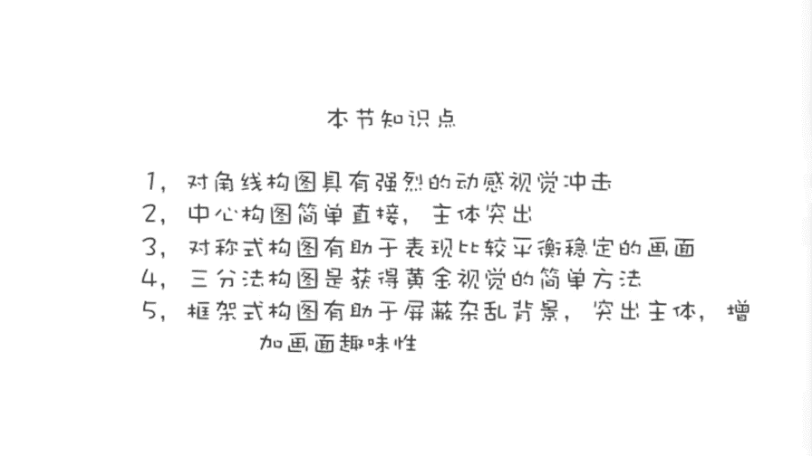
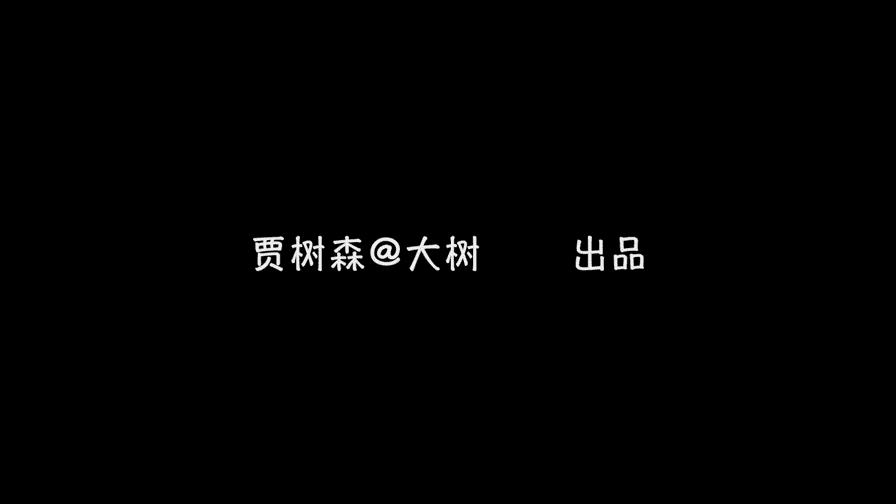

# 手机摄影高手：2：【入门】揭秘光线构图视角运用技巧：第3讲 手机摄影构图有哪些？

在本节课中，我们将要学习几种基础的手机摄影构图方法。构图是摄影的骨架，好的构图能让照片主题更突出，视觉效果更强烈。我们将通过具体的例子，逐一了解对角线构图、中心构图、对称式构图、三分法构图和框架式构图。

## 对角线构图

上一节我们介绍了构图的基本概念，本节中我们来看看第一种构图方法：对角线构图。

对角线构图是指将拍摄主体沿着画面的对角线方向进行排列。这种构图方式能为画面带来动感和不稳定的感觉，也能体现出生命的力量。它让画面看起来更加舒展和饱满，视觉冲击力更强烈。

以下是使用对角线构图的具体说明：

*   拍摄时，可以将手机倾斜，使主体沿对角线方向取景。
*   最好在拍摄前锁定焦点并调整好曝光。
*   适合抓拍具有动态感的场景，如海浪拍打沙滩。

生活中有很多场景适合对角线构图，主体不一定完全精确地对齐两个对角，大致沿对角线方向即可。这种构图方法无论是拍摄物体还是人物，都能很好地强调动感，使画面更加活跃。

## 中心构图

了解了动感十足的对角线构图后，我们来看一种最直接、最常用的构图方法：中心构图。

中心构图是将主体放置在画面中心进行拍摄。这种方法能最大化地突出主体，使主题非常明确，符合我们创作时希望主体最突出、最醒目的原始冲动。

以下是中心构图的适用场景：

*   当你想毫无歧义地突出某个单一主体时，如沙滩上的贝壳、瞭望塔。
*   拍摄人物、花卉、树木等主体时，这是最直接简便的方法。
*   它能最有效地将观众的视线引导至主体。

中心构图法是作者最常使用的构图方法之一，因为它操作简便且效果突出。

## 对称式构图

中心构图强调主体的突出，而对称式构图则追求画面的平衡与和谐。

对称式构图是指画面中存在一条中轴线，轴线两侧的元素基本一致或形成镜像。这种构图方式能带来稳定、平衡的视觉感受。

对称式构图不仅限于左右对称，上下对称也同样适用。以下是几种对称式构图的例子：

*   左右对称：如海面上的双体帆船、车的前脸、以人为中心的左右对称物体。
*   上下对称：在某些场景中，也可以找到上下对称的元素。
*   利用自然或人造结构：如窗帘缝、美术馆的天窗等。

拍摄对称式构图时，需要注意保持画面的纯净，避免无关元素闯入破坏对称性。

## 三分法构图（九宫格构图）

对称式构图讲究平衡，而三分法构图则通过不对称来创造更生动的画面。在拍摄前，请确保在手机设置中打开了网格线功能。

打开网格线后，画面会被两横两竖四条线分割，产生四个交叉点和九个方格。这四个交叉点被称为“黄金分割点”，最容易吸引观众的视线。将主体放置在这些点或线上构图的方法，就是三分法构图，也被称为九宫格构图或井字构图。

以下是三分法构图的几种常见应用方式：

*   **将地平线置于横线上**：例如，将海平面放在画面下三分之一或上三分之一处，而不是正中间。
*   **将主体置于交叉点上**：例如，将雕像、消防栓、花朵或人物放置在四个交叉点的其中一个附近。
*   **不一定精确对准**：主体位于交叉点附近即可，不需要绝对精确。

三分法构图是避免画面呆板、使构图更专业和耐看的有效方法。

## 框架式构图

最后，我们学习一种能增加照片层次感和趣味性的构图方法：框架式构图。

框架式构图是利用前景中的元素（如窗口、洞口、树枝等）形成一个“框”，将主体包围起来。这种构图能排除杂乱背景，引导观众视线聚焦于框内主体，并产生一种“窥视”或“穿越”的视觉感受，增强画面的故事性和纵深感。

框架式构图的核心作用是屏蔽杂乱和引导视线。以下是几个框架式构图的实例：

*   **利用自然或人造框架**：如通过救生圈拍摄日出，利用桥洞拍摄远处风景。
*   **创造趣味框架**：例如透过有形状的栏杆（如心形图案）拍摄内部场景，既能简化画面，又能通过框架形状传递情感（如爱心暗示有爱）。
*   **强调主体**：框架能将观众的视线牢牢锁定在你想要表现的主体上。

---

本节课中我们一起学习了五种基础的手机摄影构图方法：**对角线构图**营造动感，**中心构图**直接突出主体，**对称式构图**追求平衡稳定，**三分法构图**让画面生动和谐，**框架式构图**增加层次与趣味。掌握这些构图技巧，并能灵活运用，将帮助你显著提升照片的视觉效果和表现力。