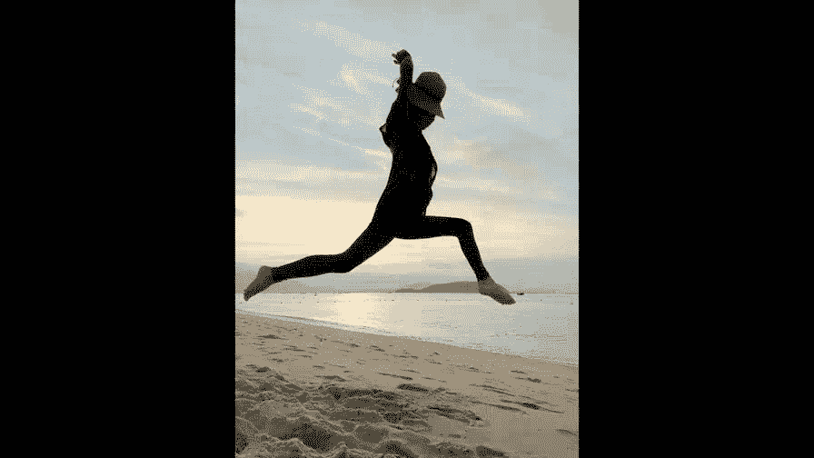
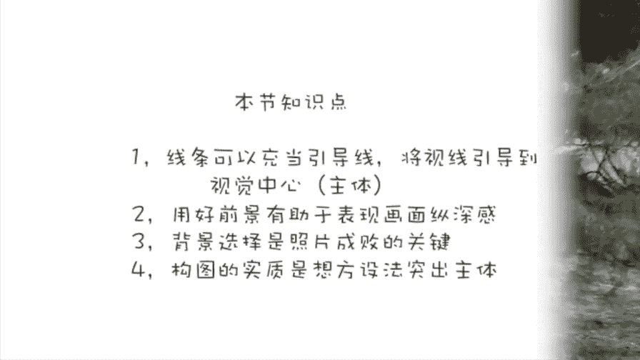

# 贾树森-手机摄影高手（完结）：2：【入门】揭秘光线构图视角运用技巧：第4讲 如何在复杂的背景下突出拍摄主体？

在本节课中，我们将要学习几种实用的构图技巧，帮助你在复杂的拍摄环境中，有效地突出照片的主体。这些技巧包括引导线构图、前景的运用以及背景的选择与处理。

## 引导线构图：指引观众的视线

上一节我们介绍了基础的构图原则，本节中我们来看看如何利用画面中的线条来引导观众的注意力。引导线构图是一种利用画面中具有方向性的线条，将观众的视线自然引向被摄主体的方法。

例如，一张由多条木条组成的摇椅照片，从特定角度看去，木条会形成放射状的线条指向镜头。这种构图方式能将视觉焦点集中在主体（如人物）身上。

能作为引导线的元素多种多样。以下是几种常见的引导线示例：

*   **道路与边缘**：照片中路的边缘和草坪的边缘可以形成引导线。
*   **弯曲的公路**：弯曲的公路线条能将视线引导到公路上的车手身上。
*   **建筑与自然曲线**：例如海边的一个漂亮弯道，能将视线引导至远处的悉尼歌剧院。
*   **不规则的形状**：例如一棵树的树干，可以将视线引导到树顶的花朵上。

由此可见，引导线不一定是具体的直线，**但凡具有一定方向性和连续性的元素，都可以作为引导线**。在现实中，道路、河流、色块、阴影，甚至人物的目光，都可以起到引导视线的作用。

例如，一张照片中的海鸥，观看者的目光会先落在海鸥身上，然后自然地移动到远处的小女孩身上，此时海鸥就起到了引导线的作用。因此，在拍摄时，应努力发掘一切类似线条的元素来为构图服务。

## 前景的运用：增加层次与故事性

了解了如何引导视线后，我们来看看如何利用前景来丰富画面。前景在画面中大致有两种作用：作为主体或作为陪衬。

**第一种情况，前景本身就是拍摄主体。** 例如，拍摄海滩上的一块珊瑚石，它既是前景也是主体。这种拍法能有效增加画面的纵深感，营造立体氛围，同时突出主体的质感。

另一种情况是采用三分法构图，让前景（如沙滩）占据画面大部分面积，此时沙滩既是前景也是主体，能突出沙滩上的肌理（如密密麻麻的脚印）。

**第二种情况，前景作为陪衬，用于衬托主体。** 例如，拍摄人物时，利用前方的树木或绿植作为前景，可以交代环境，同时让画面构成更丰富，避免单调。

类似的情况还有：拍摄人物的影子时，如果将人物本尊也纳入画面作为前景，照片会显得更立体、更丰富。又或者，用一艘大轮船作为前景，与远处的悉尼歌剧院形成对比和衬托，能增加画面的趣味性。

一张街头表演的照片中，拍摄者、路过的老爷爷都是前景，他们有效烘托并丰富了画面，同时也将观众的视线引导至街头艺人这个主体身上。另一张照片中，孩子作为前景，是母亲目光的落点，这为照片增添了故事性和情感连接。

**在运用前景时，需要注意：前景不应抢夺主体的风采。** 例如，拍摄悉尼歌剧院时，将前景的海鸥虚化并控制其比例，就能确保歌剧院的主体地位，海鸥只起到陪衬作用。

## 背景的选择：简化与衬托主体

处理完前景，背景的选择同样关键。好的背景能突出主体，反之则会让主体淹没其中。

**选择相对干净的背景**是常用方法。例如，让人物站在一面墙前，虽然人物较小，但依然突出，同时背景也交代了环境（花、楼房、椰子树）。也可以更近一些，只用墙作为背景，让画面更干净，或者纳入旁边的树影，避免过于单调。

**干净的背景有助于突出主体，但过于干净可能使画面单调。** 因此，可以寻找光影漂亮的地方作为背景。这样既能突出主体，背景也有内容，光影还能对主体形成反衬，让画面影调更漂亮。

**很多时候需要交代环境**，不能一味寻找绝对干净的背景。例如在泳池，找到一个相对干净的背景已属不易。此时可以：
1.  使用手机的**虚化功能**（如人像模式）来虚化背景。
2.  寻找没有人的方向拍摄。
3.  **尽量靠近拍摄主体**，使主体在画面中变大，背景中的人物相对变小，对主体的干扰也就减小了。

有些背景确实非常复杂，例如儿童游乐场。虽然有困难，但只要用心取景和构图，仍能拍出好照片。如果实在无法处理背景，**将人物脸部充满画面**也是一种简便有效的突出主体的方法。

## 总结：构图的本质是突出主体

构图方法确实很多，除了本节课讲的，还有明暗对比、色彩对比、虚实对比等。但不要困惑，**构图的本质就是为了突出主体**。一切技巧都为此服务。

还记得好照片的三个标准吗？主题明确、主体突出、画面简洁。因此，在拍摄前可以问自己三个问题：
1.  我要表现的**主题**是什么？
2.  我是否已尽最大努力将观众的视线集中到**主体**身上？
3.  我是否已将容易分散注意力的元素排除在画面之外，让画面更**简洁**？

在这个前提下去拍摄，具体使用哪种构图方法，反而显得不是那么重要了。

本节课中我们一起学习了三种在复杂背景下突出主体的核心技巧：利用**引导线**指引视线，运用**前景**增加层次和故事性，以及通过选择与处理**背景**来简化和衬托主体。记住，所有构图手段的最终目的都是服务于主体，让照片的主题更鲜明。

