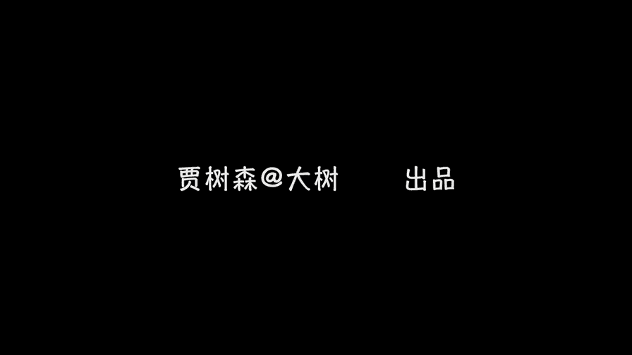

# 手机摄影高手：2：【入门】揭秘光线构图视角运用技巧：第5讲 怎样才能拍出视角独特的照片？

在本节课中，我们将学习如何通过改变拍摄视角来创作出独特、引人注目的照片。我们将详细探讨俯拍、仰拍和平拍三种基本视角的特点、适用场景以及注意事项。

## 概述：理解视角的重要性

视角是摄影构图中一个非常关键的元素。它决定了观众看到被摄主体的方式，直接影响照片的视觉效果和情感表达。通过有意识地选择非常规视角，我们可以打破常规，让照片脱颖而出。

## 俯拍：从高处向下看

上一节我们介绍了视角的基本概念，本节中我们来看看第一种视角：俯拍。

俯拍是指相机位置高于被摄主体，从上方向下拍摄。这种视角会压缩被摄体的高度，使其显得矮小。

以下是俯拍的主要特点和应用：

*   **视觉效果**：有利于表现地平面上的景物层次、数量和位置关系，能营造辽阔、深远的画面感。
*   **适用场景**：常用于拍摄风光、建筑群或需要展示地面环境信息的场景。
*   **拍摄人物注意**：容易将人物拍得矮小。若用于人像摄影，需注意此特点，有时可用于表达特定的情绪或关系。

例如，在拍摄孩子时，俯拍不仅能捕捉到孩子的表情，还能将孩子周围的地面环境（如玩具、光影）纳入画面，丰富照片的故事性。

## 仰拍：从低处向上看

了解了从高处看的俯拍后，我们再来看看相反的视角：仰拍。

仰拍是指相机位置低于被摄主体，从下方向上拍摄。这种视角能突出被摄体的高大感和气势。

以下是仰拍的主要特点和应用：

*   **视觉效果**：有利于突出被摄主体，使其显得高大、有力量感。与俯拍表现地面景物相反，仰拍擅长表现天空、屋顶等上部空间的景物。
*   **适用场景**：适合拍摄树木、高楼、人物跳跃或飞翔等需要表现向上延伸感和动感的主题。
*   **拍摄人物注意**：对于脸部较胖的人物，仰拍可能会强化这一特征，需谨慎使用。

贴近地面的仰拍，可以极大地夸张运动物体的动势，让画面充满视觉冲击力。

## 平拍：保持平等的视线

前面我们探讨了有高低落差的视角，现在我们来学习最接近人眼日常观察的视角：平拍。

平拍是指相机与被摄主体处于同一水平线上进行拍摄。这种视角最不易使被摄体产生变形。

以下是平拍的主要特点和应用：

*   **视觉效果**：画面平稳，给人以平等、亲切、真实的视觉感受。
*   **适用场景**：广泛应用于人像摄影，尤其是拍摄儿童时，蹲下来与他们平视，能建立平等的交流感，捕捉到更自然的神情。在风光摄影中，地平线的处理是关键。
*   **构图技巧**：在拍摄自然景物时，应避免地平线将画面平均分割，否则容易显得呆板。通常将地平线置于画面上方或下方三分之一处，以突出天空或大地。

**公式：** 避免 `地平线位置 = 画面中心线`。

## 实践：如何寻找独特视角

我们已经掌握了三种基本视角，那么如何运用它们来拍出独特的照片呢？核心在于：**寻找有别于正常视角的拍摄角度**。

“正常视角”因人、因场景而异。要拍出独特照片，就需要主动探索那些你第一眼不会想到的角度。

以下是进行视角探索练习的步骤：

1.  **选择一个固定对象**：可以是一个静物、一个人或一处景物。
2.  **进行全方位取景**：围绕被摄对象，尝试从俯拍、仰拍、平拍，以及正面、侧面、背面等各个方位进行拍摄。
3.  **对比与发现**：拍完后，对比所有照片。找出哪些角度是你习惯的（正常视角），哪些是新颖的、能带来不同视觉感受的（独特视角）。

通过这样的练习，你能不断挖掘自己的观察潜力，培养发现非常规视角的“摄影眼”。

## 总结

本节课中我们一起学习了摄影中三种核心的拍摄视角。

*   **俯拍** 从高处向下，展现辽阔与层次。
*   **仰拍** 从低处向上，突出高大与气势。
*   **平拍** 平等对视，传达亲切与真实。

要拍出视角独特的照片，关键在于打破观看习惯，积极尝试和探索那些非常规的、能带来新鲜视觉体验的拍摄角度。课后请务必找一个对象进行实践练习，这是提升构图能力最有效的方法。

