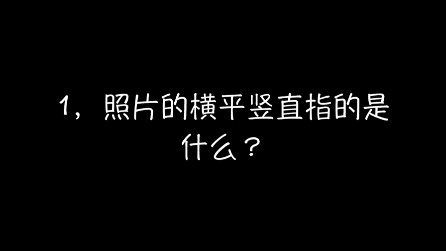
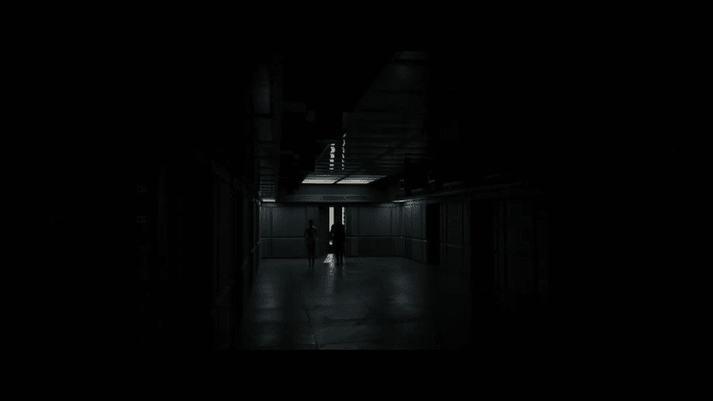
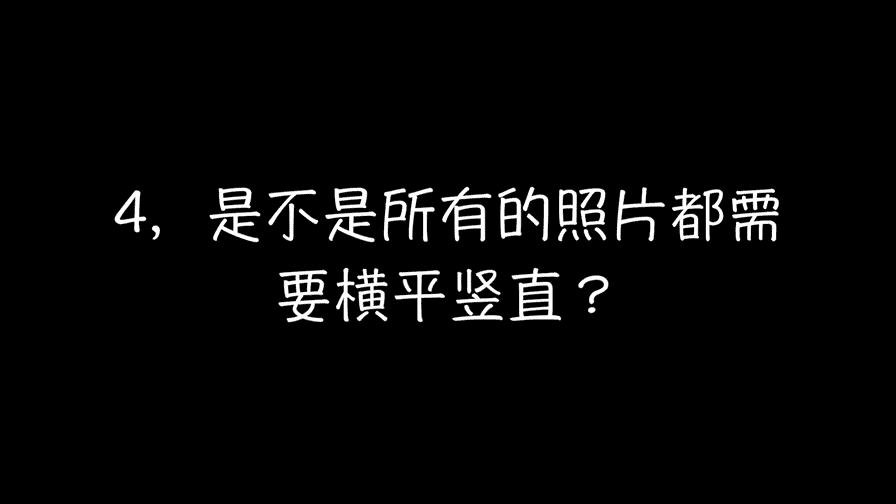

# 贾树森-手机摄影高手（完结）：2：【入门】揭秘光线构图视角运用技巧：第6讲 照片的横平竖直是怎么回事儿？

在本节课中，我们将要学习摄影构图中的一个基本原则——横平竖直。理解并掌握这一原则，能让你的照片看起来更稳定、更专业。

## 什么是照片的“横平竖直”？📐

上一节我们介绍了构图的基本概念，本节中我们来看看一个具体的原则：横平竖直。为了更形象地解释这个问题，我们可以参考一些电影片段。观看时，请注意画面旁边的小窗，其中用红色和黄色标出了隐藏的线条。

所谓的“横平竖直”，就是指画面中这些隐藏的线条。**红色线条代表竖直线条，黄色线条代表水平线条**。这些线条应该处于它们应有的位置上：竖直的线条保持垂直，水平的线条保持水平。在取景构图时，如果把这些线条摆正，拍出的照片就是横平竖直的。

这些线条通常隐藏在画面中，如果不特意指出，可能不会被注意到。例如，在这个镜头中，如果不标记，你可能不会主动去分辨哪些是竖直线，哪些是水平线。

## 为什么需要“横平竖直”？🤔

有的同学可能会问：我看到了这些线条，但为什么一定要把它们拍得水平和竖直呢？难道不能歪着拍吗？

当然可以歪着拍，但“横平竖直”的拍法符合建筑本身的基本特点。我们盖楼时，墙是垂直向上的，地面是水平的。海平面也是水平的。像比萨斜塔这样的倾斜建筑毕竟是少数例外。绝大多数建筑、门、窗户都是横平竖直的，因此拍摄时应遵循这一基本规律。

即便在拍摄人物时，因为人物生活在这样一个横平竖直的世界里，所以也应尽量将取景构图处理得横平竖直。这样人物才会显得稳定，不会给人向后歪倒的感觉。

因此，照片的横平竖直符合自然界的基本规律，也符合人的基本视觉习惯。

## 如何实现“横平竖直”？📱

横平竖直说起来容易，做起来却不轻松。那么，到底应该如何保持拍照时的横平竖直呢？我们可以使用什么来判断？

以下是几个实用的判断方法：

1.  **利用屏幕边框**：手机屏幕的四边围成一个长方形，我们可以用它作为辅助，判断画面中的线条是否笔直。
2.  **使用参考线**：拍照界面上通常有“九宫格”参考线（两横两竖）。我们可以用这些竖线来对齐取景中存在的竖直线条（如楼体），用横线来对齐水平线条（如墙面、地平线）。

**核心操作要点**：想要拍出竖直的照片，手持手机时要注意让手机垂直于地面。如果手机向下倾斜（俯拍）或向上仰起（仰拍），就很难拍出竖直的照片。同时，要用取景框中的横线去对齐背景里的水平线条。手机只要稍有倾斜，拍出的照片就会倾斜。

## “横平”和“竖直”必须同时满足吗？🔍

这个问题很好。横平和竖直不一定需要同时满足。

例如，在某些电影画面中，可能只有竖直是满足的，水平线在画面中没有直接体现。但既然墙体是垂直的，地面 inherently 是平的。有些镜头中，水平线非常直观，但看不到垂直线。由此可见，在拍摄时，只要满足“横平”或“竖直”中的一项，照片就不会看起来歪七扭八。

以下是几个例子：

*   **只满足“横平”**：例如拍摄一把椅子时，只有水平线是平的，竖直线条并不竖直（因略带俯拍），这完全没有问题。
*   **只满足“竖直”**：例如拍摄街道或家中场景时，竖直线条是竖直的，但画面中找不到明显的水平线，这也没有关系。

还有一些特殊情况，比如建在山坡上的房子或长在斜坡上的大树。这时，我们可以让房屋的墙或大树本身保持垂直即可。

## 所有照片都必须“横平竖直”吗？🚫

这个问题提得非常好。需要澄清的是：**照片的横平竖直是构图时的“基本原则”，而非具体的“构图方法”**。

像框架式构图、引导线构图、三分法构图等是构图方法。而横平竖直是你在运用这些构图方法时，仍需遵循的一个基础原则。提出这个原则，是因为我们常常觉得某些照片看起来不舒服，却又不知原因何在。学习了横平竖直后，你就能发现症结所在。

那么，答案是否定的：**并非所有照片都必须横平竖直**。

大约90%的情况需要遵守此原则，但仍有10%的例外。不遵循横平竖直原则的情况大致分为以下几种：

以下是几种例外情况：

1.  **拍摄特定主体**：拍摄沙发或怀抱婴儿等场景时，可以微微倾斜，视觉上依然舒服，不会显得突兀。
2.  **与构图方法冲突时**：当使用某些构图方法（如**对角线构图**）与横平竖直原则冲突时，应以构图方法为主。
3.  **创意表达需要**：当你有独特的想法或创意时，可以遵循自己的构思进行构图，打破常规。

最后，给初学者的建议是：在练习阶段，应尽量把照片拍得横平竖直，打好基础。

## 总结

本节课中，我们一起学习了摄影构图中“横平竖直”这一基本原则。我们了解了它的含义、重要性以及实现方法。记住，它是让照片显得稳定、专业的基石。虽然并非所有场景都必须严格遵守，但掌握它并能判断何时使用、何时突破，是摄影学习中的重要一步。

