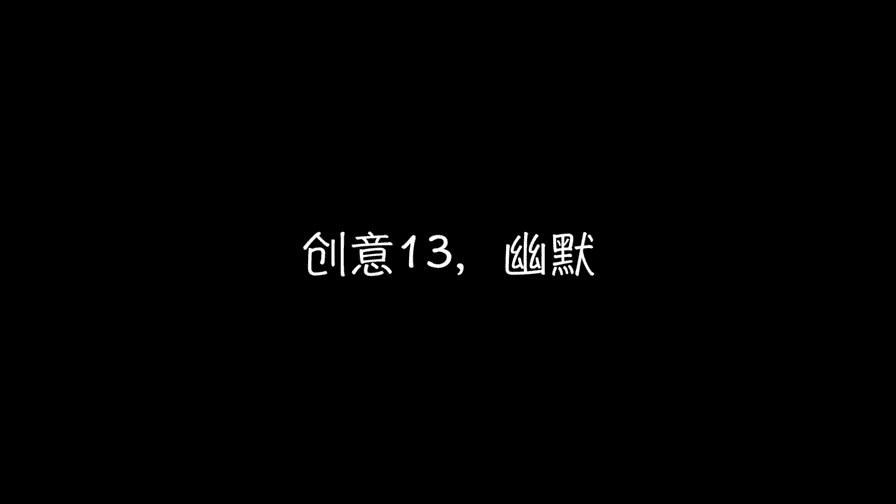

# 贾树森-手机摄影高手（完结）：2：【入门】揭秘光线构图视角运用技巧：第7讲 你知道什么是创意视角吗？🎨

在本节课中，我们将要学习如何运用创意视角来拍摄有趣的照片。创意视角能让普通的场景变得不普通，为你的摄影作品注入灵魂。我们将通过一系列具体的方法和实例，帮助你打开思路，掌握创造视觉惊喜的技巧。

---

## 创意一：错位摄影

上一节我们介绍了视角的基础概念，本节中我们来看看如何通过错位制造视觉趣味。错位摄影的核心是利用物体之间的**位置、距离或高低差异**，制造出与常规认知不同的视觉错觉。

**核心公式**：`视觉错觉 = 前景物体位置 + 背景物体距离 + 拍摄角度`

以下是利用错位手法的几个例子：

*   **天体互动**：例如，用手“捏住”或“捧起”远处的太阳或月亮。这是利用人与天体的巨大距离差，通过特定角度使它们看起来在同一平面。
*   **建筑戏法**：例如，站在远处，用手“拿起”电视塔，仿佛它是一个小火炬。原理同样是利用近大远小的透视关系。
*   **情景错位**：可以设计动作，制造惊险或有趣的场景。例如，趴在地面上，利用前景的石块或路面线条，拍出仿佛悬挂在悬崖边的效果。
    *   **拍摄要点**：寻找有纵深感的场景；设计符合意境的肢体动作；拍摄后通常需要旋转照片，以强化错觉效果。

---

## 创意二：多次曝光

错位摄影改变了空间的感知，而多次曝光则能在时间维度上做文章。它可以将多个画面叠加在一张照片中，营造出梦幻或富有故事性的效果。

以下是实现多次曝光的两种方法：

*   **后期合成法**：
    1.  将相机固定在三脚架上。
    2.  规划好人物在画面中的不同位置，分别拍摄。**注意**：人物位置不可互相重叠，且需至少有一张背景纯净无其他行人。
    3.  使用后期软件（如 Photoshop）进行图层合成。
*   **相机直出法**：
    使用具备多次曝光功能的相机APP（如 **Hipstamatic**），可直接在拍摄时叠加两张影像。此方法操作简便，但叠加次数通常有限。

---

## 创意三：巧用反射面

镜子、玻璃、水面等反射面，能帮我们轻松地将两个空间的景象压缩到同一画面中，产生超现实的视觉效果。

我们可以利用生活中各种反射面：

*   **太阳镜**：放在镜头前可作为滤镜；拍摄其镜面可以反射环境。
*   **老式镜头**：将其置于手机镜头前，可拍摄出带有圆形光晕和倒影的独特画面（需精细对焦）。
*   **镜子**：利用镜子反射，将背后的景物纳入画面，拓展视觉空间。
*   **各类反光面**：不限于镜子，电脑屏幕、手机屏幕、橱窗玻璃、水面、甚至积水都可以成为创作工具。
    *   **进阶技巧**：对于倒影突出的照片，可以尝试在后期将画面180度旋转，以强化视觉冲击力。

---

## 创意四：改变观察高度与角度

我们习惯了以人眼高度观察世界，改变这个高度，就能立刻获得新颖的视角。

以下是两种改变视角的方法：

*   **极低视角（宠物视角）**：将手机贴近地面拍摄，可以展现一个常被忽略的微观世界，画面会显得新奇有趣。
*   **极高视角**：从高处向下俯拍，可以获得宏观的、图案化的画面效果。

---

## 创意五：尝试特殊拍摄方式

除了角度，我们还可以借助一些道具或方法，进入非常规的拍摄模式。

以下是一些特殊的拍摄创意：

*   **微距摄影**：靠近拍摄物体，揭示其细微的纹理和结构。可为手机加装外置微距镜头。
*   **水下摄影**：使用手机防水壳或防水袋，尝试浅水区域拍摄，获得不一样的质感。
*   **管道视角**：通过水管、纸筒或卷起的杂志进行拍摄，形成天然的画框和隧道感。
*   **万花筒视角**：将手机镜头对准万花筒，可以拍摄出色彩斑斓、对称重复的奇幻画面。

---

## 创意六：捕捉光影与幽默瞬间

最后，不要忽略光影本身和画面内容带来的创意。

以下是两个重要的创意来源：

*   **玩转影子**：影子是光的画笔。可以关注物体投射出的有趣形状，甚至利用多重折射制造多个影子，增加画面趣味。
*   **注入幽默**：在拍摄时，有意识地安排或捕捉一些幽默的动作、巧合的瞬间或滑稽的表情。让照片会“讲故事”或引人发笑，是最高级的创意之一。

---

本节课中我们一起学习了多种开启创意视角的方法：从制造视觉错觉的**错位摄影**，到叠加时间的**多次曝光**；从利用**反射面**拓展空间，到改变**拍摄高度**发现新世界；再到尝试**特殊拍摄方式**并为画面注入**幽默感**。创意无处不在，关键在于观察和尝试。希望这些方法能成为你摄影创作的起点，助你拍出更多令人眼前一亮的作品。