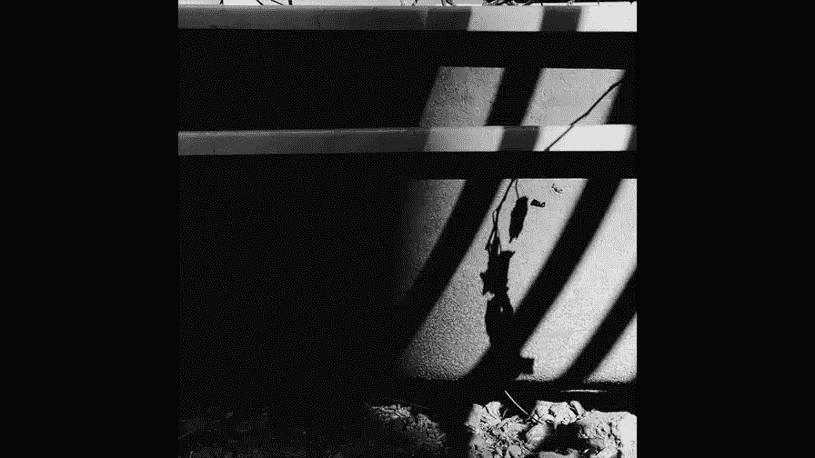

手机摄影高手课：3：如何让照片具有故事性？

在本节课中，我们将学习如何让静态的照片像电影一样讲述故事。通过一系列具体的拍摄技巧，你可以让照片超越简单的记录，变得引人入胜、耐人寻味。

现在是一个图片泛滥的时代，我们每天都能看到并制造大量图片。如何让照片耐看并脱颖而出？一个核心秘诀是让照片能够讲故事。一张凝聚了情感和好奇心的照片，能在海量图片中抓住观众的眼球。

静态图片如何能像电影一样讲故事呢？接下来，我们将通过具体建议来探讨这个问题。

---

### 向电影学习：采用横构图

既然希望图片像电影一样讲故事，第一个建议是尽量采用**横构图**。横构图的画面能容纳更多信息，其宽广的视角更易于叙述一个完整的故事。

以下是横构图与竖构图的对比思考：
*   **竖构图**：画面可能缺失了关键的场景信息。
*   **横构图**：提供了更丰富的环境细节，这些额外的信息为观众传递了更多背景，激发了想象。

---

### 捕捉生活中的故事场景

第二个建议是主动发现并拍摄生活中本身就充满故事性的场景。一些日常片段因其光线、色彩、人物互动而极具感染力，本身就构成了一幅生动的“电影剧照”。

例如，一对年轻夫妇在草坪上休闲，孩子们在一旁玩耍。这个场景充满了浪漫的生活气息，很容易让人联想到他们幸福的生活状态，故事感自然而生。

---

### 主动设定照片剧情

第三个建议是主动为照片设定一个剧情。当你在拍摄时观察到能引发联想的元素，可以迅速构思并捕捉下来。

例如，在拍摄一棵树时，发现一对老夫妻互相搀扶走来。你可以联想到这棵树与他们的岁月关联，然后抓拍这个瞬间。预先的“剧情”构思能让照片充满叙事潜力。

---

### 利用动静结合制造冲突

第四个建议是在画面中安排动静结合的元素，制造微小的戏剧冲突。这种冲突能有效增强照片的故事性。

例如，一个孩子滑滑梯（动），另一个孩子在旁边静静观看（静）。观看者羡慕或惊讶的眼神与滑梯者的动态形成互动。如果缺少这个静态的观看者，画面就少了这份互动和由此引发的故事联想。

---

### 拍摄充满神秘感的背影

第五个建议是拍摄人物的背影。背影天生带有一种神秘感，能引发观众走近、了解人物的好奇心。

当人物的背影与周围环境巧妙结合时，这种神秘感和故事感会更为强烈。

---

### 借助恶劣天气渲染情绪

第六个建议是利用恶劣天气来制造故事感。特殊的天气条件能为画面注入强烈的情绪。

通过对风雨、阴霾等情绪的渲染，可以让照片传递某种特定情节，例如“山雨欲来”的紧张或“雨中哭泣”的忧伤，从而引发观众对正在发生或即将发生之事的好奇。

---

### 聚焦身体的局部特写

第七个建议是只拍摄身体的某一部分，例如手或脚。这种方法隐去了主体全貌，能激发观众对画面之外内容的兴趣。

观众会开始想象看不见的部分，甚至将这些想象编织成故事。

---

### 拍摄引发联想的空镜头

第八个建议是拍摄一些没有人的“空镜头”。这在电影中是推动剧情发展的重要手法。

例如，夕阳下海边的一把空椅子。观众会联想：谁曾坐在这里？有过怎样的对话？这把椅子听过多少故事？拍摄前后可能都有人与之关联，这种联想空间本身就是故事。

---

### 尝试新奇独特的拍摄角度

第九个建议是尝试非常规的拍摄角度。新奇的视角能为照片带来奇妙的感觉，并增强空间感和叙事性。

例如，透过有反光的玻璃拍摄，将外部景物与人物重叠在一起。这种视角能营造出一种人物在观察、探究世界的氛围，使照片更具神秘感和叙述性。

---

### 捕捉会说话的眼睛

第十个建议是特写人物的眼睛。眼睛是心灵的窗户，能够传达丰富的情感。

一个眼神可以温柔似水，也可以锐利如刀。捕捉眼神就是捕捉瞬间的故事和情绪。

---

### 运用比例强调环境与意境

第十一个建议是强调比例，俗称“把场景拍大，人物拍小”。这种构图能清晰展现环境的规模、陡峭或宏大。

同时，大量的留白使画面更具意境，也赋予了照片更强的故事性，让人物在环境中的状态更具解读空间。

---

### 利用明暗对比营造神秘

第十二个建议是使用强烈的明暗对比。一览无余的画面可能像白开水般平淡。

在照片中加入浓重的阴影可以增加神秘感，吸引观众去探究阴影中隐藏的内容，从而增强作品的可读性和故事性。

---

### 用剪影激发好奇心

第十三个建议是拍摄剪影。剪影是阴影的一种特殊形式，它简化了主体的细节，反而更能激起观众的好奇心。

例如，一张两个人影在聊天的剪影照片。观众会非常想知道他们的样貌和谈话内容，因此剪影非常适合用来营造氛围和故事感。

---

### 直接刻画人物情绪

第十四个建议是直接拍摄和突出人物的情绪。人物的表情能瞬间抓住观众的心。

例如，一个孩子委屈的表情。观众会立刻想知道他为什么这样，是受了责备还是另有原因？这种情绪是推动观众探究照片背后故事的重要基石。

---

### 用组照讲述完整故事

除了单张照片，第十五个建议是使用一组照片来讲述一个更完整、立体的故事。

组照可以记录一个事件的片段或全过程，也可以从不同景别（全景、中景、特写）来展现同一主题。通过多角度的呈现，可以构建一个更丰富的叙事。

---

### 总结与提升建议

本节课我们一起学习了十五个让照片更具故事性的实用技巧，从构图选择、场景捕捉到情绪渲染和组照叙事。

最后，一个长期的提升建议是：多观看电影，并留意电影中讲故事的手法，如镜头语言、节奏控制和情绪铺垫。从中汲取灵感，能有效提高你用图片叙事的能力。

---

今天的课程就到这里。我们下次再见。