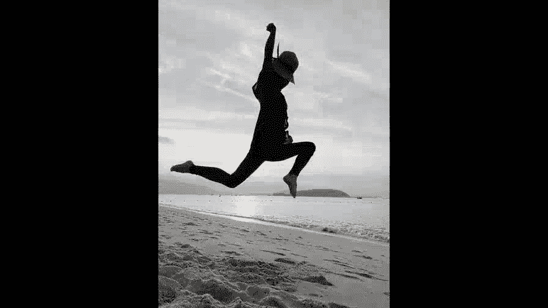
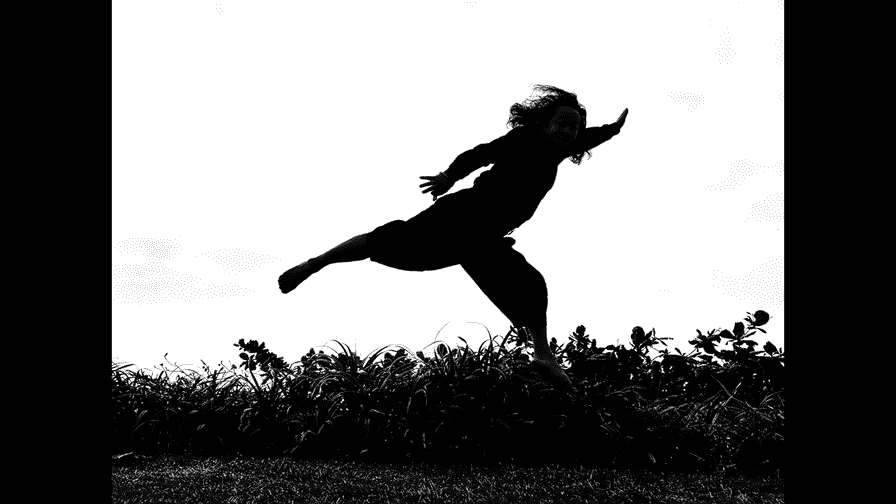
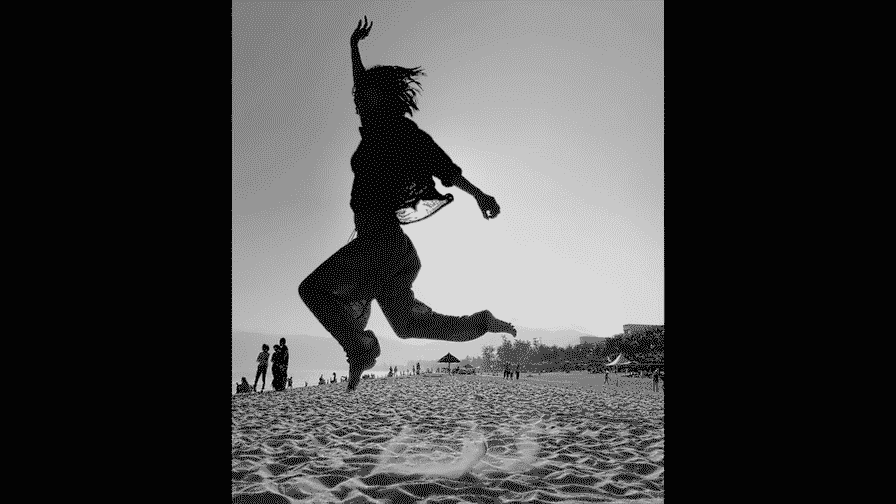
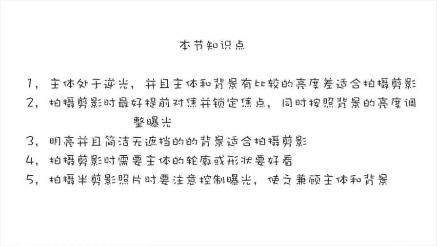
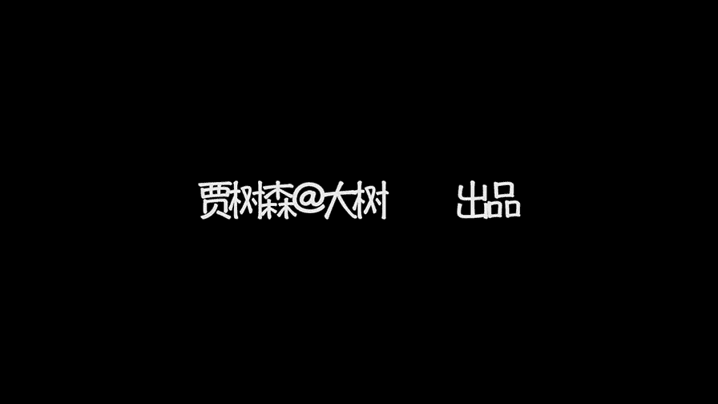

# 贾树森-手机摄影高手（完结）：3：【高手】24种生活场景模拟拍摄训练：第11讲 怎么拍摄剪影？

在本节课中，我们将要学习如何拍摄剪影照片。剪影是一种通过强烈的明暗对比，让主体呈现为黑色轮廓的摄影技法。我们将从光线条件、拍摄技巧、构图要点以及半剪影的拍摄方法等方面，系统地掌握这一技能。

---

## 光线条件：寻找完美的逆光

上一节我们介绍了剪影的基本概念，本节中我们来看看拍摄剪影最关键的因素——光线。

最适合拍摄剪影的光线是**逆光**。在室外，最佳拍摄时机是清晨或黄昏。此时太阳角度较低，光线柔和，环境中的反射光和杂光较少，最容易拍出效果好的剪影。

一旦太阳升高，光线变强，环境中会出现各种杂光和反射光，甚至可能直接照射到主体侧面，这会严重影响剪影效果。例如，墙面、地面等物体的强烈反光会照亮主体，使其难以形成纯粹的黑色轮廓。

拍摄剪影不仅限于室外，室内同样可以。核心条件是满足**逆光**，并且主体与背景之间有**足够大的亮度差**。例如，在室内利用明亮的灯光作为背景光源，或在黑暗房间中布置灯光照亮背景，都可以创造出拍摄剪影的条件。

**核心光线条件公式**：
> **剪影拍摄条件 = 逆光 + 主体与背景的高亮度差**

---

## 拍摄操作：对焦与曝光锁定

了解了光线条件后，我们来看看具体的拍摄操作。

在理想条件下，相机自动曝光可能就能拍出剪影。但在多数情况下，我们需要手动干预。建议进行**对焦和曝光锁定**。

由于在逆光下拍摄，相机可能对焦失误，因此需要先锁定焦点。随后，根据实际情况调整曝光。大多数情况下，需要**降低曝光（压暗画面）**，以确保背景曝光正常，而主体因曝光不足形成剪影。

判断曝光是否合适的标准是：**以背景的亮度为曝光基准**。当背景（如天空、海面）曝光合适时，较暗的主体自然会因曝光不足而变成剪影。

---

## 构图与背景选择：突出轮廓之美

上一节我们介绍了如何控制曝光，本节中我们来看看如何通过构图让剪影更出彩。

剪影隐藏了主体的细节，只保留其轮廓和形状。因此，背景的选择至关重要。

以下是选择背景的要点：
*   **背景应明亮且简洁**，避免杂乱的物体干扰主体轮廓。
*   **确保光源和主体之间没有遮挡物**，否则主体的形状会受到影响。

如果拍摄环境中存在干扰物，可以尝试**降低机位进行仰拍**。这样可以让地面上的杂物消失或减弱其影响。

有时，强烈的阳光会在镜头上产生炫光。可以**调整拍摄角度，让主体恰好挡住太阳**，以消除炫光。甚至可以让太阳从主体边缘露出一点，形成光斑，为画面增添气氛。

---

## 主体姿态与动态捕捉

因为剪影强调轮廓，所以主体的姿态和形状就变得格外重要。

静态站立往往比较平淡。可以**引导主体做出跳跃、舞蹈、瑜伽等富有动态或优美线条的动作**，这样拍出的剪影会更生动、精彩。

在拍摄动态剪影（如跳跃）时，需要注意：
*   **预先构图**，设想好主体的活动范围。
*   **使用连拍功能**，在动作开始前就按下快门，连续拍摄多张，从中选取最佳瞬间。

---

## 进阶技巧：半剪影的拍摄

在某些逆光场景中，主体与背景的反差可能不足以形成全黑的剪影，或者我们希望保留主体的一些细节。这时可以拍摄**半剪影**。

半剪影同样要求背景简洁、主体轮廓分明。但与全剪影不同，它允许主体保留部分细节，例如服装的纹理或模糊的表情。

拍摄半剪影时，曝光控制需要更加精细：
*   **需兼顾主体和背景的曝光**，让两者都保留一定的层次和细节。
*   **可以开启手机的HDR功能**，帮助平衡画面中的高光和阴影部分，更好地呈现细节。

---

本节课中我们一起学习了拍摄剪影的完整方法。我们首先明确了**逆光**和**大光比**这两个核心光线条件。接着，掌握了通过**锁定对焦并降低曝光**来确保主体变暗、背景正常的操作技巧。在构图上，我们学会了选择**明亮简洁的背景**，并通过**低角度仰拍**来规避杂物。为了让剪影更生动，可以引导主体做出**优美的动态姿态**。最后，我们还了解了当光比不足时，如何拍摄保留部分细节的**半剪影**，并利用HDR功能来辅助曝光。掌握这些要点，你就能在各种场景下拍出轮廓鲜明、富有艺术感的剪影照片了。