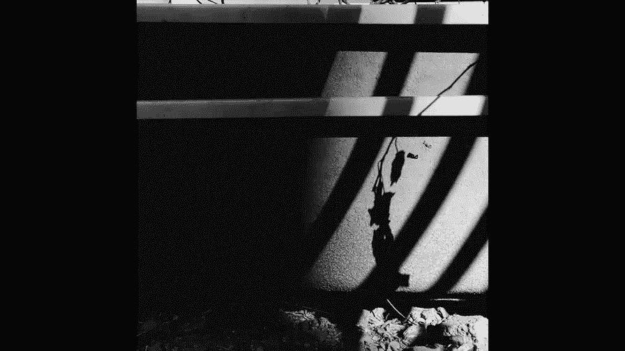
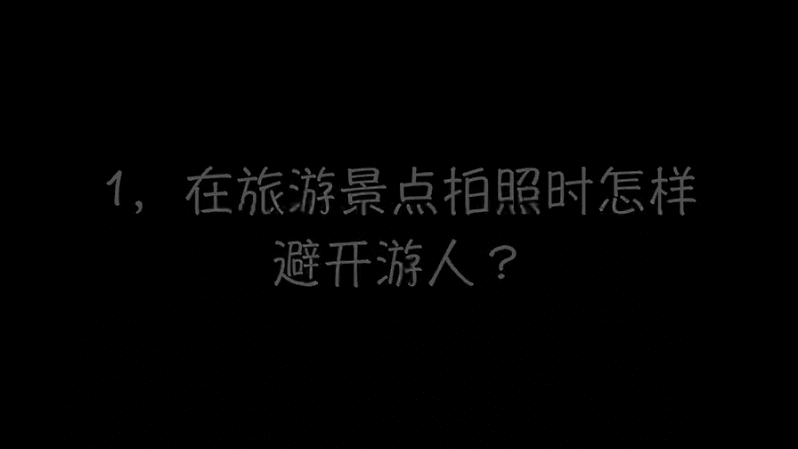
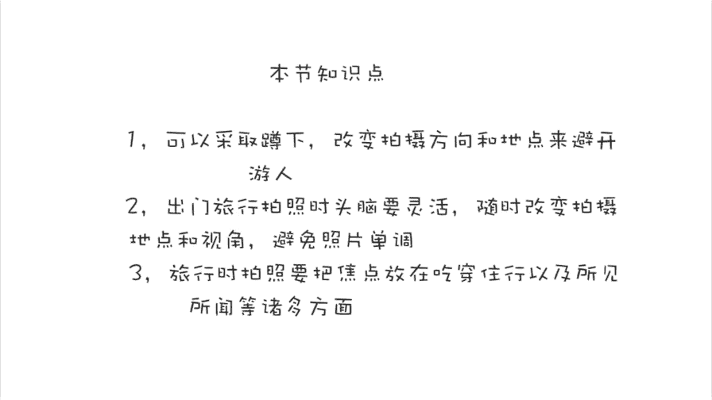
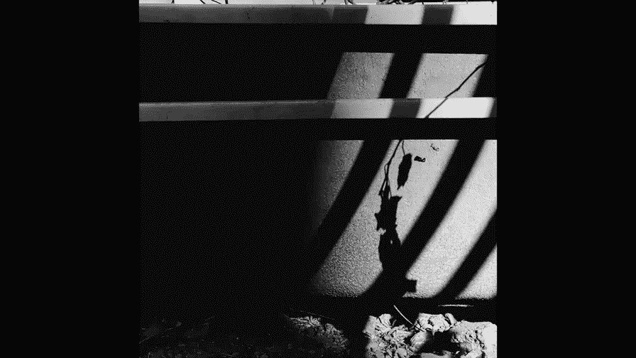

# 手机摄影高手：3.12：旅行时如何避免“游客照”？

在本节课中，我们将要学习在热门旅行景点如何避开人群，拍出精彩照片，以及如何记录丰富多彩的旅行瞬间，告别单调的“游客照”。

## 避开人群的四个绝招 🏖️

在热门景点，背景中的人群常常会干扰拍摄。上一节我们介绍了场景选择的重要性，本节中我们来看看如何通过拍摄技巧避开人群。

以下是四个实用的拍摄绝招：

1.  **改变拍摄角度（低角度仰拍）**：当拍摄者降低机位（如蹲下或坐下）并靠近拍摄主体时，由于**近大远小**的透视原理，主体会显得高大，而背景中的人群则会显得渺小，从而被弱化。

2.  **转换拍摄方向**：不一定要对着人多的标志性建筑拍摄。可以尝试转向人少的方向，例如从沙滩望向大海，等待行人走过，就能获得干净的背景。

3.  **寻找僻静角落**：主动离开人流最密集的核心区域，沿着沙滩或街道寻找相对低洼、偏僻的角落进行拍摄。低角度结合人少的背景，能有效避开干扰。

4.  **利用背景虚化**：使用手机的人像模式或大光圈功能，将背景杂乱的人群进行虚化处理。如果手机没有此功能，也可以在后期使用软件（如Snapseed、美图秀秀）模拟虚化效果。

## 让照片生动不单调的五种方法 🌊

掌握了避开人群的技巧后，我们还需要让照片本身更具吸引力。以下是五种避免照片单调死板的方法：

1.  **让主体动起来**：引导被拍摄者做一些动态动作，如跳跃、旋转、甩动头发，摄影师进行抓拍，能让画面充满活力。

2.  **拍摄多样化的背景**：不要只拍大海，可以转身拍摄沙滩、酒店、街道或天空，结合动态姿势，丰富照片的构成。

3.  **拍摄背影与互动**：拍摄人物望向远方的背影，或记录家人之间的互动瞬间（如妈妈给孩子讲故事），能营造故事感和氛围感。

4.  **拍摄局部与细节**：不一定要露脸。可以拍摄一家人的脚丫、映在沙滩上的影子、局部特写或具有代表性的随身物品，用细节讲述故事。

5.  **记录沙滩活动**：在沙滩上画画、玩泡泡等亲子活动，能自然产生许多有趣、有爱的互动瞬间，让照片充满欢乐与温情。

## 全面记录旅行：吃穿住行与所见所闻 📸

旅行摄影不应只局限于景点打卡。脑筋要灵活，视角要多样。以下是记录一次完整旅行的拍摄思路，涵盖“吃穿住行”与“所见所闻”：

*   **行前与途中**：记录收拾行李、前往机场/车站、候机、飞机窗外的风景、孩子在旅途中的新奇反应或睡姿等。
*   **住宿体验**：在酒店的走廊、楼梯、房间内拍摄，这些地方往往人少，容易拍出有格调的照片。
*   **当地美食**：不仅拍摄食物本身，还可将具有当地特色的街道、招牌、行人作为背景，突出异域风情。
*   **标志景点**：可以拍摄“到此一游”的纪念照，但应结合之前学习的技巧，让人物与景点更好地融合。
*   **风土人情**：主动拍摄当地独特的建筑（如教堂）、街景、文化标志等，这些都是“所见所闻”的重要组成部分。

本节课中我们一起学习了在旅行时避开人群的四种拍摄绝招，让照片生动不单调的五种方法，以及全面记录旅行瞬间的拍摄思路。记住，灵活运用角度、寻找独特视角、用心观察并记录细节，你就能拍出与众不同的精彩旅行照片。

