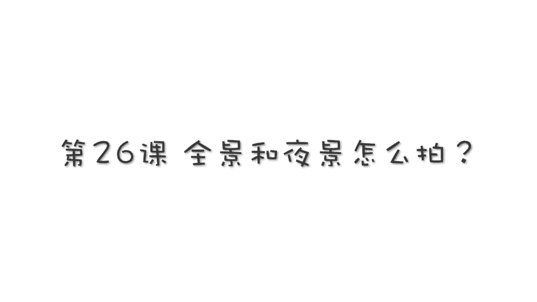
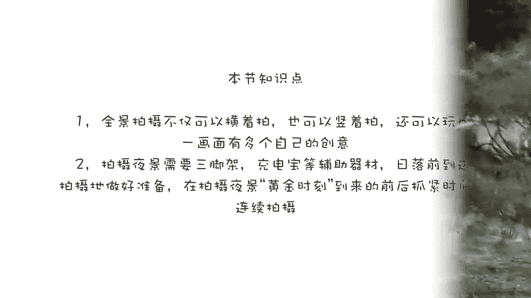

# 贾树森-手机摄影高手（完结）：3：【高手】24种生活场景模拟拍摄训练：第13讲 全景和夜景怎么拍？

在本节课中，我们将学习如何使用手机的全景模式和夜景模式进行拍摄。课程将分为两个主要部分：全景拍摄的技巧与创意玩法，以及夜景拍摄的必备工具、软件选择和最佳时机。通过学习，你将能够掌握拓展手机拍摄视角和捕捉美丽夜景的方法。

## 全景拍摄基础与操作 🏙️

手机通常内置了专门拍摄全景的模式，例如iPhone的“全景”模式或安卓手机的类似功能。这个功能可以将多张照片拼接成一张宽广的画面。

以下是进入和设置全景模式的基本步骤：

1.  **打开相机应用**：在拍照界面中，找到并切换到“全景”模式。
2.  **理解取景界面**：切换到全景模式后，画面会出现一个箭头和一条中心参考线。拍摄时需要平稳移动手机，让箭头始终沿着这条线移动，不能过高、过低或偏离。
3.  **锁定曝光与焦点**：为了获得稳定的曝光，可以在画面中较亮（但不是最亮）的区域长按屏幕，以锁定焦点和曝光。这有助于让整张照片的明暗适中。
4.  **保持水平**：在开始移动前，确保画面中的垂直线条（如大楼边缘）与手机屏幕边框平行，同时保持水平移动，这样拍出的建筑和地平线才不会歪斜。
5.  **调整移动方向**：iPhone的全景移动方向可以点击箭头进行切换（如从左到右或从右到左）。安卓手机的操作可能有所不同，部分型号需要在屏幕左上角切换横拍或竖拍方向，有些则支持双向移动而无需切换。

## 全景拍摄的创意应用 🎭

上一节我们介绍了全景模式的基础操作，本节中我们来看看如何创造性地运用这个功能。

全景模式并不仅限于拍摄超宽风景，它还可以作为手机的“超广角镜头”使用。拍摄时，不一定要旋转完整个角度，当你觉得画面足够时，可以随时按下快门停止拍摄。这样，你就获得了一张视角更广的单张照片。

除了横向拍摄，全景模式也支持竖向拍摄。竖向全景能拍出具有视觉冲击力的高大场景，比如高楼或树木。拍摄时，需要将手机横置，然后平稳地向上移动。

全景模式还有一个非常有趣的玩法——拍摄“多胞胎”照片，即在同一画面中出现同一个人物的多个影像。其原理是：在全景拍摄过程中，让被摄者在镜头移动的间隙，快速从镜头后方绕到下一个拍摄位置。

以下是拍摄“多胞胎”照片的具体步骤：

1.  将手机固定在三脚架上，进入全景模式，锁定焦点和曝光。
2.  被摄者进入第一个位置摆好姿势。
3.  开始移动手机进行拍摄。
4.  当镜头即将移过被摄者时，被摄者迅速从镜头**移动的反方向**离开画面，并绕到镜头后方。
5.  被摄者跑到下一个预定位置站好。
6.  镜头平稳移动过来，捕捉到第二个影像。
7.  重复步骤4-6，可以创造出多个影像。

这个玩法非常适合在海边、草原等开阔地带进行创意拍摄，人物可以摆出各种姿势，或近或远，增加画面的趣味性和新奇感。

## 夜景拍摄的准备工作与核心工具 🌃

拍摄夜景与白天拍摄有很大不同，需要一些额外的准备和工具。

首先，三脚架是夜景拍摄的必备品。虽然现在有些手机具备手持长曝光功能，但使用三脚架能最大程度保证画面稳定，获得更清晰的照片。

其次，由于夜景拍摄通常需要长时间曝光，耗电量较大，建议随身携带一个充电宝，以防手机电量不足。

最后，拍摄地点的选择至关重要。选择有特色建筑、灯光以及**水面**的地点会事半功倍，因为水面的倒影能与实景交相辉映，让夜景照片的魅力加倍。

## 夜景拍摄的软件选择与设置 📱

对于安卓手机，通常打开内置的“超级夜景”模式，就能应对大多数夜景场景。而iPhone原生相机缺乏类似的长曝光功能，因此需要借助第三方软件。

这里介绍两款常用的夜景拍摄软件：**NightCap Camera** 和 **Slow Shutter**。

**1. NightCap Camera**
这款软件的“亮光轨迹”模式非常适合拍摄车流、光绘等动态光影效果。

其核心参数设置如下：
*   **快门速度 (ESP)**：调整至画面亮度合适。
*   **感光度 (ISO)**：尽量调低，或设为自动，以减少噪点。
*   **对焦 (FOC)**：在屏幕上点击选择对焦点。
*   **白平衡 (WB)**：调整画面色温（偏黄或偏蓝），通常自动即可。

**2. Slow Shutter**
这款软件同样功能强大，主要模式包括：
*   **灯光轨迹**：与NightCap的亮光轨迹类似，用于捕捉移动光源的轨迹。
*   **动态模糊**：让画面中移动的物体变虚，营造动感。
*   **低光模式**：即长曝光模式，用于拍摄稳定的夜景、使水流雾化等。

它的操作特点是：在屏幕上点按后，可以对焦框（蓝色）和测光圈（黄色）进行分离调整，实现更精准的控制。

这两款软件都是付费应用。iPhone用户如果对夜景和慢门摄影有强烈需求，可以考虑购买。安卓用户则可以先充分利用手机自带的超级夜景功能。

## 夜景拍摄的最佳时机与技巧 🌇

拍摄夜景最重要的不是深夜，而是**日落后的黄金时段**。如果天色完全变黑再拍，天空往往会死黑一片，缺乏层次。

最佳的拍摄时机是日落后，华灯初上，天空尚未完全变黑，呈现出深邃的蓝色时。此时天空的亮度（密度）与地面灯光的光比达到最佳平衡，画面色彩丰富，细节饱满。

这个黄金时段光线变化极快，可能只有十几到二十分钟。因此，务必提前到达拍摄地点，完成选景、构图和三脚架调试等准备工作，然后耐心等待最佳时刻的到来，并抓紧时间拍摄。

你可以尝试在不同的时间点，用不同的模式（如原生相机、超级夜景、长曝光、亮光轨迹）进行拍摄，对比水面倒影、天空细节和灯光效果的差异，从而找到自己最喜欢的风格。

## 课程总结

本节课中，我们一起学习了手机全景与夜景拍摄的核心技巧。

*   在**全景拍摄**部分，我们掌握了保持水平、锁定曝光的基础操作，并学习了将其作为广角镜头使用以及拍摄创意“多胞胎”照片的方法。
*   在**夜景拍摄**部分，我们了解了三脚架和充电宝的必要性，认识了两款强大的第三方拍摄软件（NightCap Camera和Slow Shutter）及其参数设置，并掌握了抓住日落后的“蓝色时刻”这一最关键的成功秘诀。

希望你能灵活运用这些技巧，拓展手机的拍摄潜力，记录下更广阔、更绚丽的视觉瞬间。

