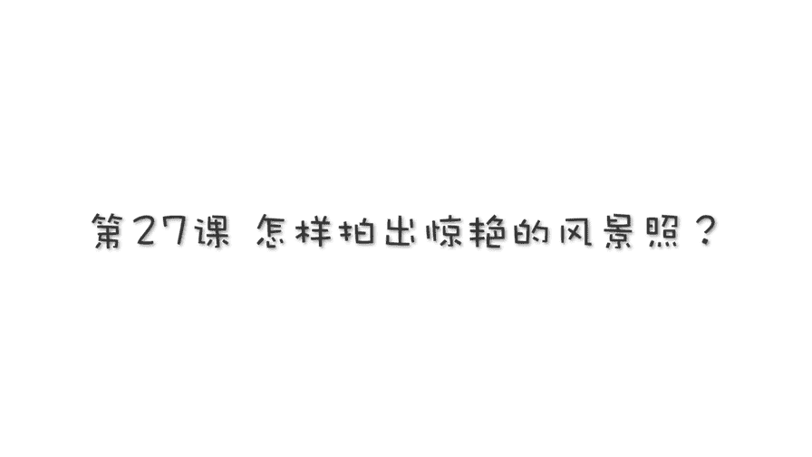

# 贾树森-手机摄影高手（完结）：3：【高手】24种生活场景模拟拍摄训练：第14讲 怎样拍出惊艳的风景照？

## 📖 概述
在本节课中，我们将学习如何用手机拍出惊艳的风景照。课程将涵盖拍摄心态、光线运用、构图技巧以及如何发现身边的美等多个核心方面，帮助你全面提升风景摄影水平。

---

## 🧠 第一部分：心态与观察力——风景摄影的根基
上一节我们介绍了课程概述，本节中我们来看看拍摄风景前最重要的准备：心态与观察力。

很多人认为只有去壮丽的自然景观或名胜古迹才能拍出好风景。这其实是一种误解。如果你只能在外地拍出好照片，说明你对日常生活的感受力有待提高。你的生活也是别人的风景。著名摄影家欧文·佩恩说过：“即便是拍摄一块蛋糕，也可以产生艺术。”

当你用心观察，用全新的眼光看待身边事物时，不仅能拍出好照片，更能让生活更加丰满。我们之前的课程讲过如何培养“摄影眼力”和对日常生活的感知能力。例如，一块普通的、掉落在路边的油漆，其形状和颜色都很美，但有多少路人会注意到呢？

想拍好风景，在拍摄前一定要“谋定而后动”。很多人一到景点就忙于拍摄，生怕错过什么，这样容易拍出大量废片，也让自己处于忙乱中，无心体味风景。**摄影是一个取舍的过程**。什么都想要，可能什么都得不到。真正的好作品首先要打动自己，才能打动别人。

因此，我们需要真正提高自己的摄影眼力和感受风景的基本功。只有这样，你才能发现周围的美，并在前往风景名胜时，发现别人看不到的独特景致，通过风景表达你对生活的热爱。当你的感知力提升，摄影水平会大幅进步，你也会活得更幸福。**爱与激情是成就一切的根基，摄影也不例外。**

---

## ☀️ 第二部分：光线的魔法——风景摄影的灵魂
上一节我们探讨了心态的重要性，本节中我们来学习风景摄影的灵魂：光线。

摄影是光线的艺术，拍风景也是如此。有了好光线，就成功了一大半。

### 黄金时段与侧光
在讲光线时我们曾提过，**侧光有助于体现景物的立体感**。在日出之后和日落之前的一段时间，太阳角度较低，光线柔和，对地面景物的照射角度比较立体。如果选择侧光拍摄，比较容易获得惊艳的照片。这个“一早一晚”的时段被称为**摄影的黄金时段**，容易出片。

### 逆光的独特魅力
除了侧光，也应多关注**逆光**。虽然逆光在风景拍摄中不常用，但它能使画面产生独特的气氛和特殊的光影效果。巧妙运用逆光，即使在中午等光线不佳的时候，也能拍出不错的风景照。**运用逆光拍摄剪影**也是非常好的选择。

### 日出日落与特殊天气
日出日落本身就是一道亮丽的风景。我们除了关注此时的光线，也可以直接拍摄日出日落本身，具体方法将在下一课介绍。

好天气带来好光线，但坏天气时也不要停止拍摄。有时，恶劣的天气反而是完美的拍照光线。我们在第20课讲过如何在恶劣天气里拍照，这种天气往往能拍出具有独特气氛甚至令人震撼的照片。

### 应对大光比与慢门应用
对于**反差（光比）比较大**的景物，建议开启手机的 **HDR功能** 进行拍摄。因为手机记录光线的能力有限，反差过大容易导致某些细节丢失。

我们也可以运用相机的**慢门**来拍摄景物，这样能让平凡的景物变得独特，展现出不一样的风景。具体如何使用慢门，我们在上一节夜景课中分享过两款针对苹果手机的软件：**Slow Shutter** 和 **NightCap**。安卓手机的“流光快门”也有类似效果。

### 城市夜景
除了自然风光，也可以拍摄城市夜景。如何拍夜景我们上一节课刚讲过，其中最重要的同样是对光线的把握。拍摄夜景也有黄金时刻，不能太早，也不能太晚。

---

## 🖼️ 第三部分：构图技巧——构建画面的骨架
上一节我们学习了光线的运用，本节中我们来看看如何通过构图来构建惊艳的风景画面。

构图对于拍摄风光极端重要。

### 善用线条
以下是关于线条运用的建议：
*   **引导视线**：风景中有很多线条（直线、曲线、斜线、S型、放射型等）。这些线条辨识度高，有很强的吸引力。拍摄时应尽量利用它们，将观者视线引导至风景纵深处，增强画面的立体感。
*   **装饰画面**：某些线条也能对画面起到装饰作用。

### 极简构图
**极简是手机摄影的不二法则**。极简构图充分体现了“少即是多”的概念，用很少的画面元素表达出悠远的意境和丰富的韵味。

极简构图通常指**大面积的留白**配上一个**有趣的主体**。一般会寻找大片的纯色背景，如蓝天、大海、草原等，再配上一个关注度较高的主题。当然，并非一定是大场面，生活中的小细节也能构成极简画面，只要用心观察就能发现。

### 加入倒影
在拍风景时加入**倒影**元素，会让画面更具张力。它有时能颠覆常规思维，让人感到惊艳。倒影常使美丽的风景加倍美丽，因为它形成了**虚实相应**的关系，有时还能构成一种**对称美**。

### 地平线的位置
拍摄风景绕不开地平线的位置。以下是基本原则：
*   如果天空内容特别丰富（如云彩漂亮），可以让**天空占2/3，地面占1/3**。
*   如果地面和天空都很精彩，可以让它们**一分为二（各占1/2）**。
*   如果地面景物比较丰富，可以让**地面占2/3甚至更多**。

### 色彩的运用
注意画面中的**色彩运用**可以提升照片的视觉张力。色彩是风景照片中极为重要的元素。不管是**对比色**还是**和谐色**，运用到位都能带来意想不到的视觉冲击，让人眼前一亮。

有时会遇到色彩不够漂亮的风景，这时完全可以尝试**黑白照片**。黑白照片只有黑、白、灰，排除了色彩干扰，反而让照片中的**影调、线条、图案或纹理**更加突出。

### 框架式构图
拍摄风景还可以尝试经典的**框架式构图**。将风景置于窗户、桥洞或其他框架之中，会别有一番风味。这些框架不仅增添了美感，也增加了画面的**层次感和纵深感**。

### 运用前景
再美丽的风景也需要陪衬。好的前景除了起到衬托作用，还能增添照片的**纵深感**，使照片的近景、中景、远景层次更加分明。

---

## 🔍 第四部分：视角、元素与情感——让风景照脱颖而出
上一节我们掌握了多种构图技巧，本节中我们来看看如何通过改变视角、加入元素和注入情感，让风景照更具个性。

### 改变视角
对于司空见惯的风景，可以采取**改变视角**的办法。例如，正常看到的花可能是平视的，但通过**趴在地上仰拍**，就能从一个低角度拍出人们平时见不到的视觉效果。

### 关注局部与微观
除了恢宏的全景，也可以关注景物的**细节和局部**。例如一块岩石，远看只是一种颜色，但靠近仔细看，也能发现其独特的美。在拍摄特别细致的局部甚至微观世界时，可以为手机加装**微距镜头**，来表现日常生活中可能被忽略的细致之美。

### 加入动物
动物是风光照片里特别重要的一部分。不管是野生的还是农场圈养的，把它们纳入画面，让动物成为画面的主角或陪衬，都会让照片更有味道。

### 加入人物
相比较其他元素，人更容易成为焦点，也更容易制造故事。所以，**人物也是风景中不可或缺的一部分**。如果运气好，可以拍到一些陌生人。如果条件允许，也可以将自己的朋友或家人纳入画面，甚至**自己的影子**也可以成为风景的组成部分。

### 加入小道具
我们也可以在风景中放置一个小道具。例如，用手拿着一片叶子，或者将自己喜欢的玩偶放在美丽的风景中。

### 注入情感与思想
**摄影本质上是思想的外部投射**。你怎么想，便会怎么拍。风景不单单是风景，更是我们思想情感的承载体。最高级的风景是**以景言志，以景寓情**。

---

## 🎨 第五部分：后期修图——画龙点睛之笔
上一节我们学习了如何为风景照注入情感，本节中我们来看看风景摄影的最后一步：后期修图。

跟其他照片一样，风景照片也需要进行后期修图。对于风景照，一般遵循 **“七分拍，三分修”** 的原则，建议不要修得过度。

修图的最终标准，是要体现我们拍摄风景的**初衷**，要体现出我们的**情感**，表达出我们拍摄时的**情绪**。具体的一些修图方法，我们会在后面的后期课程中一一介绍。

---

## 📝 总结
本节课中，我们一起学习了如何拍出惊艳的风景照。我们从**调整心态、培养观察力**开始，认识到美无处不在。接着，我们深入探讨了**光线的运用**，包括黄金时段、逆光、特殊天气及慢门技巧。然后，我们学习了多种**构图方法**，如利用线条、极简构图、加入倒影和前景等。最后，我们了解了如何通过**改变视角、加入动物、人物、道具以及注入个人情感**来让作品脱颖而出，并简要介绍了后期修图的原则。记住，最高级的风景照，是技术与情感的结合。