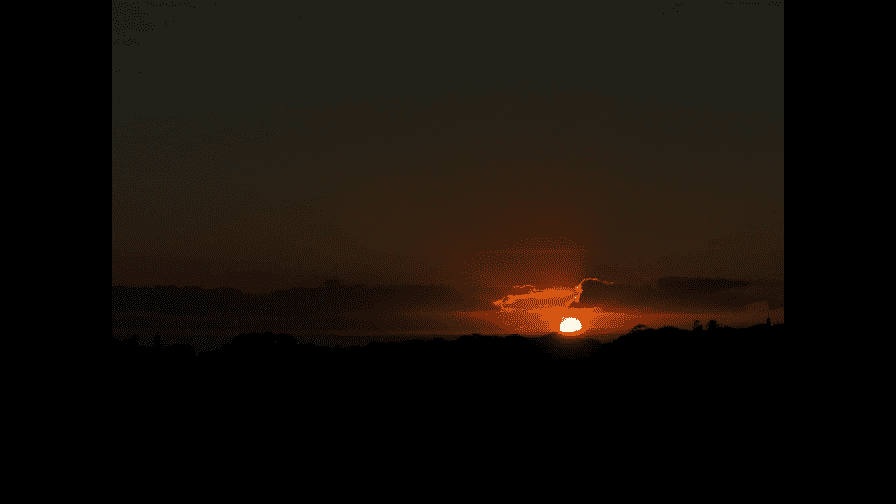
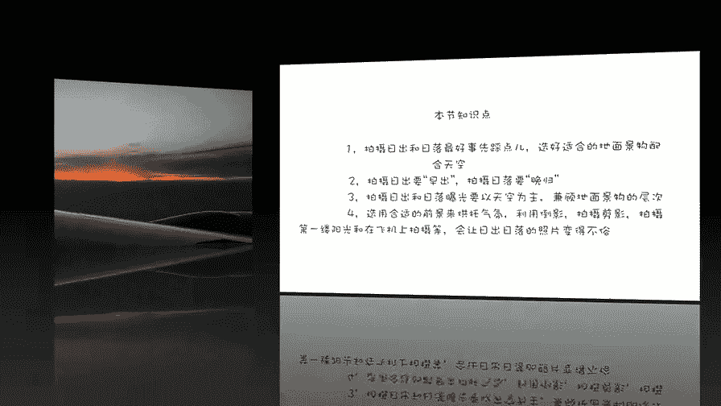

# 手机摄影高手：3：如何拍日出日落？

在本节课中，我们将学习如何用手机拍摄日出和日落。我们将从地点选择、拍摄时机、曝光控制、前景运用等多个方面，系统地掌握这一经典题材的拍摄技巧。

## 一、 选择拍摄地点 🌍

拍摄日出日落最重要的一条是选好拍摄地点。对于经常居住的地方，我们会知道太阳大概从什么地方升起和落下，以及地面上有什么景物可以衬托太阳。要知道，太阳本身没有变化，但拍出来的效果可以完全不同，这很大程度上取决于你选择的拍摄地和用来衬托太阳的景物。

以下是选择地点的一些思路：

*   **熟悉环境**：在家附近，我们可以从楼顶拍摄，也可以在公园里寻找桥或水面来衬托太阳。
*   **旅行发现**：在外旅行时，可以留意并寻找有特色的前景，如草原上的小船、著名的海滩等。
*   **提前踩点**：如果发现一个漂亮的场景（如牧场、海边），可以在头一天晚上踩点，第二天提前到达等待拍摄。

## 二、 把握最佳时机 ⏰

上一节我们介绍了地点的选择，本节中我们来看看拍摄时机的把握。想要拍好日出和日落，需要做到“早出晚归”。

**拍摄日出要“早出”**。我们需要在太阳出来之前就到达拍摄点。太阳从露头到完全升起的过程很短暂，去晚了容易错过。更重要的是，日出前天空光线的变化特别丰富多彩，比如紫色的朝霞，非常漂亮。

**拍摄日落要“晚归”**。太阳落山后千万不要马上离开。日落后的半小时甚至更久，天空的色彩（尤其是朝东的天空）会发生非常丰富和微妙的变化，从黄色到橘红，再到静谧的蓝色，每一刻都值得记录。

## 三、 控制曝光与层次 📸

拍摄日出日落时，曝光有一定难度，因为此时天空与地面的明暗反差很大。

**核心原则是：通常以天空的亮度为基准进行曝光**，确保天空的云霞和太阳有层次，而不是白花花一片。公式可以理解为：**曝光补偿向负值（-EV）调整**，让画面整体变暗，以保留亮部细节。此时地面景物可能会比较暗，甚至成为剪影，这没有关系。

在某些情况下，如果地面景物也很美，我们想同时保留天空和地面的细节，就需要使用手机的 **HDR（高动态范围）模式**。这个功能会自动拍摄多张不同曝光的照片并合成，从而获得亮部和暗部都有细节的照片。

## 四、 巧用前景与倒影 🌅

如果只拍摄一个太阳，画面可能会略显单调。这时，为画面增加一个合适的前景，有助于烘托照片的气氛。

可以作为前景的元素有很多，例如人物、椅子、草原上的花、水中的小船，甚至是正在吃草的奶牛。选择前景时要注意主次分明，前景是为了衬托日出日落的美景，不要让它抢夺了主体的风采。

此外，可以想办法拍出倒影。利用玻璃、水面等反射面，不仅能将天空中的美景加倍，还能让照片产生虚实相生的美感。

## 五、 捕捉特殊光线与剪影 ✨

除了直接拍摄太阳和天空，我们也可以把镜头对准日出日落时投射在地面上的那一缕“神奇”的阳光。此时光线角度很低，会在地面的缝隙中形成平时难以见到的美丽光柱。捕捉这样的光线需要一双善于发现的眼睛。

日出和日落时分也是拍摄剪影的绝佳时机。拍摄方法很简单：**对焦在明亮的背景（天空）上，并降低曝光**，使前景的人物或物体因曝光不足而变成黑色的轮廓。

## 六、 飞机上的日落拍摄 ✈️

如果乘坐飞机时恰逢日落，选择一个靠窗的位置，可以体验在云端拍摄日落的独特感受。

在飞机上拍摄需要注意以下几点：

*   **持续拍摄**：云海和光线的变化很快，要持续拍摄以免错过精彩瞬间。
*   **避开眩光**：透过舷窗拍摄时，注意调整角度，避免玻璃反光造成的眩光斑。
*   **利用机翼**：飞机的机翼无需刻意避开，可以将其作为构图的一部分，为画面增加线条感和层次感。
*   **把握“镶金边”时刻**：无论是拍摄太阳冲破云层（日出），还是落进云层（日落），留意云彩被阳光镶上金边的那个瞬间，感染力极强。

---

本节课中我们一起学习了拍摄日出日落的完整流程：从**提前选点踩点**，到**把握“早出晚归”的黄金时机**；从**以天空为准控制曝光**到**巧妙运用前景和倒影**丰富画面；最后还探讨了**捕捉特殊光线**、**拍摄剪影**以及在**飞机上拍摄日落**的特殊技巧。记住，最美的景色往往出现在太阳升起之前和落下之后，耐心等待和细致观察是拍出好照片的关键。