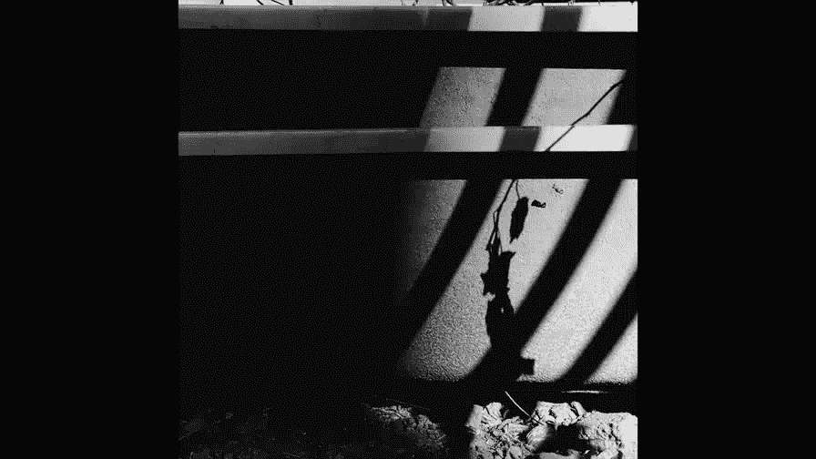
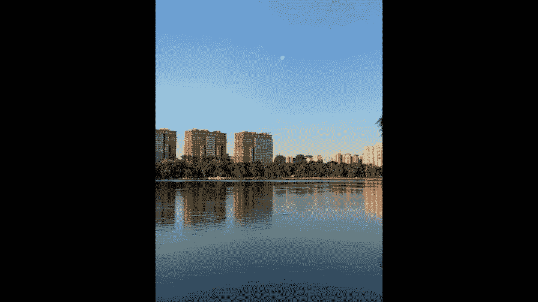

# 贾树森-手机摄影高手（完结）：3：【高手】24种生活场景模拟拍摄训练：第16讲 手机能拍月亮吗？

在本节课中，我们将要学习如何使用手机拍摄月亮。很多人认为手机无法拍好月亮，但事实并非如此。只要掌握正确的时机、曝光、对焦和构图技巧，手机同样可以拍出富有意境的月亮照片。我们将从拍摄时机、曝光调整、对焦技巧、变焦使用以及前景搭配这几个核心方面，详细讲解手机拍月亮的全过程。

## 把握正确的拍摄时机 🌅

上一节我们介绍了手机拍月亮的可能性，本节中我们来看看拍摄时机的选择。拍月亮的最佳时机并非在夜晚，而是在白天，具体来说是清晨或傍晚。

以下是关于拍摄时机的具体说明：
*   夜晚天空完全黑暗时，月亮会成为一个过亮的亮点，周围景物漆黑，手机难以拍出层次。
*   清晨太阳刚升起或傍晚天未全黑时，天空尚有亮度，月亮与周围景物的光比相对平衡，此时是拍摄的黄金时间。
*   如果太阳升得过高，天空过亮，月亮的亮度会相对变弱，在画面中变得不明显。
*   月亮出现的具体时间（清晨或傍晚）因季节和农历日期（上半月或下半月）而异，需要平时多加观察。

## 调整曝光与使用HDR功能 ⚖️

了解了最佳拍摄时机后，我们需要解决如何正确曝光的问题。拍摄月亮时，曝光的基准应以月亮本身的亮度为准。

以下是曝光调整的核心要点：
*   确保月亮表面有细节和层次，避免月亮成为一个死白的亮点。公式可以理解为：**曝光补偿应向“减号”（-）方向调整，直到月亮显现出纹理**。
*   为了最大限度地保留月亮的高光细节，务必在拍摄时**打开手机的HDR（高动态范围）功能**。这能让亮部（月亮）和暗部（地面景物）的细节都得到更好呈现。
*   以月亮为基准曝光时，周围的景物可能会被压暗，甚至成为剪影，这是正常且可接受的效果。

## 掌握精准的对焦技巧 🔍

正确曝光保证了画面亮度，而清晰的对焦则决定了照片的质感。用手机对焦月亮有时会遇到困难。

以下是对焦的具体方法和技巧：
*   直接对焦月亮时，如果手机自动对焦无法准确合焦，月亮会显得模糊。
*   建议先使用**1倍或2倍光学变焦**进行对焦，避免一开始就使用高倍率数码变焦。
*   如果无法直接对焦月亮，可以寻找与月亮处于相近无限远距离的参照物进行对焦，例如远处的树木或建筑。
*   成功对焦后，再根据需要调整构图或进行变焦。

## 谨慎使用数码变焦 📏

对焦清晰后，我们可能希望月亮在画面中显得更大。这时就会用到变焦功能，但必须谨慎使用。

以下是关于变焦使用的注意事项：
*   优先使用手机的**光学变焦**（如2倍或3倍），这是通过镜头物理结构实现的，画质损失小。
*   如果光学变焦仍无法满足构图需要，可以**适度使用数码变焦**，但通常建议控制在3倍左右，尽量不要超过4倍。
*   过度使用数码变焦会导致画面出现明显锯齿、细节模糊，画质严重下降。代码逻辑可以类比为：`if (变焦倍数 > 光学变焦上限) { 画质 = 显著下降; }`。
*   更推荐的方法是：先用合理焦段拍摄，后期通过**裁剪画面**来放大月亮，这比拍摄时使用过高数码变焦的效果更好。

## 巧妙利用与寻找前景 🌲

手机拍摄的月亮通常不会占据太大画面，因此搭配一个有趣的前景至关重要，这能为照片增添意境和故事感。

以下是利用前景构图的方法：
*   积极寻找地面景物作为前景，如树木、建筑、水面、山峰等，与天空的月亮形成呼应。
*   为了将月亮放置在合适的位置，需要耐心调整拍摄角度和位置，可能需要“爬上爬下、左转右挪”。
*   有些动态前景需要等待时机，例如飞鸟经过、流云遮月等。
*   如果缺乏自然前景，可以发挥创意，用手或其他物体在镜头前制造一个前景框架。

本节课中我们一起学习了用手机拍摄月亮的全套技巧。关键在于**把握清晨或傍晚的拍摄时机**，以月亮为基准**调整曝光并开启HDR**，运用参照物完成**精准对焦**，**谨慎使用数码变焦**，并耐心**寻找或营造生动的前景**。记住，手机摄影更注重意境与场景的结合，多观察、多尝试，你也能用手机捕捉到动人的月色。

