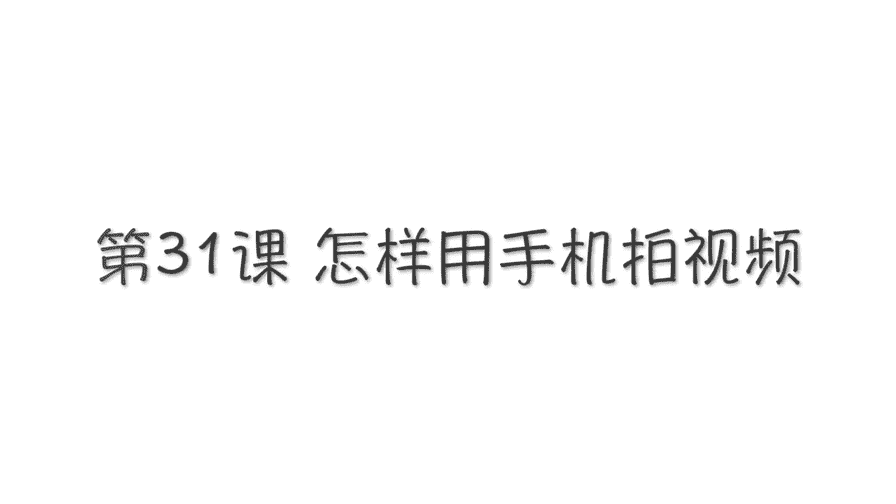
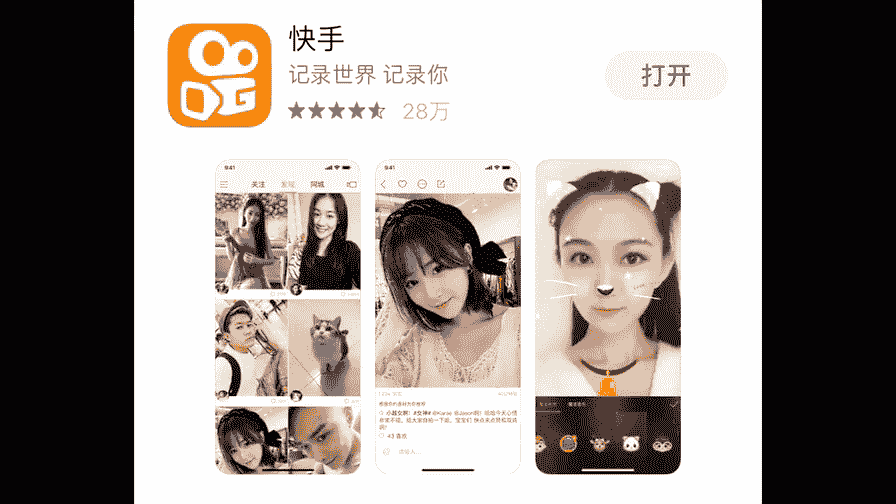
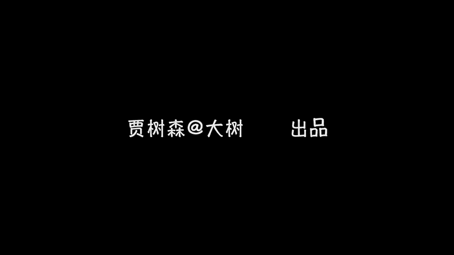

# 手机摄影高手：3：【高手】24种生活场景模拟拍摄训练：第18讲 怎样用延时拍摄拍视频？

在本节课中，我们将要学习如何使用手机的延时摄影功能，以及拍摄高质量视频的核心技巧。课程将分为两个主要部分：第一部分讲解延时摄影的拍摄方法，第二部分介绍拍摄普通视频的八大实用建议。

## 第一部分：延时摄影拍摄指南

上一节我们介绍了相机界面的各种符号，其中提到了延时摄影功能。本节中我们来看看如何具体操作。

延时摄影功能在安卓和苹果手机的相机应用中都能找到。选中该功能后，即可开始拍摄。

拍摄延时摄影时，必须使用三脚架固定手机，以确保画面绝对稳定。例如，可以使用八爪鱼三脚架，它能弯曲并固定在栏杆等物体上。

取景并固定好手机后，按下录制按钮即可开始拍摄。延时摄影需要持续拍摄一段时间。

延时摄影适合拍摄动态变化明显的对象。例如天空中的流云。如果天气晴朗、万里无云，则不适合拍摄。

此外，延时摄影也适合拍摄人来人往的轨迹，或车流光轨等过程。

拍摄延时摄影时，可以锁定焦点和曝光。但对于亮度会发生变化的场景，则不应锁定曝光。例如拍摄从白天到黄昏的过程，曝光应设置为自动，以便相机能自动适应环境光线的变化。

## 第二部分：手机视频拍摄八大核心技巧

掌握了延时摄影后，我们再来看看拍摄普通视频需要注意的关键点。以下是拍摄高质量手机视频的八个实用建议。

### 1. 确保画面稳定

用手机拍视频，最需要注意的就是画面要稳。手持手机时不要晃动，镜头运动也不宜过快，以免观感眩晕。

例如，记录孩子玩耍时，可以跟随主体缓慢移动。主体离开画面后，不必立刻追回，可保持镜头稳定等待主体返回。这种镜头运动方式称为“摇”。

“摇”镜头时要保持平稳，避免上下摆动，也忌讳频繁左右摇摆。

为了稳定画面，可以双手持机，并将胳膊肘尽量靠近身体。如果对视频质量要求较高，可以选用手机稳定器。有条件的话，最好使用三脚架拍摄。

也可以将胳膊肘支撑在栏杆、桌子上，或将身体靠在树上，以稳定相机，避免画面抖动。

在拍摄视频过程中，可以点击画面右下角的白色圆点同时拍摄静态照片，以便捕捉精彩瞬间。

### 2. 谨慎使用变焦

拍摄视频时要谨慎使用变焦功能。在运动摄影中，变焦被称为“推”和“拉”。虽然可以使用，但变焦过程必须缓慢。切忌频繁快速变焦，这会导致观感混乱。

### 3. 多使用横拍

拍摄视频时，尽量采用横向构图。横拍画面更具电影感，也更符合多数播放设备的屏幕比例。

### 4. 善用对焦功能

在运动拍摄中，如果感觉对焦不准，可以稍作等待，因为自动对焦需要时间。若仍未对准，可用于指轻点需要对焦的区域，尽量不要锁定对焦。

而在拍摄固定镜头时，则可以进行对焦和曝光锁定，这样焦点会更加准确。

### 5. 保证充足光线

用手机拍视频对光线的需求比拍照更严格。光线不足会导致画面出现大量噪点和颗粒，质量下降。

如果遇到光照不理想的情况，应尽量开灯、移动到明亮处，或使用LED灯、手电筒等工具改善光照。

### 6. 丰富景别变化

拍摄时不要固定在一个景别上。应结合全景、中景、近景乃至特写进行拍摄。这样在后期剪辑时，画面会更加丰富。

### 7. 搭配运动镜头

注意固定镜头与推、拉、摇、移等运动镜头的有机搭配。例如，“移”镜头是指相机本身移动拍摄。

同时，可以创新运动方式。例如，“摇”镜头不仅可以左右摇，还可以旋转摇，让画面更有趣味。

### 8. 注重后期剪辑

拍摄完成后，要善于使用后期编辑软件进行剪辑、配乐。这能大大提升视频的观赏性和分享价值。

目前常用的视频剪辑软件有VUE、美拍、小影等。苹果手机自带的iMovie也非常好用。这些软件也能将照片制作成视频。

此外，抖音、秒拍、快手等视频社区也具备基础的剪辑功能。

下面以VUE为例，简单介绍使用方法：

在桌面上打开VUE应用，界面下方的红色圆点可用于直接拍摄。

点击屏幕上方的菜单栏，可以进行画幅选择、总时长设定和分段设置。建议选择“自由分段”，总时长设为10秒，便于分享至朋友圈。

设置好后，点击左下角加号，从手机相册选择视频进行编辑。因为是自由分段，每段视频的长度可以自主选择，最短为1秒。

选取片段后，点击右下角对勾，继续编辑下一段，直至总时长达到10秒。

随后可以对视频进行润色。屏幕顶部的菜单栏提供了调整亮度、对比度、添加暗角、提高锐度、添加转场、字幕、滤镜、音乐和贴图等功能。

有两点需要特别注意：
*   滤镜可以在拍摄前通过红、黄、蓝三个圆圈图标预先设定。
*   在设置中（点击三个横杠图标进入），务必开启“全高清输出”选项。

最后，用两个由VUE剪辑的短片结束今天的课程。除了图片，视频也是记录生活的有力形式。

## 课程总结

本节课中我们一起学习了两个核心内容：一是如何使用延时摄影功能拍摄动态变化的场景，并注意曝光的控制；二是掌握了拍摄高质量手机视频的八大实用技巧，包括稳定画面、谨慎变焦、横拍构图、准确对焦、保证光线、丰富景别、搭配运动镜头以及注重后期剪辑。希望这些知识能帮助你更好地用视频记录生活。