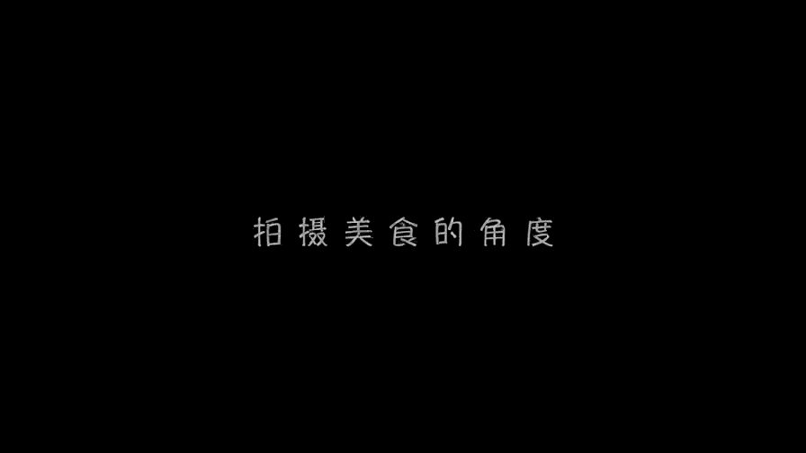

# 贾树森-手机摄影高手（完结）：3：【高手】24种生活场景模拟拍摄训练：第1讲 如何拍出刷爆朋友圈的美食？🍽️

在本节课中，我们将学习如何用手机拍出令人垂涎欲滴的美食照片。我们将从拍摄角度、光线运用、构图技巧、创意摆盘以及后期软件等多个方面，系统地掌握美食摄影的核心要点。

## 美食拍摄的三种基本角度 📐

上一节我们介绍了课程概述，本节中我们来看看拍摄美食的三个基本角度。选择合适的拍摄角度是展现食物美感的第一步。

以下是三种核心的拍摄角度：

1.  **平拍（0度角）**
    *   **描述**：相机与食物所在平面（如桌面）几乎处于同一高度，夹角接近零度。
    *   **适用场景**：适合拍摄侧面形状漂亮或侧面质感突出的食物。

2.  **俯拍（90度角）**
    *   **描述**：相机位于食物正上方，与桌面成90度夹角垂直向下拍摄。
    *   **适用场景**：适合展现食物的整体外形或餐盘的布局。

3.  **斜拍（45度角）**
    *   **描述**：相机角度介于平拍与俯拍之间，夹角大约在40至50度之间。
    *   **适用场景**：能兼顾展现食物立体感和整体布局，是应用最广泛的美食拍摄角度。

## 光线的魔力：为美食注入灵魂 💡

了解了拍摄角度后，光线是决定美食照片成败的另一个关键因素。合适的光线能让食物色泽诱人，充满食欲。

*   **自然光是最佳选择**：尽量选择靠窗或室外的就餐位置，利用自然光拍摄。
*   **避免使用内置闪光灯**：手机内置闪光灯会产生生硬的光影，破坏食物质感。
*   **光线的方向**：
    *   **顺光**：光线从相机后方射向食物。立体感较差，表现一般。
    *   **逆光**：光线从食物后方射向相机。能拍出食物（如果肉、汤汁）的半透明感，质感突出。
    *   **侧光**：光线从食物侧面射入。对食物的颜色、立体感和质感表现都很好。
*   **光线方向总结**：**逆光**和**侧光**是拍摄美食最常用的光线。
*   **光线反差处理**：当逆光或侧光导致明暗反差过大时，可以使用白纸、白色桌布或反光板进行补光。
*   **弱光环境对策**：在餐厅灯光不理想时，可以借助另一部手机的手电筒功能，从侧向或略带逆光的方向进行补光，避免使用顺光。

## 构图技巧：让画面更吸引人 🖼️

掌握了光线，我们还需要通过构图来组织画面，引导观众的视线。好的构图能让普通食物也变得诱人。

以下是几种常见的构图方式：

1.  **特写构图**：贴近拍摄食物的局部细节，突出其颜色、质感或特殊形状。
2.  **全景构图**：完整展现餐盘或食物整体，适合造型美观的菜品。
3.  **留白构图**：在食物周围留有适当的空白区域，使画面更简洁、高级。
4.  **组合构图**：将多种食物或饮品组合在一起拍摄，营造丰富的场景感。
5.  **环境构图**：除了食物本身，将人物动作、餐具、甚至具有地方特色的环境（如街道、招牌）纳入画面，增加故事性和氛围感。

## 创意摆盘与道具运用 🎨

构图不仅仅是取景，更包括拍摄前的“摆盘”。有创意的摆盘和恰当的道具能极大提升照片的格调。

*   **道具是关键**：专业美食摄影会使用大量道具，如各种纹理的桌布、餐盘、刀叉、砧板、鲜花、绿植等。
*   **色彩搭配**：引入对比色或互补色的道具（如在黄色芒果旁放置绿色树叶），能让画面更醒目。
*   **营造氛围**：通过道具的组合，可以营造出浪漫、温馨、清新等不同的画面情绪。
*   **创意无限**：摆盘方式有无数种可能，可以充分发挥想象力进行搭配。

## 后期修图软件推荐 📱

拍摄完成后，适当的后期处理能让照片更出彩。这里推荐两款实用的软件。

1.  **Foodie（美食相机）**
    *   **核心功能**：专为美食设计的相机应用，内置 **26种** 针对不同食物优化的滤镜（如“美味”、“浪漫”、“新鲜”）。
    *   **操作**：简单易用，可快速获得效果不错的照片。
    *   **搜索提示**：请使用英文名“Foodie”进行搜索。

2.  **VSCO**
    *   **核心功能**：功能强大的通用型照片编辑软件，拥有丰富的滤镜和精细的调整工具（曝光、对比度、色调等）。
    *   **使用建议**：许多摄影师更喜欢先用手机原生相机拍摄，再导入VSCO进行更自由和个性化的后期调整。

---

本节课中我们一起学习了手机美食摄影的完整流程。我们从**平拍、俯拍、斜拍**三种角度入手，探讨了利用**逆光与侧光**营造食欲感，学习了**特写、全景、环境**等多种构图方法，并了解了**创意摆盘**和**道具运用**的重要性，最后介绍了**Foodie**和**VSCO**两款后期软件。掌握这些要点，你就能系统地提升美食拍摄水平，轻松拍出刷爆朋友圈的诱人美食照片。