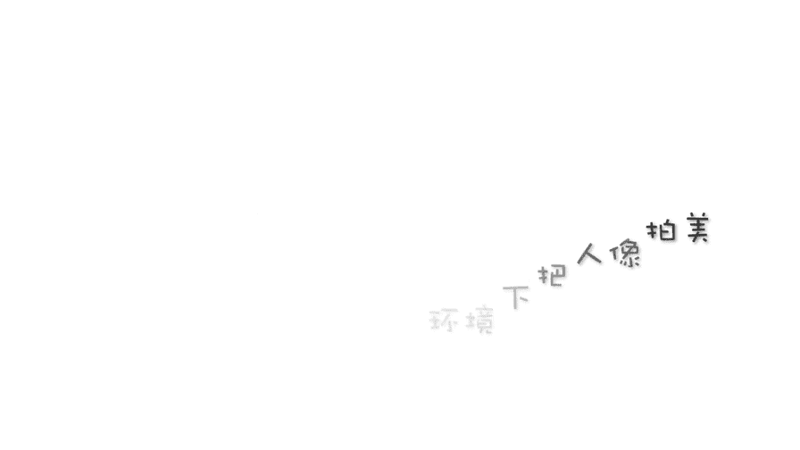
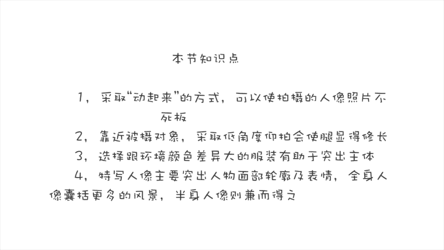

手机摄影高手课：3.2：如何在不同环境中拍出优美的人像

在本节课中，我们将学习如何在不同环境下拍摄生动、自然且优美的人像照片。我们将探讨如何引导模特、选择拍摄角度、搭配服装以及理解不同景别的构图方法，从而避免照片显得死板。

---

### **一、 让模特动起来，告别僵硬**

上一节我们介绍了场景选择的重要性，本节中我们来看看如何让拍摄对象更自然。如果让被拍摄者僵硬地摆姿势或强颜欢笑，即使是明星或超模也难以拍出精彩的照片，普通人更是如此。时间稍长，表情就会变得困倦和不耐烦，照片也会显得死气沉沉。

一旦让模特动起来，哪怕只是在沙滩上漫步，也能拍出相对生动的照片。有句话说“牵一发而动全身”，动态能让照片出彩。在动起来的同时，可以配合一些动作。

以下是几个让照片生动的动作建议：
*   **甩头发**：无论是长发还是短发，做这个动作时，模特通常会感到开心，拍照气氛会很好。
*   **跳跃**：跳跃是打破拍照死板的绝佳技巧。腾空时，人物往往处于忘乎所以的放松状态。**注意**：拍摄跳跃时，务必使用手机的**连拍模式**。
*   **奔跑**：朝着镜头奔跑的拍摄难度较大，但过程充满乐趣，且能捕捉到许多无法预料的精彩瞬间。

当人处于放松、高兴的状态时，全身都会散发出迷人的魅力，这时的人像最美。

---

### **二、 低角度拍摄，拉长腿部线条**

在掌握了动态拍摄后，我们来看看如何优化静态构图，尤其是如何拍出更修长的腿部线条。想要拍出“大长腿”效果，首先需要采用低角度拍摄。

手机镜头通常是**广角镜头**（约**24mm**焦距）。广角镜头有一个特点：当靠近拍摄主体时，会产生**变形拉伸**的透视效果。我们可以利用这一点。

以下是拍出长腿的几个关键技巧：
*   **低角度+靠近模特**：将手机放低，并尽量靠近模特的脚部。
*   **脚贴画面底部**：将模特的脚部尽量靠近画面下边缘，利用广角变形拉伸腿长。
*   **脚尖姿势**：在沙滩等场景赤脚拍摄时，可将脚后跟微微提起，模拟穿高跟鞋的感觉，进一步拉长小腿线条。
*   **坐姿拍摄**：坐姿拍摄时，双腿最好并拢并向一侧微斜，同样确保脚部贴近画面底部，并采用低角度。

如果模特的脚伸向画面底部的某个角落，并尽量接近该角，腿部也会被拉长。无论是坐在地上还是长椅上，这个方法都有效。

---

### **三、 服装搭配与环境的协调**

除了拍摄技巧，服装选择也直接影响照片效果。外出拍照时，应根据拍摄环境来挑选服装。

核心原则是：**让服装颜色与环境形成反差**，从而突出人物主体。
*   **错误示范**：在绿色植物多的环境中穿绿色外套，人物容易“融入”背景，无法突出。
*   **正确选择**：应选择与环境形成反差的颜色，如黄色、红色、白色等。俗话说“红花还需绿叶衬”，就是这个道理。
*   **万能推荐色**：
    *   **红色**：在许多环境中都非常醒目突出。
    *   **白色**：百搭色，几乎在任何场景都能拍出好效果。

此外，想拍出修长腿型，应尽量穿着修身款式的服装，如瘦腿长裤、牛仔短裤、A字裙等。避免上衣过长遮挡腿部。

---

### **四、 理解人像摄影的三种基本景别**

最后，我们来解答一个基础但重要的问题：如何根据场景决定拍特写、半身还是全身？这涉及到人像摄影的三种基本景别。

以下是三种景别的定义与适用场景：
*   **特写人像**
    *   **定义**：取景到人物肩部以上。公式表示为：`取景范围 ≈ 头部 + 肩部`。
    *   **作用**：主要突出人物面部表情和神态，对背景表现较少。
    *   **适用场景**：环境杂乱或不美观时；需要强调人物面部情绪时。**注意**：即使拍特写，也应选择相对干净的背景。

*   **全身人像**
    *   **定义**：人物全身（从头到脚）都在画面内，或人物在画面中比例较小。
    *   **作用**：能展现人物的整体状况（服装、肢体语言）和大量环境信息。
    *   **适用场景**：遇到特别漂亮的风景时；需要突出人物形体动作或传递某种整体情绪时。

*   **半身人像**
    *   **定义**：介于特写与全身之间，通常取景到人物腰部或膝盖以上。公式表示为：`取景范围 ≈ 腰部/膝盖以上`。
    *   **作用**：能兼顾人物表现与环境氛围，是**最常用**的人像拍摄方式。

---

本节课中我们一起学习了如何通过引导模特动态拍摄来获得生动表情，利用低角度广角透视来优化身材比例，根据环境色彩搭配服装以突出主体，以及根据拍摄目的灵活运用特写、半身、全身三种景别进行构图。掌握这些核心技巧，你就能在各种环境下拍出更美的人像照片。