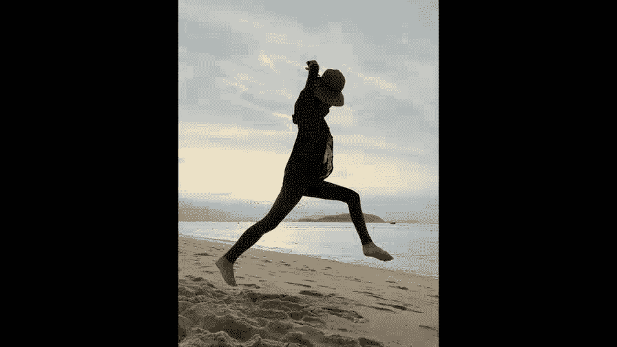

# 手机摄影高手：3.4：如何自拍好看又不落俗套？📸

在本节课中，我们将学习如何摆脱千篇一律的自拍方式，通过多种创意手法和设备辅助，拍出更具艺术感和生活气息的自拍照。

---

## 概述

自拍是手机摄影中最常见的场景之一。本节课将介绍几种超越常规手持自拍的方法，包括利用镜子、自拍杆、三脚架以及身边物品，帮助你拍出与众不同、富有创意的自拍照。

---

## 一、超越手持自拍

上一节我们介绍了自拍的基础概念，本节中我们来看看如何超越最常见的手持自拍方式。手持前置摄像头自拍，尤其是斜上方45度的角度，容易显得单调。我们可以尝试以下方法：

以下是几种创意手持自拍思路：

*   **闭眼自拍**：无论是冥想、遐想还是假装入睡，闭上眼睛能让照片产生独特的氛围和故事感。
*   **拍摄影子**：不直接拍人，而是拍摄跳跃、牵手或投射在有趣物体（如树木、岩石）上的影子，能让画面更具想象空间。
*   **利用镜子**：通过镜子拍摄，可以让人物在画面中的比例变小，避免只拍到大脸。不同的镜子能产生奇妙的效果，例如利用两面相对的镜子制造多重反射，将人物的多个侧面融入同一画面。

---

## 二、使用自拍杆拓展视角

使用自拍杆可以让相机离我们更远，从而容纳更多的背景和身体部分。单纯手持可能只能拍特写，而自拍杆可以轻松拍摄半身照。

不过，直接使用自拍杆拍摄的照片可能更像生活记录。要让照片更具艺术感，可以尝试以下技巧：

以下是提升自拍杆拍摄效果的两个关键点：

*   **隐藏自拍杆**：尽量让自拍杆不出现在画面中，或减少其显露的部分。
*   **不看镜头**：在隐藏自拍杆的同时，将视线移向镜头之外。这样拍出的照片视角更自然，仿佛是由他人拍摄，从而提升了照片的格调。

---

## 三、三脚架与延时自拍

如果想在自拍中融入更大的场景（如海边、草原、街道），并拍摄全身照或动态画面，三脚架和延时自拍功能是绝佳组合。

以下是利用三脚架进行创意自拍的步骤：

1.  **架设与构图**：将手机固定在三脚架上，预先构图并锁紧。
2.  **锁定对焦与曝光**：选择一个点（通常是人物将站立的位置）进行对焦和曝光锁定。
3.  **开启延时自拍**：设置10秒延时。按下快门后，迅速移动到预定位置摆好姿势。
4.  **利用连拍捕捉动态**：部分手机（如关闭实况照片的iPhone）在延时自拍时会连拍10张。在此期间可以做一些连续动作（如跳跃），以便后期挑选最佳瞬间。
5.  **及时回放与调整**：拍摄后及时查看回放，根据效果调整姿势或构图。

---

## 四、遥控快门：动态自拍的利器

使用三脚架配合延时自拍来捕捉跳跃等动态瞬间，时间点可能难以把握。此时，一个**遥控快门**将成为得力助手。

使用遥控快门后，拍摄变得非常自由，可以轻松完成跳跃、玩耍甚至翻跟头等动作。这里有一个关键诀窍：

**核心技巧公式**：`拍摄跳跃 = 在起跳前按下并保持快门 -> 记录全过程 -> 后期挑选最佳帧`

即在起跳之前就按下遥控快门使其持续拍摄，从而完整记录整个跳跃过程，之后只需从连续画面中选出姿态最好的一帧即可。

此外，如果手机前置摄像头像素足够高，可以将其对准自己。这样你能在屏幕上实时看到自己的动作和表情，更容易把握拍摄效果。

> **重要提示**：在公共场所使用三脚架自拍时，务必留意手机安全，防止被他人拿走。

---

## 五、没有三脚架怎么办？

当我们没有携带三脚架，却又想进行远距离自拍时，完全可以利用身边的物品作为临时支架。

以下是可以充当“临时三脚架”的物品示例：

*   **地面与石头**：将手机放在地面，用两块石头倚靠固定。
*   **桌子与杂物**：利用咖啡壶、杯子、书本等物品将手机夹稳在桌面上。
*   **矿泉水瓶**：以及其他任何能提供稳定支撑的物体。

只要善于发现和利用环境，自拍可以随时随地发生。

---

## 总结

本节课我们一起学习了多种提升自拍创意与质感的方法。从简单的闭眼、拍影子，到利用镜子、自拍杆改变视角，再到使用三脚架配合延时自拍和遥控快门来创作场景化、动态化的自拍照，最后还学会了如何利用日常物品替代三脚架。记住，核心在于打破“手持大头照”的定式，让自拍融入环境、讲述故事。