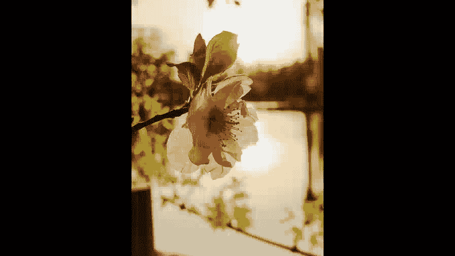
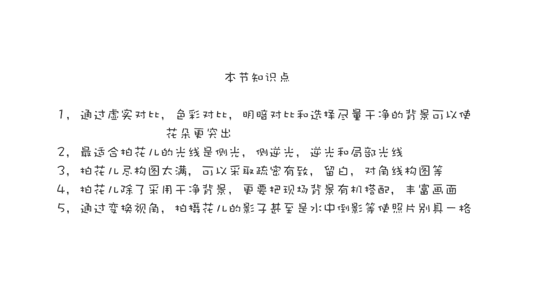

# 手机摄影高手：3.5：如何拍好花卉？

在本节课中，我们将学习如何拍摄出优秀的花卉照片。课程将涵盖突出主体的技巧、光线的运用、构图方法以及创意视角的探索，帮助你全面提升花卉摄影水平。

## 突出主体的三大对比技巧

上一节我们介绍了花卉摄影的基本概念，本节中我们来看看如何让花朵在照片中更突出。以下是三种有效的对比技巧。

**1. 虚实对比**
通过让主体清晰、背景模糊来突出花朵。具体操作是：将手机尽量靠近花朵进行对焦拍摄。
*   **对焦准确**：靠近拍摄时需仔细对焦，避免失焦。
*   **保持距离**：确保被摄花朵与背景或其他花朵有一定距离，以获得更好的虚化效果。

**2. 色彩对比**
利用不同颜色之间的反差来衬托主体。俗话说“红花还需绿叶配”。
*   **搭配元素**：拍摄时不要只拍单一颜色的花。可以引入叶子或其他颜色的花朵作为陪衬。
*   **增强效果**：通过色彩对比，能使主体更加鲜明突出。

**3. 明暗对比**
通过亮度的差异来强化主体。
*   **暗背景衬托**：将花朵置于相对较暗的背景中。
*   **利用反差**：花朵会因明暗反差而更加醒目。

如果一张照片能同时运用虚实、色彩和明暗对比，它将是一张非常出色的花卉摄影作品。

## 光线的选择与运用

了解了如何突出主体后，我们来看看不同光线对花卉拍摄效果的影响。光线是摄影的灵魂，选择合适的光线至关重要。

**顺光拍摄**
顺光光线均匀，但拍出的画面容易显得平淡，缺乏立体感。

**侧光拍摄**
让花朵处于侧光位置。侧光能增强立体感，使花朵形态更分明，并有助于与背景分离。

**逆光拍摄**
逆光能清晰勾勒花瓣和叶脉的纹理，质感强烈。
*   **适用性**：花瓣较薄的花朵更适合逆光，厚重的花朵可能因光线无法穿透而效果不佳。
*   **曝光技巧**：拍摄时需适当增加曝光补偿，调亮画面，并开启HDR功能以保留更多细节。
*   **最佳时间**：清晨或傍晚光线柔和时进行逆光拍摄，色彩温暖，氛围感好。

**侧逆光拍摄**
光线介于逆光与侧光之间。
*   **效果**：能为花朵勾勒出明亮的轮廓边，兼具逆光的通透感和与背景的分离度，使花朵醒目突出。
*   **避免眩光**：逆光或侧逆光拍摄时，若太阳直射镜头易产生光斑。可用花朵、枝叶等遮挡太阳，避免耀眼的光斑。

**局部光运用**
寻找从树叶、花丛缝隙中透出的局部光线。
*   **制造对比**：这缕光线能打亮主体，周围环境则暗下来，利用明暗对比使花朵格外艳丽突出，有“众星捧月”的效果。
*   **创意应用**：即使是顺光场景，利用最后一抹夕阳产生的局部光，也能拍出不俗的照片。

**补光技巧**
在傍晚等光线不佳时，若想继续拍摄，可使用手机手电筒进行补光。
*   **距离与角度**：补光光源不宜离花太近，以免光线过硬、花朵过曝。同时注意变换补光角度，避免平淡的正面光。
*   **模拟自然光**：可用树枝或其他物体遮挡部分补光，模拟阳光穿透的效果，制造光影层次。

## 构图的基本原则

掌握了光线运用，接下来我们探讨构图。好的构图能让画面更和谐、更具美感。以下是拍花时需注意的构图要点。

**1. 避免构图过满**
对于花丛繁茂的场景，忌讳将画面塞得满满当当。
*   **疏密有致**：构图应注意疏密变化。可以纳入部分天空，或选择枝条间有缝隙的角度拍摄。
*   **呼吸空间**：留有缝隙能让画面有“呼吸感”，看起来更舒适。

**2. 学会适当留白**
在花朵周围预留一些空白区域。
*   **国画意境**：借鉴国画的留白手法，给花朵延展的空间，也给观者留下想象余地。

**3. 尝试对角线构图**
当拍摄带有枝条或花朵排列有方向性时，可尝试对角线构图。
*   **操作**：略微旋转手机，让树枝呈倾斜状态。
*   **效果**：这比横平竖直的构图更生动，能避免呆板。

**4. 灵活运用其他构图法**
中心构图法等也很适合拍摄花卉特写，应根据实际情况灵活选择。

## 景别与视角的变化

构图解决了画面的布局，而景别和视角则决定了我们观看花朵的方式。丰富的变化能让你的作品集更出色。

**1. 景别多样化**
不要只拍摄花朵的特写。
*   **多景别结合**：除了充满画面的特写，还可以拍摄数朵花的近景、带枝条的中景，乃至一大片花海的全景。
*   **环境烘托**：将周围的绿树等环境元素纳入画面，在掩映下花朵可能显得更加娇艳。

**2. 营造空间层次**
注意画面中元素的远近关系。
*   **前后呼应**：例如，近处拍摄几根树枝，远处是成片的花树，这种远近呼应能增强画面的空间感和层次感。

**3. 追求简洁而非单调的背景**
干净的背景确实有助于突出主体。
*   **平衡之道**：但纯黑或纯白等极度干净的背景有时会略显单调。
*   **利用环境**：最佳方式是选择性利用环境，如带上枝杈、叶子或落瓣，实现虚实结合与前后呼应，使画面更丰富耐看。

## 创意视角与小花招

最后，我们学习一些打破常规的创意方法，让你的花卉照片与众不同。

**1. 变换拍摄视角**
对于低矮的花朵，常规平拍可能缺乏新意。
*   **仰拍尝试**：可以尝试趴在地上采用仰拍视角。这种非常规的观察角度能给人眼前一亮的感觉。

**2. 利用倒影与影子**
在有水面的环境，可以拍摄花朵在水中的倒影。
*   **创意加分**：这能使照片更具创意和新意。
*   **直接拍影**：也可以直接将花的影子作为拍摄对象纳入画面。

**3. 关注落花与虚化**
将镜头对准洒落在地上的花瓣，可以营造“落英缤纷”的意境。
*   **故意拍虚**：偶尔尝试故意将花朵拍虚，能产生独特的朦胧美感。

这些创意“小花招”有助于你拍出别具一格的作品。大家也可以在实践中不断挖掘属于自己的新鲜拍法。

---

本节课中我们一起学习了如何拍好花卉。我们从**突出主体的三大对比（虚实、色彩、明暗）** 开始，探讨了**不同光线（顺光、侧光、逆光、侧逆光、局部光）** 的运用技巧，掌握了**构图（避免过满、适当留白、对角线构图）** 的基本原则，了解了**景别与视角变化**的重要性，最后还分享了一些**创意视角和小花招**。希望你能灵活运用这些知识，在实践中拍出越来越出色的花卉照片。